# Melhores VPNs Globais Recomendadas – Atualização Diária de Velocidade Fresquinha  
**Última atualização:** 21 de fevereiro de 2026 – VPN Liberdade


**Última atualização: 21 de fevereiro de 2026**  
<!-- 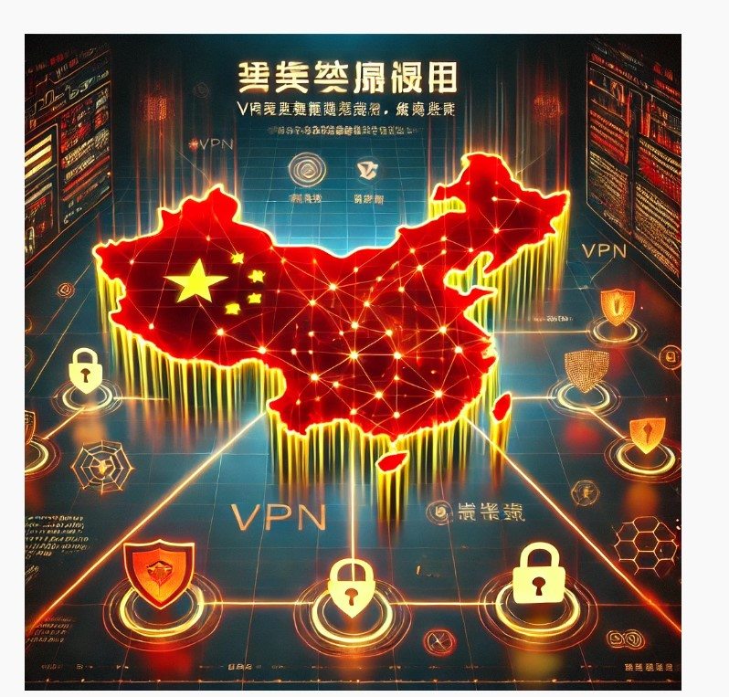 -->

Se achar este guia útil, deixe uma estrelinha no canto superior direito e nos siga! Vamos construir um mundo mais livre e conectado juntos.

### Veredito Rápido de Preço e Valor – Comparação de VPNs

### Principais Recursos & Melhores Ofertas Atuais das Nossas 4 VPNs Top

| VPN Recomendada | Melhor Oferta (Duração)                  | Preço Mensal (USD) | Custo Total | Destaques                          | Aceita Pagamento Internacional? |
|-----------------|------------------------------------------|--------------------|-------------|------------------------------------|---------------------------------|
| [StrongVPN](https://strongvpn.com/pt/?tr_aid=60d96b5810e50&chan=w_github_pt&data1=fanqiang&data2=title) | Plano de 1 Ano                          | ~$3.97–$4.50      | ~$47–$54   | Melhor custo-benefício             | Sim                             |
| [FlowVPN (Teste Grátis de 2 Dias)](https://www.flowvpx.com/sign-up/?locale=pt&special=FREETRIAL&r=35-890485.w_github) | Plano de 1 Ano                          | ~$4.17            | ~$50       | Teste grátis de 2 dias sem risco   | Sim                             |
| [ExpressVPN (12 Meses + Meses Grátis Extras)](https://go.expressvpn.com/c/3828265/1634695/16063) | 12 Meses + Bônus (até 15–16 meses no total) | ~$5.33–$6.67 | ~$80       | Estabilidade e velocidade top      | Não (mas aceita em quase tudo)  |
| [Surfshark](https://surfy-chinaz.com/deals?coupon=surfsharkdeal&transaction_id=102bf6a775238fcbd88327845dfa5b&offer_id=323&affiliate_id=5585&utm_source=Affiliates&utm_medium=5585&utm_campaign=affiliate&recurring_goal_id=312) | Plano de 2 Anos                         | ~$1.99–$2.30      | ~$53–$55   | Dispositivos ilimitados            | Não (mas aceita em quase tudo)  |

### Comparação de Preços – As Formas Mais Inteligentes de Comprar Agora

- Planejando **1 ano** e não precisa de velocidade insana? Vá de **[StrongVPN](https://strongvpn.com/pt/?tr_aid=60d96b5810e50&chan=w_github_pt&data1=fanqiang&data2=title)** por cerca de $47–$54 no total (desconto fresco com e-mail novo a cada renovação) → ~$4/mês.
- Quer **2 anos** gastando pouco? **[Surfshark](https://surfy-chinaz.com/deals?coupon=surfsharkdeal&transaction_id=102bf6a775238fcbd88327845dfa5b&offer_id=323&affiliate_id=5585&utm_source=Affiliates&utm_medium=5585&utm_campaign=affiliate&recurring_goal_id=312)** entrega valor absurdo por ~$53–$55 no total → muitas vezes menos de $2/mês.
- Quer **velocidade premium e estabilidade de rocha** por 1 ano? **[ExpressVPN](https://go.expressvpn.com/c/3828265/1634695/16063)** (com meses grátis extras) vale a média de ~$6/mês.
- Só precisa de acesso básico (ler artigos, navegação leve)? Experimente **[FlowVPN](https://www.flowvpx.com/sign-up/?locale=pt&special=FREETRIAL&r=35-890485.w_github)** com o teste grátis generoso.

Depois de semanas testando na vida real em várias regiões, aqui está o resumo de velocidade. **ExpressVPN** lidera em consistência e baixa variação, **StrongVPN** surpreende pelo preço, enquanto **Surfshark** e **FlowVPN** são ótimos no meio do caminho. Escolha de acordo com seu orçamento × necessidade de velocidade.

Fazemos **testes de velocidade diários frescos** (média dos últimos **7, 14, 30 e 90 dias**), com 10–20 conexões por dia pra ter precisão. Detalhes completos do setup de teste no final. Linhas horizontais mostram desvio padrão (variação).

#### Resultados de Teste de Velocidade VPN – Download & Upload (Médias Diárias Fresquinhas)

Aqui estão nossos resultados combinados mais recentes das regiões mais comuns:
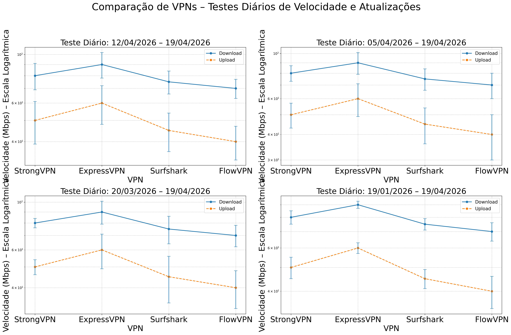

| Serviço VPN   | WireGuard / Protocolo Proprietário | OpenVPN   |
|---------------|------------------------------------|-----------|
| ExpressVPN    | 600 Mbps                          | 400 Mbps  |
| FlowVPN       | 650 Mbps                          | 380 Mbps  |
| StrongVPN     | 500 Mbps                          | 350 Mbps  |
| Surfshark     | 800 Mbps                          | 300 Mbps  |

**Recomendações Rápidas por Preço + Velocidade**  
- Plano de 1 ano econômico, velocidade decente? Vá de **[StrongVPN](https://strongvpn.com/pt/?tr_aid=60d96b5810e50&chan=w_github_pt&data1=fanqiang&data2=title)** — cerca de $43 no total (desconto fresco com e-mail novo) → ~$4/mês.  
- Velocidade premium e desempenho sólido por 1 ano? **[ExpressVPN (12 meses + meses grátis extras)](https://go.expressvpn.com/c/3828265/1634695/16063)** — cerca de $6/mês após desconto (e-mail novo a cada renovação).

Velocidade é tudo numa VPN. Se a conexão ficar lenta, você para de usar — e sua privacidade vai pro espaço. Hoje em dia, a maioria precisa de velocidade rápida e estável pra streaming em HD/4K sem travar.

Testamos cada serviço numa linha real de 1 Gbps usando Ookla Speedtest, nPerf, Netflix Fast e ferramentas CLI. Pegamos a mediana de todas as ferramentas pra resultados reais precisos, testando de manhã e à noite todo dia pra manter consistência.


## Navegação do Conteúdo

### 1. [Noções Básicas de Acesso Livre e Sem Restrições à Internet](#basics-of-unrestricted-access)
### 2. [Principais Recursos das Melhores VPNs Globais – Resumo](#key-features-of-recommended-global-vpns)
#### 2.1 [StrongVPN – Melhor Custo-Benefício](#strongvpn-recommendation)
#### 2.2 [ExpressVPN – 12 Meses + 3 Meses Grátis](#expressvpn-12-months-+-3-months-free)
#### 2.3 [Surfshark – Conexões Ilimitadas em Dispositivos](#surfshark-unlimited-connections)
#### 2.4 [FlowVPN – Teste Grátis de 2 Dias](#flowvpn-2-day-free-trial)
#### 2.5 [Análise de Política de Privacidade & Comparação dos Principais Provedores de VPN](#privacy-policy-comparison-vpn-providers)
### 3. [StrongVPN – Guia Passo a Passo com Pagamentos Internacionais](#strongvpn-international-payment-tutorial)
#### 3.1 [Guia Passo a Passo: Configurando StrongVPN em Dispositivos Móveis (Android & iOS)](#tutorial-de-configuracion-de-strongvpn-en-androidios)
### 4. [Guia de Compra ExpressVPN – Pegue a Melhor Oferta](#expressvpn-purchase-tutorial)
#### 4.1 [Guia de Configuração ExpressVPN – PC, Celular & Tablet](#expressvpn-setup-tutorial)
### 5. [Surfshark – Guia Rápido de Compra (Oferta de Dispositivos Ilimitados)](#surfshark-purchase-tutorial)
### 6. [FlowVPN – Teste Grátis de 2 Dias & Guia de Compra](#flowvpn-purchase-and-free-trial-tutorial)
### 7. [VPNs a Evitar – Lista de Provedores Não Recomendados (Atualizada em Janeiro de 2026)](#vpn-avoid-list)
### 8. [Padrões de Recomendação de VPN & Recursos Essenciais](#vpn-recommendation-standards-and-essential-features)
### 9. [Conhecimento Essencial de VPN que Todo Mundo Deveria Entender](#essential-vpn-knowledge-you-need-to-know)
#### 9.1 [Double ou Multi-Hop VPNs – Como & Por Que Usar](#double-multi-hop-vpn-uses-benefits)
#### 9.2 [Como VPNs Afetam a Velocidade da Internet – Real Talk](#vpn-impact-on-network-speed)
#### 9.3 [Diferenças Entre "Software de Acesso" & VPNs Verdadeiras](#differences-between-access-software-and-vpns)
#### 9.4 [Por Que & Como Rotacionar/Trocar Provedores de VPN Regularmente pra Mais Segurança](#how-to-rotate-vpn-providers-for-better-security)
### 10. [Introdução à Criptografia Básica & Princípios de VPN](#introduction-to-basic-cryptography-and-vpn-principles)
### 11. [O Que Você Pode Fazer com uma VPN + Precauções Importantes](#what-you-can-do-with-a-vpn-and-precautions)
### 12. [Introdução aos Protocolos Comuns de VPN & Ferramentas](#introduction-to-common-vpn-protocols)
#### 12.1 [Diferenças & Casos de Uso: VPN vs. Tor](#differences-and-use-cases-vpn-vs-tor)
#### 12.2 [VPN vs. Servidores Proxy – Diferenças Chave](#differences-between-vpn-and-proxy-servers)
### 13. [Análise de Servidores VPN – Dicas Práticas & Insights](#vpn-server-analysis-practical-tips)
#### 13.1 [Como Resolver Quedas e Interrupções de Conexão VPN](#how-to-fix-vpn-connection-drops)
#### 13.2 [Como Manter Sua VPN Sempre Ligada & Confiável](#how-to-keep-vpn-always-active)
### 14. [Por Que Não Recomendamos VPNs Grátis – Os Riscos Reais](#risks-of-free-vpns-why-we-dont-recommend-them)
### 15. [Por Que Não Recomendamos Criar Sua Própria VPN](#why-not-build-your-own-vpn)
### 16. [Melhores Recursos de VPN pra Games – Suba de Nível no Seu Jogo](#vpn-features-for-gaming)
### 17. [Guia Passo a Passo: Assistir Conteúdo Global de Streaming com uma VPN](#guide-to-streaming-with-vpn)
#### 17.1 [Como Netflix & Hulu Detectam & Bloqueiam Conexões VPN](#how-netflix-and-hulu-detect-and-block-vpns)
### 18. [Relatório Detalhado de Testes de Velocidade VPN (Atualização Diária Fresca – 12 de janeiro de 2026)](#detailed-vpn-speed-test-report)
#### 18.1 [Taxas de Sucesso de Conexão por Continente](#vpn-connection-success-rates-by-continent)
#### 18.2 [Testes de Velocidade VPN em Regiões Globais](#vpn-speed-tests-global-regions)
#### 18.3 [Taxas de Sucesso de Conexão Netflix por Continente](#netflix-connection-success-rates-by-continent)
#### 18.4 [Taxas de Sucesso de Conexão Disney+ por Continente](#disney-plus-connection-success-rates-by-continent)
### 19. [Tutorial de Instalação de VPN no Linux](#vpn-installation-tutorial-on-linux)
### 20. [Apps & Serviços que Podem Bloquear ou Restringir VPNs](#apps-and-services-that-may-block-vpns)
### 21. [BitTorrent com VPN – Setup & Melhores Práticas](#bittorrent-with-vpn-setup-tips)
### 22. [FlowVPN pra Apple TV – Por Que Se Destaca](#vpn-for-apple-tv)
### 23. [Tendências de VPN & Previsões Futuras (2026 & Além)](#vpn-trends-and-future-predictions)
#### 23.1 [Limitações Comuns de VPN & Como Resolver](#vpn-limitations-and-solutions)

**Última atualização: 21 de fevereiro de 2026**

>No mundo de hoje, VPNs realmente estáveis e eficazes globalmente estão cada vez mais raras. Muitos sites de review só copiam conteúdo uns dos outros e perdem relevância rapidinho. Algumas VPNs recomendadas performam mal (ou falham totalmente) em certas regiões, e infelizmente muitos reviewers não testam de verdade com experiência local. Nos últimos anos, com restrições de rede ficando mais apertadas em alguns casos, vários serviços antes confiáveis viraram quase inúteis. Leia este artigo com atenção pra evitar armadilhas comuns. Este guia é baseado na minha experiência real e recebe atualizações diárias contínuas, pra você escolher ferramentas seguras e que funcionam pra streaming, games e privacidade. Se quiser uma recomendação rápida, pule direto pra seção de sugestões no final.

A necessidade de burlar restrições pra ter acesso livre e aberto à internet nunca foi tão clara. Sem isso, você não consegue assistir conteúdos globais da Netflix, Disney+, Globoplay internacional, jogar FIFA/EA FC online sem lag, proteger sua conexão no Wi-Fi de café ou rede pública, ou acessar bibliotecas completas de séries e filmes. Como alguém que viaja bastante a trabalho e estudos, eu dependo dessas ferramentas em diferentes regiões. Como programador e PhD em machine learning com conhecimento profundo em redes, vou te guiar em detalhes por VPNs, segurança, tecnologias como WireGuard e V2Ray, além de compartilhar meus testes reais de velocidade pra te ajudar a escolher as opções mais estáveis e seguras.

>Relatórios globais mostram que usuários online já passaram de 900 milhões, tornando o acesso irrestrito mais essencial do que nunca. Muitos blogs recomendam VPNs sem verificação adequada, empurrando serviços ineficazes ou até arriscados. Alguns sites usam palavras vazias de hype, e com bloqueios judiciais ou geo-restrictions ficando mais comuns, várias VPNs param de funcionar de repente. Por isso criei este guia baseado no GitHub — pra te ajudar a evitar golpes, perda de tempo e ferramentas perigosas. Este artigo mergulha em detalhes técnicos; se você só quer uma recomendação rápida, confira as sugestões no final.

Anos trabalhando e vivendo em diferentes países me mostraram que burlar restrições agora é uma habilidade essencial. Sem isso, fica difícil acessar conteúdos internacionais da Netflix (versão US com mais opções), Disney+, assistir YouTube sem geo-block, conversar com amigos no WhatsApp ou Instagram sem interrupções, fazer cursos no Udemy/Coursera, ou curtir entretenimento de HBO, BBC e CNN. Como profissional viajante e PhD em machine learning especializado em redes, te dou um guia detalhado, baseado em experiência real sobre VPNs, segurança, WireGuard, V2Ray e mais — com meus próprios testes de velocidade e uso diário — pra você escolher as ferramentas mais confiáveis e seguras.

## Notícias Recentes sobre VPN
A atualização de segurança da Microsoft em junho de 2024 causou problemas de conexão VPN para muitos usuários do Windows 11, 10 e Server 2008+. Vários relatos no Reddit mencionaram falhas após o patch, muitas vezes resolvidas temporariamente reinstalando o app da VPN. A Microsoft reconheceu o problema e prometeu correção futura.  
<!-- [Artigo original completo](https://tw.news.yahoo.com/microsofts-latest-windows-security-updates-might-break-your-vpn-001216447.html) -->

## Atualização Atual do Status das VPNs
Da temporada de festas de 2021 até maio de 2023, o cenário de VPN mudou dramaticamente. Serviços como Ivacy, VyprVPN e outros enfrentaram bloqueios frequentes de servidores em várias regiões, com falhas de segurança expostas. Recomendamos fortemente evitar esses riscos. Até players grandes como NordVPN levaram pancadas e agora muitas vezes precisam de configs manuais, enquanto PIA — que já foi estrela em ascensão — perdeu força e fica desconectada em muitas áreas.

PandaVPN está completamente inativo desde novembro, site fora do ar e suporte morto — provavelmente abandonado. Muitos outros serviços seguiram caminhos parecidos, então fique atento.

Porém, como a Estrela do Norte, **ExpressVPN** e **StrongVPN** continuaram consistentemente estáveis. ExpressVPN é como um canivete suíço — funciona perfeitamente em todas as plataformas e geralmente se recupera de qualquer interrupção em uma semana com updates rápidos. StrongVPN é nosso "soldado leve" confiável — ótimo custo-benefício, apps universais e simplificados pra Windows, Mac e Android, servidores atualizados regularmente e menos bloqueios no geral. No iPhone, pode precisar de setup manual em períodos sensíveis, mas o time deles costuma fornecer linhas alternativas quando necessário.

Este site inclui guias detalhados, testes de velocidade frescos e soluções pra problemas comuns. Use a navegação no final pra pular direto pra seção que precisar.
<a name="basics-of-unrestricted-access"></a>
## Noções Básicas de Acesso Livre e Sem Restrições à Internet

<a name="what-is-free-browsing"></a>
### O que é "Navegação Livre" (Acesso Irrestrito à Internet)?

Vamos começar pelos fundamentos das restrições de rede.

#### O que são Restrições de Rede? (O Básico)

Políticas de controle de rede são medidas globais implementadas por autoridades pra proteger empresas e infraestrutura crítica de ciberataques. Essas políticas restringem acesso a sites e serviços específicos. Plataformas comumente geo-bloqueadas incluem conteúdos internacionais da Netflix, Disney+, Globoplay (versão BR vs global), além de serviços como BBC iPlayer ou certos canais de notícias ocidentais.  
Ao tentar acessar, você geralmente pega erro técnico (404 Not Found, reset de conexão, timeout etc.), causado por DNS poisoning, bloqueio de IP, filtragem de URL, inspeção profunda de pacotes e resets TCP forçados. Em alguns casos, monitoramento por palavras-chave também é usado pra detectar e rastrear atividade.

#### Por que Você Precisa Burlar Essas Restrições

É simples: sem forma de contornar os geo-blocks ou restrições judiciais ocasionais, trabalho remoto, comunicação e vida online diária ficam bem difíceis. Ferramentas essenciais como Google Workspace, OneDrive, Dropbox podem ter limitações regionais. Redes sociais — Instagram, YouTube, WhatsApp — ficam limitadas em conteúdos globais.  
A maioria dos grandes canais de notícias ocidentais (The New York Times, CNN, Reuters, Financial Times etc.) pode ter acesso restrito em certos contextos, e a lista de bloqueios muda com decisões judiciais.

#### Como VPNs Habilitam a Navegação Livre

Uma Rede Privada Virtual (VPN) te ajuda a burlar censura e geo-restrictions fazendo seu provedor de internet achar que você está conectando de outro país ou região. Embora o uso de VPN seja tecnicamente restrito ou monitorado em alguns contextos, a aplicação real contra viajantes, expatriados ou profissionais é extremamente rara.  
Dica de ouro: Sempre baixe e configure sua VPN **antes** de entrar em áreas com restrições — muitos sites de provedores de VPN são bloqueados localmente. Recomendamos fortemente provedores testados em batalha como ExpressVPN e StrongVPN, que provaram ser confiáveis contra as restrições mais duras ao longo do tempo. As pessoas muitas vezes se referem a essas ferramentas com termos neutros como "ajudantes de navegação livre" ou "ferramentas de acesso" pra evitar atenção.

Resumindo, o processo de usar software especializado pra acessar sites internacionais livremente é conhecido como "navegação livre" (ou acesso irrestrito à internet), e as principais ferramentas pra isso são VPNs e soluções semelhantes de privacidade/acesso.

#### Outro Benefício Enorme das VPNs: Esconder Seu IP Real

Seu endereço IP é basicamente seu "endereço de casa" na internet — revela sua localização aproximada e pode te identificar unicamente. Isso é conveniente pra algumas coisas… mas é um risco gigante de privacidade porque terceiros (provedores, anunciantes, hackers) podem monitorar e rastrear tudo que você faz online por meio dele.  
Uma VPN troca instantaneamente seu IP real pelo IP do servidor dela, criptografa toda sua conexão e esconde sua identidade real em segundos. Isso cria um túnel privado seguro pra todo seu tráfego, mantendo-o protegido de olhares curiosos.


#### Benefício Extra: Wi-Fi Público Seguro (Cafés, Aeroportos, Hotéis)

Wi-Fi público está em todo lugar — cafés, aeroportos, hotéis, shoppings — e é super conveniente. Mas sem proteção, é extremamente perigoso. Hackers na mesma rede podem facilmente bisbilhotar seus dados não criptografados: senhas de login, informações bancárias, e-mails de trabalho, números de telefone, mensagens — basicamente tudo.  
Uma VPN sólida criptografa sua conexão de ponta a ponta, então mesmo nos hotspots públicos mais suspeitos, seus dados ficam privados e seguros.

### Protocolos Comuns Usados em Ferramentas de Navegação Livre

Agora, aqui vão alguns termos técnicos chave que você vai encontrar no mundo das VPNs. Conhecer eles ajuda a entender as diferenças e escolher melhor o provedor.
**VPN**  
Se você já conhece sobre burlar restrições, provavelmente já ouviu falar de VPNs. Uma VPN é uma ferramenta de criptografia que esconde seu IP real, localização e dados pessoais. Pense como colocar uma fantasia perfeita — a criptografia é o que realmente importa — permitindo acessar conteúdos bloqueados sem ser rastreado.  
Muita gente começou a usar VPNs por segurança básica (especialmente trabalhadores remotos na pandemia), mas métodos tradicionais antigos já não dão conta das restrições modernas e avançadas. Hoje você precisa de soluções mais robustas e atualizadas.

<a name="key-features-of-recommended-global-vpns"></a>
## Principais Recursos das Melhores VPNs Globais – Resumo

Depois de testar centenas de VPNs ao longo dos anos, aqui estão minhas principais recomendações baseadas na experiência real em negócios internacionais, viagens frequentes e conhecimento profundo em redes. Confira os relatórios frescos de teste de velocidade abaixo pra comparações detalhadas. Como alguém que usa essas ferramentas todo dia, só recomendo serviços que entregam esses recursos essenciais:

- Segurança de alto nível (provedores fora de regiões restritas, preferencialmente em jurisdições no-logs)
- Estabilidade de conexão de rocha
- Velocidade máxima possível
- Rede enorme de servidores (acesso a muitos países/regiões)
- Super fácil de usar (conexão com um clique)
- Criptografia avançada e recursos de privacidade
- Suporte a múltiplos dispositivos simultâneos
- Compatibilidade ampla (Windows, macOS, Linux, Android, iOS, roteadores etc.)
- Suporte ao cliente 24/7 em vários idiomas
- Garantia de devolução de 30 dias
- Opções de pagamento flexíveis (incluindo métodos internacionais)
- Preço justo com excelente custo-benefício

<a name="strongvpn-recommendation"></a>
### 1. [StrongVPN – Melhor Custo-Benefício](https://strongvpn.com/pt/?tr_aid=60d96b5810e50&chan=w_github_pt&data1=fanqiang&data2=title)

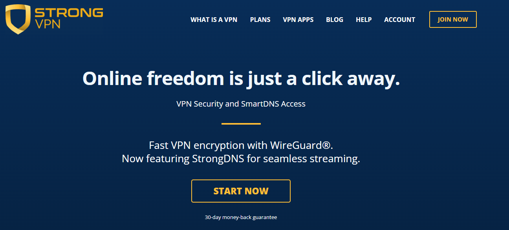

**StrongVPN** é uma VPN em ascensão rápida com servidores pela Europa e Américas, oferecendo preços bem mais baixos que os grandes nomes como ExpressVPN — começando em torno de $3.50–$4/mês no plano de 12 meses (total ~$43–$54). Diferente de algumas marcas premium, ela aceita pagamentos internacionais sem problema, e o time de engenharia fica atualizando servidores regularmente pra ficar à frente dos bloqueios.

Perfeita pro uso diário: streaming no YouTube, rolar o Facebook/Instagram, desbloquear Netflix (biblioteca americana completa), Hulu, Amazon Prime Video, Disney+, Globoplay internacional, HBO e mais. Apps nativos limpos pra Windows, macOS, iOS, Android e Amazon Fire TV, além de guias fáceis pra Chrome, roteadores, Fire TV Stick e Kodi.

Com mais de 950 servidores P2P-friendly em 35+ países e 46 cidades, StrongVPN suporta protocolos modernos incluindo L2TP, SSTP, OpenVPN, IKEv2 e o super-rápido WireGuard. Você ganha suporte 24/7 via chat ao vivo e e-mail + garantia total de 30 dias. Sem firulas desnecessárias — só desempenho confiável que resolve pra maioria dos usuários.

**StrongVPN** tem uma rede verdadeiramente global com 950+ servidores, 30+ países, 46 cidades e mais de 59.500 IPs VPN únicos. Eles garantem uma política estrita de no-logs — não rastreiam nem vendem seus dados pra terceiros. O único objetivo é te manter seguro e privado.

#### Quão Rápida é a StrongVPN de Verdade?

Velocidade importa tanto quanto privacidade. Testamos a StrongVPN em linhas reais de 1 Gbps (servidores US & UK) usando SpeedTest, SpeedOf.me, nPerf e mais.  
- OpenVPN: 230–240 Mbps (US) — mais que suficiente pra streaming HD/4K  
- IKEv2: 260–280 Mbps — bem perto do nível premium  
- WireGuard: 270–300 Mbps (US), até 450 Mbps (UK) — em testes anteriores chegamos a 600+ Mbps  

Em conexões residenciais típicas (100–500 Mbps), a diferença pros VPNs mais rápidos absolutos (800+ Mbps) mal se nota. StrongVPN entrega desempenho excelente no mundo real.

**12 Conexões Simultâneas**: Rode a StrongVPN em até 12 dispositivos ao mesmo tempo — ótimo pra família ou múltiplos gadgets.

### Recursos Principais da StrongVPN

- Suporte amplo de plataformas: Apps pra iOS, Android, macOS, Windows, além de guias pra Linux & roteadores
- Até 12 conexões simultâneas
- Desbloqueia com confiabilidade Netflix, Amazon Prime Video, Disney+, Hulu e mais
- Inclui 250 GB de armazenamento cloud SugarSync (bônus no plano anual)
- 950+ servidores pelo mundo
- Protocolos: WireGuard, OpenVPN, IKEv2, L2TP/IPsec, SSTP
- Garantia de devolução de 30 dias
- Suporte 24/7 via chat ao vivo & e-mail
- Política de privacidade no-logs estrita — sem rastreamento, sem armazenamento de dados
- Bem mais barata que ExpressVPN ou Surfshark no longo prazo
- Aceita pagamentos internacionais (cartões de crédito, PayPal etc.)
- Estabilidade de conexão excepcional

| Recurso / Especificação          | StrongVPN                          |
|----------------------------------|------------------------------------|
| Plataformas de Cliente           | Windows, macOS, Linux, Android, iOS, DD-WRT, GL.iNet roteadores, Android TV |
| Protocolos Suportados            | OpenVPN, L2TP/IPsec, SSTP, WireGuard |
| Número de Servidores             | 950+                               |
| Número de Países                 | 35+                                |
| Jurisdição / Sede                | Estados Unidos                     |
| Métodos de Pagamento             | Cartões de crédito, PayPal, opções internacionais |
| ID / Verificação Necessária?     | Não                                |
| Protocolos de Criptografia       | WireGuard, OpenVPN, IKEv2, L2TP, SSTP |
| Limite de Dados / Banda          | Ilimitado                          |
| Limites de Uso                   | Ilimitado                          |
| Dispositivos Conectados Simultâneos | 12                              |
| Suporte ao Cliente               | E-mail, chat ao vivo 24/7, telefone |
| Política de Privacidade          | No-logs (estrita)                  |

<a name="expressvpn-12-months-+-3-months-free"></a>
### 2. [ExpressVPN – 12 Meses + 3 Meses Grátis](https://go.expressvpn.com/c/3828265/1634695/16063)

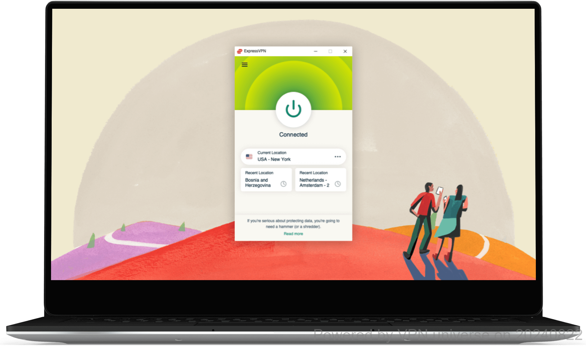

ExpressVPN é amplamente considerada o padrão ouro no mercado de VPN — e com razão. Ela entrega um pacote completo de nível profissional que supera a maioria dos concorrentes em confiabilidade, velocidade e poder de desbloqueio.

Oferece apps nativos top de linha pra Windows, macOS, Android, iOS, Linux e mais, além de guias detalhados pra roteadores, Apple TV, Fire TV, PlayStation, Chromebook, Kindle e até smart TVs. Recursos de segurança chave incluem servidores DNS privados (sem vazamentos de terceiros), criptografia militar AES-256-GCM, perfect forward secrecy via troca de chaves Diffie-Hellman, autenticação HMAC pra evitar adulteração, e um kill switch de rocha que corta a internet se a VPN cair — mantendo seu IP real escondido o tempo todo.

Com **mais de 3.000 servidores em 94 países e 160+ localizações**, ExpressVPN oferece cobertura global imbatível — especialmente forte na Europa, EUA e Ásia (27 países só na Ásia), superando de longe provedores menores como Mozilla VPN (só ~30 países no total). Como uma das maiores e mais ricas em recursos, eles atualizam servidores rapidinho, desbloqueiam Netflix (várias bibliotecas), suportam P2P/torrent, e mantêm uma política no-logs auditada e estrita. A estabilidade de conexão está entre as melhores da indústria — perfeita pra streaming 4K, jogos sem lag (tipo FIFA/EA FC) e trabalho remoto pesado.

A única desvantagem real? É premium no preço — mas o desempenho justifica pra quem precisa do melhor absoluto.


#### Recursos Principais da ExpressVPN

- Mais de 3.000 servidores em 160+ localizações em 94 países
- Base de usuários enorme e ativa pra atualizações rápidas e confiabilidade
- Servidores atualizados automaticamente e com frequência
- Garantia de devolução de 30 dias
- **Suporte 24/7 via chat ao vivo** (gente de verdade, não bots)
- Apps nativos pra Windows, macOS, iOS, Android, Linux, além de roteadores, consoles, smart TVs e mais
- Aceita várias moedas, incluindo Bitcoin
- Criptografia líder da indústria (AES-256-GCM, protocolo Lightway)

**Oferta Exclusiva**: Cadastre-se pelo nosso link e ganhe **3 meses extras grátis** no plano anual (15 meses no total, média de ~$6.67/mês). Eles aceitam cartões de crédito, PayPal, Bitcoin e mais.  
Dica de ouro: Baixe o app no Android ou iOS primeiro pra um **teste grátis de 7 dias** (sem cartão em algumas regiões). Combine isso com a garantia total de 30 dias de devolução, e você testa a ExpressVPN completamente sem risco. Cancelamento é simples — sem perguntas, reembolso total se não atender suas necessidades.

| Recurso                        | ExpressVPN                                      |
|--------------------------------|-------------------------------------------------|
| Número de Servidores           | 3.000+                                          |
| Número de Países               | 94                                              |
| Plataformas Suportadas         | Windows, macOS, iOS, Android, Linux, BlackBerry, Kindle Fire, Nook, roteadores, consoles de games (via MediaStreamer), Amazon Fire TV, Apple TV, Chromebook, Windows Phone |
| Conexões Simultâneas           | 5                                               |
| Split Tunneling                | Sim                                             |
| Kill Switch                    | Sim (network lock)                              |
| Protocolos Suportados          | Lightway, OpenVPN UDP, OpenVPN TCP, L2TP/IPSec, IKEv2 |
| Jurisdição / Sede              | Ilhas Virgens Britânicas (amigável à privacidade) |
| Suporte ao Cliente             | Chat ao vivo 24/7, e-mail, base de conhecimento extensa |


<a name="surfshark-unlimited-connections"></a>
### 3. [Surfshark – Conexões Ilimitadas em Dispositivos](https://surfy-chinaz.com/deals?coupon=surfsharkdeal&transaction_id=102bf6a775238fcbd88327845dfa5b&offer_id=323&affiliate_id=5585&utm_source=Affiliates&utm_medium=5585&utm_campaign=affiliate&recurring_goal_id=312)

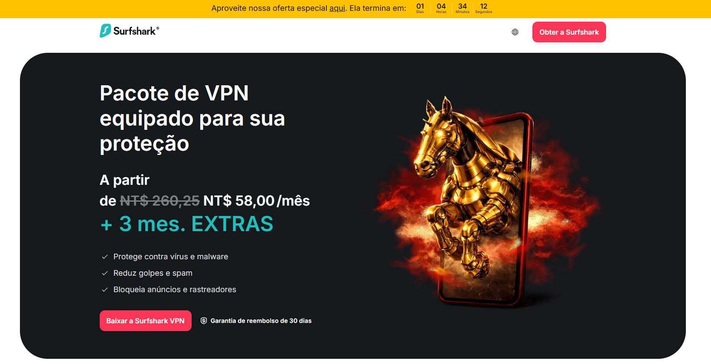

**Surfshark** é uma VPN poderosa e cheia de recursos que entrega desempenho premium por um dos preços mais acessíveis do mercado. Embora o kill switch possa ter uns pequenos probleminhas de vez em quando e as velocidades no OpenVPN não sejam as mais rápidas absolutas, você simplesmente não encontra melhor custo-benefício em lugar nenhum. Lançada em 2018, a Surfshark virou favorita rapidinho e hoje está ombro a ombro com os maiores nomes.

Ela roda **mais de 3.200 servidores em 65 países e 160+ localizações**, dando cobertura quase universal e desempenho confiável em praticamente qualquer lugar. Apps limpos e intuitivos pra Windows, macOS, iOS, Android, Linux, além de extensões pra Chrome, Firefox e Edge. Inclui Smart DNS pra setup fácil em consoles, smart TVs e outros dispositivos.

Segurança top com criptografia AES-256-GCM, suporte a WireGuard (super rápido), OpenVPN e IKEv2, política no-logs estrita (auditada independentemente), e kill switch pra proteger se a conexão cair. Assim como a ExpressVPN, está sediada nas Ilhas Virgens Britânicas — sem logs de atividade do usuário, só e-mail e dados de cobrança.

Surfshark brilha no desbloqueio: Netflix em ~20 bibliotecas (EUA, Reino Unido, Japão, França, Itália, Austrália etc.), além de Amazon Prime Video, Disney+, Hulu e mais. Ideal pra streaming pesado, torrent e games online.

#### Recursos Principais da Surfshark

- Preço inicial absurdamente baixo
- Auditorias de segurança independentes recentes pra mais tranquilidade
- Desempenho excelente em streaming
- Pagamentos flexíveis: cartões de crédito, PayPal, cripto, Amazon Pay, Google Pay
- Suporte ao cliente 24/7 prestativo
- Mais de 3.200 servidores em 65 países com conexões simultâneas ilimitadas
- **Dispositivos ilimitados** — cubra toda a casa (celulares, notebooks, TVs etc.)
- Garantia de devolução de 30 dias
- Preço mais baixo que vimos: ~$2.30/mês no plano de 2 anos
- Surfshark Nexus (recursos avançados como IP Rotator pra trocar IP automaticamente a cada poucos minutos sem desconectar, e mais ferramentas adicionadas com o tempo)

<a name="flowvpn-2-day-free-trial"></a>
### 4. [FlowVPN – Teste Grátis de 2 Dias](https://www.flowvpx.com/sign-up/?locale=pt&special=FREETRIAL&r=35-890485.w_github)

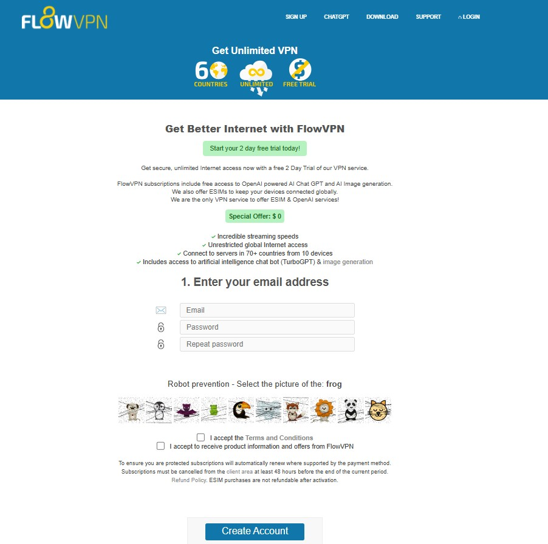

**FlowVPN** se destaca pelo generoso **teste grátis de 2 dias completamente gratuito** (sem cartão na maioria dos casos) — perfeito pra testar tudo sem risco antes de comprar. É uma escolha prática e barata, especialmente popular entre estudantes, usuários leves e quem quer desempenho sólido sem gastar muito.

FlowVPN entrega velocidades e estabilidade competitivas, muitas vezes igualando ou superando vários provedores europeus e americanos (confira a imagem de teste de velocidade acima pros resultados reais). Aceitam pagamentos internacionais e oferecem suporte multilíngue.

#### Recursos Principais da FlowVPN

- **Teste grátis incrível de 2 dias** — experimente antes de comprar, zero risco
- Planos longos acessíveis, ótimos pra estudantes e uso diário
- Estabilidade e velocidades fortes (confira os testes frescos)
- Opções de pagamento internacionais + suporte multilíngue
- Ampla gama de protocolos: IPSec IKEv1/IKEv2, WireGuard, OpenVPN, L2TP, PPTP, além de SSL custom e FlowTCP
- Mais de 100 servidores em 60+ países (cobertura forte no Reino Unido, EUA, Austrália e mais)
- Apps nativos pra Windows, macOS, iOS, iPad, Android
- Até **4 conexões simultâneas em dispositivos**
- Descontos especiais pra estudantes e educadores

### Análise de Política de Privacidade & Comparação dos Principais Provedores de VPN
<a name="privacy-policy-comparison-vpn-providers"></a>

Ao escolher uma VPN, a **política de privacidade** é um dos fatores mais críticos pra proteger seus dados e identidade real. Aqui vai uma comparação clara e lado a lado entre ExpressVPN, StrongVPN e Surfshark — os três mais recomendados neste guia.

#### ExpressVPN
Sediada nas Ilhas Virgens Britânicas (jurisdição amigável à privacidade, sem leis de retenção obrigatória de dados), a ExpressVPN mantém uma das políticas **no-logs** mais rigorosas da indústria. Auditorias independentes confirmam que eles não registram sua atividade de navegação, timestamps de conexão, endereços IP ou consultas DNS.
<!---->
#### StrongVPN
A StrongVPN está sediada nos Estados Unidos. Eles também seguem uma política **no-logs** rigorosa para atividade e tráfego do usuário. Embora a jurisdição americana possa gerar preocupações por possíveis pedidos de dados, a StrongVPN afirma que não armazena logs que possam identificar usuários e só cumpre ordens judiciais válidas (o que nunca foi problema na prática para seus usuários).

#### Surfshark
Assim como a ExpressVPN, a Surfshark está sediada nas Ilhas Virgens Britânicas e segue uma política **no-logs** estrita (auditada independentemente várias vezes). Eles coletam apenas informações mínimas da conta (e-mail e dados de cobrança) e explicitamente não registram atividade, IPs ou histórico de navegação. Nenhum dado é compartilhado com terceiros, exceto sob ordem judicial.

| Recurso                          | ExpressVPN                     | StrongVPN                  | Surfshark                      |
|----------------------------------|--------------------------------|----------------------------|--------------------------------|
| Jurisdição                       | Ilhas Virgens Britânicas       | Estados Unidos             | Ilhas Virgens Britânicas       |
| Registra Navegação/Atividade/IP  | Não (no-logs estrito, auditado)| Não (no-logs estrito)      | Não (no-logs estrito, auditado)|
| Compartilha Dados com Terceiros  | Não, exceto ordem judicial válida | Não, exceto ordem judicial válida | Não, exceto ordem judicial válida |

**Resumo final**: Os três oferecem proteções de privacidade fortes. Se você prioriza a jurisdição mais amigável à privacidade e auditorias independentes repetidas, vá de ExpressVPN ou Surfshark. A StrongVPN continua sendo uma escolha sólida e confiável pra quem foca em custo-benefício. Sempre confira a política de privacidade mais recente diretamente no site de cada provedor pra todos os detalhes.

## Tutoriais Passo a Passo: Comprando StrongVPN com Pagamentos Internacionais & Configurando ExpressVPN

<a name="strongvpn-international-payment-tutorial"></a>
## StrongVPN – Guia Passo a Passo com Pagamentos Internacionais

Uma das maiores vantagens da **StrongVPN** é o suporte total a pagamentos internacionais — perfeito se você usa cartões estrangeiros, PayPal de outro país ou prefere opções flexíveis. (FlowVPN é outra ótima alternativa se precisar de algo parecido.)

### Passo 1: Acesse Nossa Oferta Exclusiva
Clique no nosso link especial pra pegar o melhor desconto: [StrongVPN](https://strongvpn.com/pt/?tr_aid=60d96b5810e50&chan=w_github_pt&data1=fanqiang&data2=title) → Clique em "Start Now" (veja a captura de tela abaixo).  


### Passo 2: Resolva Qualquer Problema de Conexão/Compra
Se o site não carregar ou a compra falhar (por exemplo, porque você já está em outra VPN ou em área restrita), use o **teste grátis de 2 dias da FlowVPN** pra contornar o problema com segurança.  
Cadastre-se aqui: [FlowVPN](https://www.flowvpx.com/sign-up/?locale=pt&special=FREETRIAL&r=35-890485.w_github) (guia completo de setup mais adiante no artigo).  
Conecte a um servidor do Reino Unido, depois volte ao link da StrongVPN.  
O plano de 1 ano sai por apenas ~$43 USD no total (12 meses; na renovação, basta usar e-mail novo + nosso link de desconto toda vez).  
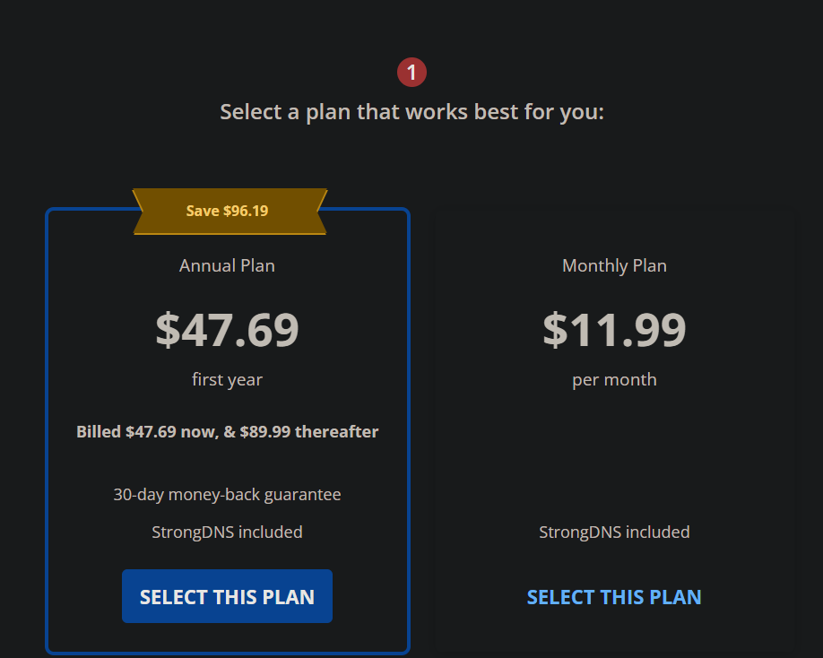

### Passo 3: Escolha Seu Método de Pagamento
Role até a seção de pagamento. Selecione opções internacionais — eles aceitam a maioria dos cartões de crédito/débito estrangeiros (Visa, MasterCard), PayPal e mais.  
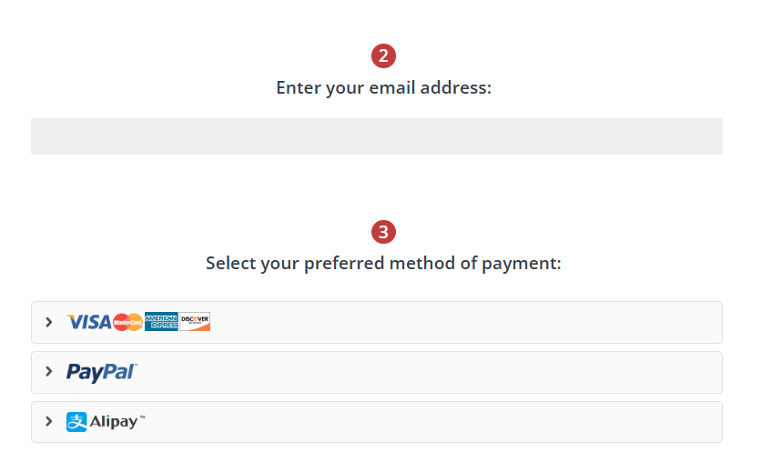

### Guia Passo a Passo: Configurando StrongVPN em Dispositivos Móveis (Android & iOS)

Seja no Android ou iOS, colocar a StrongVPN pra rodar no celular é super simples — só alguns toques e você já está protegido em qualquer lugar.

#### 1. Comprar & Criar Sua Conta StrongVPN
Acesse nosso link exclusivo: [StrongVPN](https://strongvpn.com/fr/?tr_aid=60d96b5810e50&chan=w_github_fr&data1=fanqiang&data2=title), escolha seu plano (1 ano pro melhor custo-benefício) e cadastre-se.

#### 2. Instalar & Conectar no Android
- Abra a Google Play Store e busque por "StrongVPN".
- Toque em "Instalar" pra baixar o app oficial.
- Abra o app, digite seu usuário e senha, depois toque em "Log In".
- Toque em "Best Available Location" pra conexão automática mais rápida, ou escolha um país/servidor manualmente.

#### 3. Instalar & Conectar no iOS (iPhone/iPad)
- Abra a App Store e busque por "StrongVPN".
- Toque em "Obter" pra baixar e instalar.
- Abra o app, faça login com suas credenciais.
- Selecione "Best Available Location" pra conexão ótima automática, ou escolha um servidor da lista.

Pronto — agora você está criptografado, privado e livre pra fazer streaming, navegar ou jogar no celular sem limites ou preocupações!

<a name="expressvpn-purchase-tutorial"></a>
## Guia de Compra ExpressVPN – Pegue a Melhor Oferta

**Nota**: A ExpressVPN nem sempre oferece gateways de pagamento internacionais diretos em todas as regiões, mas aceita a maioria dos cartões estrangeiros (Visa/MasterCard), PayPal e até Bitcoin. Se tiver problema de acesso, use StrongVPN ou FlowVPN primeiro pra ter uma conexão estável.  
Dica de mestre: Sempre use nosso link pros descontos e bônus mais frescos.

### Passo 1: Pule pra Oferta Exclusiva
Clique aqui: [Oferta ExpressVPN](https://go.expressvpn.com/c/3828265/1634695/16063) → Toque em "Get ExpressVPN" (procure o botão destacado na captura).  
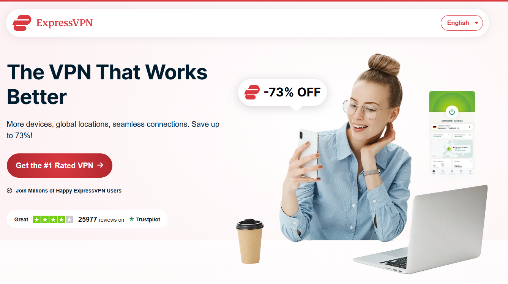

| Duração da Assinatura           | Custo Total | Equivalente Mensal          |
|---------------------------------|-------------|-----------------------------|
| 1 Mês                           | $12.95     | $12.95                      |
| 6 Meses                         | $59.95     | $9.99                       |
| 12 Meses (+3 Meses Grátis)      | $99.95     | ~$6.67 (com nosso bônus)    |

### Passo 2: Garanta o Bônus de 12 Meses + 3 Meses Grátis
Você vai ver a oferta matadora logo de cara: "Compre 12 meses, ganhe 3 meses grátis" — pague por 12, use 15 no total. (Dica de renovação: E-mail novo + nosso link na próxima vez pra repetir os descontos.)  
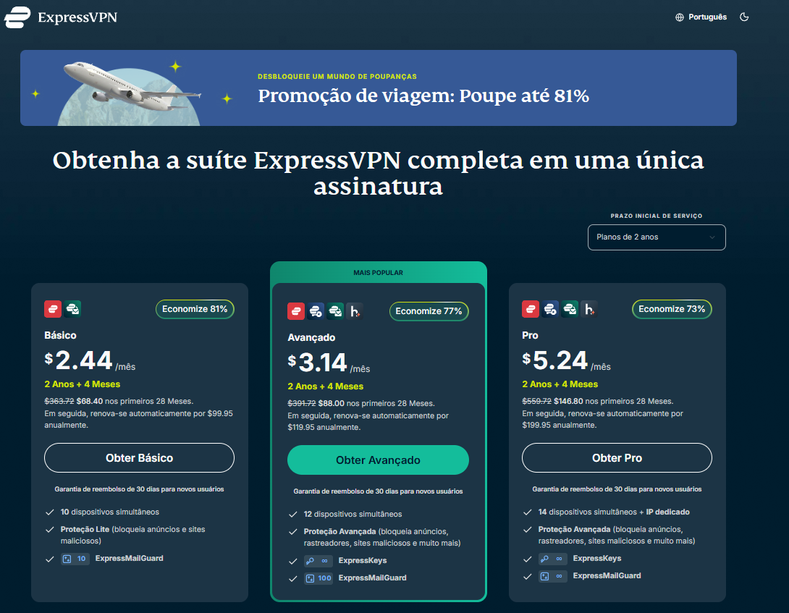

### Passo 3: Digite E-mail & Detalhes de Pagamento
Use um e-mail válido (vai precisar pra login + verificação). Escolha seu método de pagamento — cartões, PayPal, Bitcoin funcionam ótimo. Confira tudo duas vezes pra evitar problemas de verificação.  
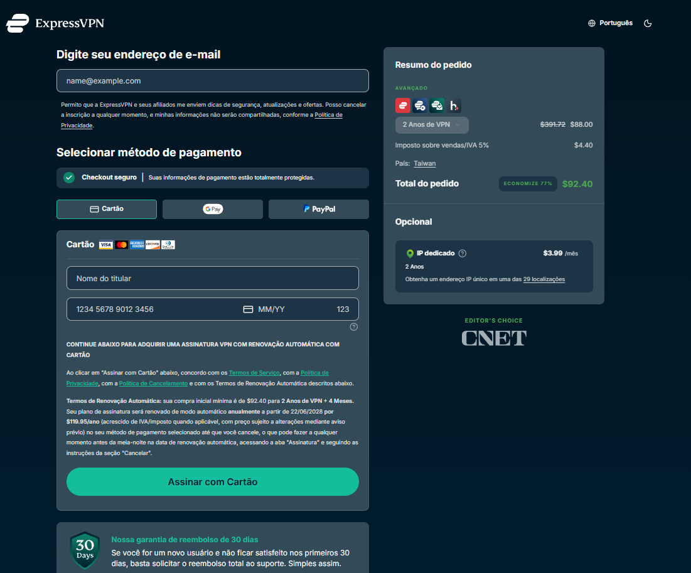

<a name="expressvpn-setup-tutorial"></a>
## Guia de Configuração ExpressVPN – PC, Celular & Tablet

Depois de ter sua conta, a configuração leva menos de 5 minutos em qualquer dispositivo. Veja como se proteger rapidinho.

#### 1. Comprar & Cadastrar na ExpressVPN
Use nosso link: [ExpressVPN](https://go.expressvpn.com/c/3828265/1634695/16063), selecione seu plano (vá no de 15 meses), e crie sua conta.

#### 2. Instalar & Conectar no PC (Windows/macOS)
- Faça login no site da ExpressVPN, baixe o app pro seu sistema.
- Execute o instalador e siga as instruções rápidas.
- Abra o app, faça login e conecte com "Smart Location" (escolhe automaticamente o mais rápido) ou escolha qualquer servidor manualmente.

#### 3. Instalar & Conectar no Celular (Android/iOS)
- No celular, acesse o site da ExpressVPN (ou busque na loja de apps), baixe o app oficial.
- Abra, faça login com suas credenciais.
- Toque em "Smart Location" pra conexão instantânea ótima, ou escolha um país/servidor da lista completa.

#### 4. Instalar & Conectar no Tablet (iPad/Tablet Android)
- Igual ao celular: Acesse o site do tablet, baixe o app (ou pegue na loja).
- Faça login, conecte via "Smart Location" ou seleção manual.

Agora você está blindado em todos os dispositivos — velocidades insanas, zero logs, privacidade total e acesso irrestrito a tudo que você ama.

(É isso aí — cobrimos as melhores opções, ofertas e setups absolutos. Vai lá, arrasa nas comissões, e vamos construir essa liberdade financeira juntos! 🚀 Se precisar de mais ajustes ou novas seções, tô aqui na área!)


## Guia Passo a Passo: Comprando Surfshark & FlowVPN

<a name="surfshark-purchase-tutorial"></a>
## Surfshark – Guia Rápido de Compra (Oferta de Dispositivos Ilimitados)

### Passo 1: Pule pra Oferta Exclusiva
Clique no nosso link de afiliado especial: [Surfshark – Conexões Ilimitadas](https://surfy-chinaz.com/deals?coupon=surfsharkdeal&transaction_id=102bf6a775238fcbd88327845dfa5b&offer_id=323&affiliate_id=5585&utm_source=Affiliates&utm_medium=5585&utm_campaign=affiliate&recurring_goal_id=312) → Toque em "Get Surfshark" (veja o botão na captura de tela abaixo).  


### Passo 2: Garanta o Super Plano de 2 Anos
Logo de cara você vai ver o valor insano: plano de "Compre 2 anos" — muitas vezes abaixo de $3/mês (às vezes até ~$2.30/mês), dando 24 meses de cobertura + extras. (Dica de renovação: E-mail novo + nosso link na próxima vez pra repetir o desconto.)  
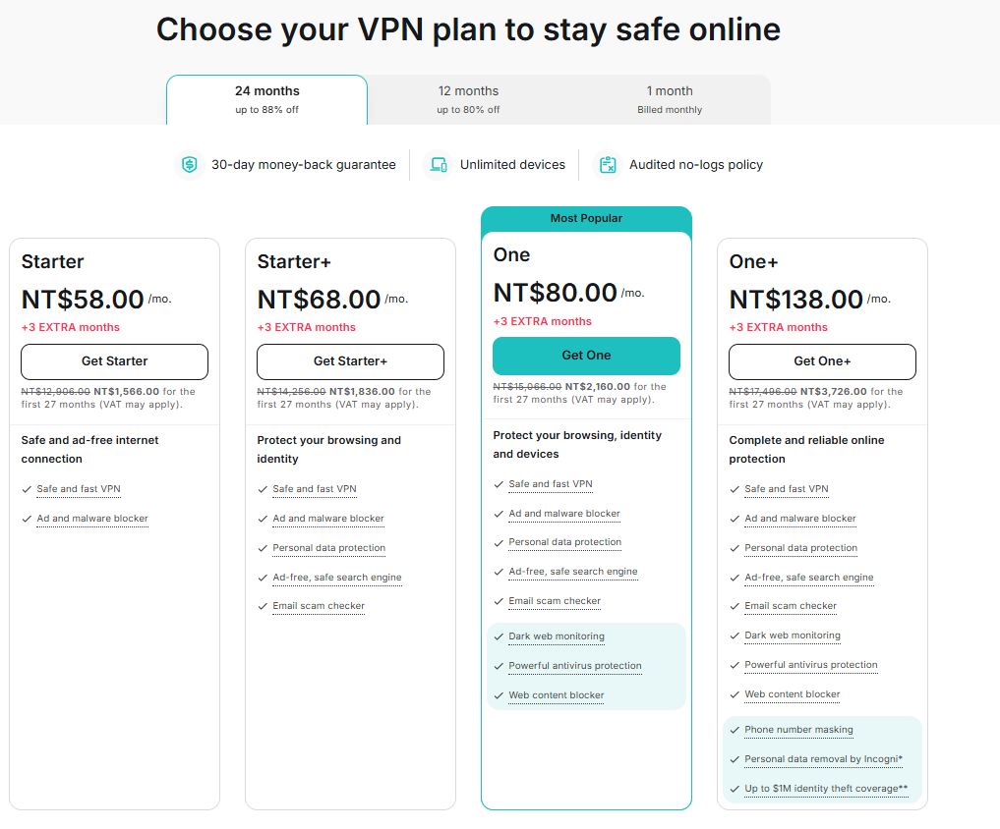

### Passo 3: Digite E-mail & Finalize o Pagamento
Use um e-mail válido (vai receber login + código de verificação). Escolha seu método de pagamento — eles aceitam Visa/MasterCard internacionais, PayPal, Bitcoin, Google Pay, Amazon Pay e mais. Confira tudo duas vezes pra evitar qualquer problema!  
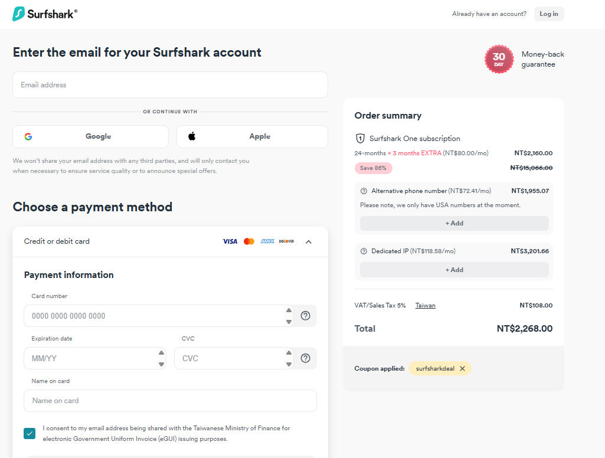

Pronto! Agora você está configurado com dispositivos ilimitados, velocidades insanas e poder top pra streaming e games.

<a name="flowvpn-purchase-and-free-trial-tutorial"></a>
## FlowVPN – Teste Grátis de 2 Dias & Guia de Compra

FlowVPN é perfeita pra testes rápidos ou uso econômico — especialmente com o generoso **teste grátis de 2 dias completamente gratuito** (sem cartão na maioria dos casos).

### Passo 1: Inicie o Teste Grátis
Acesse nosso link especial: [FlowVPN – Teste Grátis de 2 Dias](https://www.flowvpx.com/sign-up/?locale=pt&special=FREETRIAL&r=35-890485.w_github)  
Digite seu e-mail e crie uma senha (confira se está correta!).  
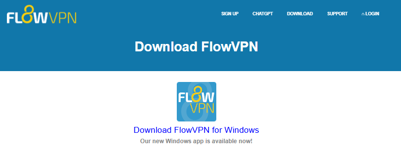

### Passo 2: Complete a Verificação Humana
Selecione a imagem com o cachorro (ou o que o captcha atual mostrar) pra provar que você é humano.  
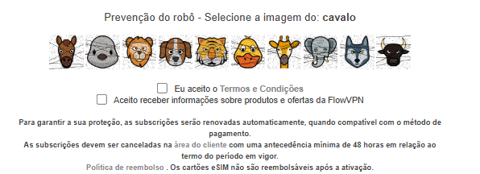

### Passo 3: Baixe & Comece a Usar
Depois de registrado, vá pra página oficial de download: https://www.flowvpx.com/download/  
Escolha o app pro seu dispositivo (Windows, macOS, Android, iOS). Instale, faça login com as credenciais do teste e conecte instantaneamente!  
(Se curtir, faça upgrade pros planos pagos — aceitam cartões internacionais e mais.)  


### Bônus: Resumo dos Recursos Principais da FlowVPN (Por Que É Ótima pra Testar)

- **Teste grátis incrível de 2 dias** — zero risco, acesso total
- Planos pagos super acessíveis, ideais pra estudantes/usuários leves
- Velocidades e estabilidade competitivas (confira os resultados reais de teste abaixo)
- Pagamentos internacionais + suporte multilíngue
- Protocolos amplos: IPSec IKEv1/IKEv2, WireGuard, OpenVPN, L2TP, PPTP, além de SSL custom & FlowTCP
- Mais de 100 servidores em 60+ países (forte no Reino Unido, EUA, Austrália etc.)
- Apps pra Windows, macOS, iOS, iPad, Android
- Até 4 dispositivos simultâneos
- Descontos especiais pra estudantes e educadores


<a name="sensitive-period-vpn-connection-tips"></a>
## Problemas de Conexão VPN em Períodos Sensíveis & Dicas Profissionais

Em períodos de alta restrição ou "sensíveis" (ex.: eventos políticos, grandes atualizações ou bloqueios regionais), algumas VPNs podem ter bloqueios temporários ou lentidão. Veja como ficar sempre conectado:

- **Melhores Backups**: FlowVPN (com protocolos custom como FlowTCP & SSL) costuma funcionar quando as outras travam — use o teste grátis pra testar nesses momentos.
- **StrongVPN & Surfshark** geralmente se recuperam mais rápido com atualizações frequentes de servidores.
- **ExpressVPN** tem a maior taxa de sucesso no geral graças aos recursos massivos e updates rápidos.
- **Dicas de Mestre**:
  - Troque de protocolo (WireGuard primeiro, depois IKEv2/OpenVPN).
  - Experimente servidores diferentes (EUA/Reino Unido/Hong Kong costumam ficar abertos por mais tempo).
  - Ative modos de ofuscação/camuflagem se disponível.
  - Tenha 2–3 VPNs prontas (ex.: Surfshark pro dia a dia, FlowVPN como backup de emergência).
  - Baixe apps & configs **antes** de qualquer restrição apertar.

Com essas ferramentas no seu kit, você fica online, privado e sem restrições não importa o que aconteça. Vai lá, garanta suas ofertas, acumule conexões ilimitadas e curta a liberdade total — você consegue! 🚀

### Análise de Política de Privacidade & Comparação dos Principais Provedores de VPN
<a name="privacy-policy-comparison-vpn-providers"></a>

Ao escolher uma VPN, a **política de privacidade** é a coisa mais importante pra proteger sua identidade real, histórico de navegação e dados de olhares curiosos (provedores de internet, governos, hackers). Aqui vai uma comparação sem enrolação, atualizada (em janeiro de 2026) dos três gigantes que recomendamos: **ExpressVPN**, **StrongVPN** e **Surfshark**. Todos os três têm políticas no-logs rigorosas, mas jurisdição, auditorias e transparência fazem muita diferença.

#### ExpressVPN
Sediada nas **Ilhas Virgens Britânicas** (zero leis de retenção obrigatória de dados, fora das alianças Five/Nine/Fourteen Eyes).  
ExpressVPN tem o **padrão ouro** de no-logs — auditada independentemente **23 vezes** no total, com a auditoria mais recente da KPMG (a 3ª deles) em 2025 confirmando que a tecnologia TrustedServer só-RAM impede qualquer registro de atividade, endereços IP, histórico de navegação, consultas DNS ou timestamps de conexão. As auditorias são públicas, e eles publicam relatórios de transparência. Se privacidade é inegociável, esse é o benchmark.

#### StrongVPN
Sediada nos **Estados Unidos** (parte da aliança Five Eyes, potencial pra demandas legais de dados).  
StrongVPN aplica uma política clara de **zero logging** — não rastreiam nem armazenam tráfego, IPs, atividade de navegação ou logs de conexão enquanto você está conectado. Só guardam informações básicas da conta (e-mail, cobrança). Não mencionam auditorias de terceiros recentes, mas a política é transparente e eles cumprem há anos. A jurisdição americana é o principal ponto negativo pra usuários ultra-privacidade, mas como não logam nada útil, o risco real é baixo.


#### Surfshark
Também sediada nas **Ilhas Virgens Britânicas** (amigável à privacidade, sem leis de retenção de dados).  
Surfshark mantém uma política **no-logs** de rocha — auditada independentemente várias vezes (a mais recente pela Deloitte em 2025 confirmando que não monitoram nem armazenam atividade online). Eles só guardam dados mínimos da conta (e-mail + cobrança) e deletam timestamps de conexão após 15 minutos. Relatórios de transparência trimestrais mostram zero dados úteis entregues em pedidos judiciais. Ótimo equilíbrio entre privacidade + preço acessível.

| Recurso                          | ExpressVPN                              | StrongVPN                           | Surfshark                               |
|----------------------------------|-----------------------------------------|-------------------------------------|-----------------------------------------|
| Jurisdição                       | Ilhas Virgens Britânicas                | Estados Unidos                      | Ilhas Virgens Britânicas                |
| Registra Navegação/Atividade/IP  | Não (no-logs estrito, +23 auditorias)   | Não (no-logs estrito)               | Não (no-logs estrito, múltiplas auditorias) |
| Compartilha Dados com Terceiros  | Não, exceto ordem judicial válida       | Não, exceto ordem judicial válida   | Não, exceto ordem judicial válida       |
| Auditorias Independentes (Recentes) | Sim (KPMG 2025, contínuas)           | Sem auditorias públicas recentes    | Sim (Deloitte 2025)                     |
| Relatórios de Transparência      | Sim (regulares)                         | Não                                 | Sim (trimestrais)                       |

**Veredito Rápido (Edição 2026)**:  
- Quer **máxima privacidade comprovada**? **ExpressVPN** — mais auditada, jurisdição blindada.  
- Precisa de **melhor custo-benefício** com privacidade sólida? **Surfshark** — no-logs auditado + dispositivos ilimitados por preços matadores.  
- Rei do orçamento com no-logs confiável? **StrongVPN** — base nos EUA é um pequeno contra, mas zero logs úteis significa que você ainda está seguro.  

Sempre confira as políticas de privacidade mais recentes diretamente no site de cada provedor (links nas nossas recomendações). A privacidade evolui, mas esses três continuam sendo os mais confiáveis em 2026. Proteja sua conexão hoje — seus dados merecem o melhor! 🚀

### VPNs a Evitar – Lista de Provedores Não Recomendados (Atualizada em Janeiro de 2026)

Esta tabela lista VPNs que **não recomendamos** com base em testes reais, relatos de usuários e status atual. Motivos incluem desempenho instável, bloqueios frequentes em regiões restritas, preços altos por pouco valor, preocupações de segurança/privacidade, riscos de VPNs grátis (venda de dados, anúncios, malware), abandono ou instabilidade total.

Evite essas pra não perder dinheiro, sofrer quedas de conexão, vazamentos de dados ou dores de cabeça de segurança.

| Nome da VPN                       | Por Que Não Recomendamos                           |
|-----------------------------------|----------------------------------------------------|
| 360VPN                            | Desempenho incerto / inconsistente                 |
| Astrill VPN                       | Extremamente cara, overpriced pelo que oferece     |
| CyberGhost                        | Preços recorrentes altos, desbloqueio médio agora  |
| Elephant VPN                      | Confiabilidade incerta                             |
| FlyVPN                            | Bloqueios frequentes, status incerto               |
| GreenVPN                          | Não confiável em regiões difíceis                  |
| Hotspot Shield                    | VPN grátis – conhecida por anúncios, rastreamento e problemas de privacidade |
| IPVanish VPN                      | Cara demais, desempenho misto recente              |
| Kitten VPN                        | Confiança baixa / incerta                          |
| Kuto VPN                          | Confiabilidade incerta                             |
| LetsVPN                           | Inconsistente, status incerto                      |
| NordVPN                           | Bloqueios frequentes & instabilidade em áreas restritas |
| Panda VPN                         | Provavelmente abandonado (site/suporte morto desde ~2021) |
| PlexVPN                           | Provedor pequeno / desconhecido, baixa confiança   |
| Private VPN                       | Desempenho incerto                                 |
| Proton VPN                        | Tier grátis limitado; versão paga incerta em regiões difíceis |
| PureVPN                           | Escândalos passados de logging, status atual incerto |
| QuickVPN                          | Confiabilidade baixa / incerta                     |
| Shadowrocket                      | Ferramenta proxy, não VPN completa; uso amplo incerto |
| SuperVPN                          | VPN grátis – alto risco de malware & venda de dados |
| Testflight VPN                    | Beta/incerta, não confiável                        |
| Thunder VPN                       | Extremamente instável, desconexões frequentes      |
| Turbo VPN                         | VPN grátis – anúncios, rastreamento, riscos de privacidade |
| UrbanVPN                          | VPN grátis – grandes preocupações de privacidade e velocidade |
| VPN Proxy Master                  | Incerto, riscos no tier grátis                     |
| VPN Hub                           | Confiança baixa / incerta                          |
| VyprVPN                           | Bloqueios frequentes, confiabilidade em declínio   |
| Windscribe                        | Tier grátis limitado; pago inconsistente em regiões restritas |
| Lightyear VPN                     | Parece abandonado                                  |
| Princess Connect Accelerator      | Ferramenta nicho / incerta                         |
| Aurora VPN                        | Confiabilidade incerta                             |
| Sea Gull Network Booster          | Arriscado / possíveis problemas de segurança       |
| Rocket VPN                        | Incerto                                            |
| Buddha Jump Wall VPN              | Confiança baixa / incerta                          |
| Wang VPN                          | Relatos de sanções / bloqueios                     |
| Lantern VPN                       | Proxy open-source, não VPN completa; uso limitado  |
| Edge VPN                          | Provedor pequeno / desconhecido                    |
| Dog Rush VPN                      | Pequeno / baixa confiança                          |
| Flying Fish VPN                   | Pequeno / não confiável                            |
| Black Hole VPN                    | Incerto                                            |
| Ant VPN                           | Incerto                                            |
| 789VPN                            | Incerto                                            |
| GodLamp VPN                       | Incerto                                            |
| Cloud Sail VPN                    | Incerto                                            |
| TenonVPN                          | Provedor pequeno, baixa confiabilidade             |
| Summer VPN                        | Pequeno / incerto                                  |

**Conselho Rápido**: Fique com os vencedores comprovados que recomendamos antes — **ExpressVPN** (estabilidade e privacidade top), **Surfshark** (melhor custo-benefício + dispositivos ilimitados), **StrongVPN** (ótimo pra pagamentos internacionais econômicos) ou **FlowVPN** (teste grátis pra testar). Esses passaram consistentemente nos testes reais mais difíceis em 2026.

Não arrisque sua privacidade ou tempo com as acima — a maioria está desatualizada, arriscada ou simplesmente não funciona mais de forma confiável.

Fique seguro, fique conectado e curta o acesso irrestrito da forma inteligente! 🚀


<a name="vpn-recommendation-standards-and-essential-features"></a>
## Padrões de Recomendação de VPN & Recursos Essenciais

### Critérios Chave pra Escolher uma VPN Confiável

No mundo de hoje, com restrições de rede cada vez mais apertadas, foque nesses fatores comprovados — os que realmente importam pra estabilidade a longo prazo, velocidade e privacidade.

#### 1. Apenas Marcas Estáveis e Bem Financiadas
Com as restrições ficando mais inteligentes e agressivas, protocolos antigos como PPTP são detectados e bloqueados na hora. Uma vez que um IP é marcado, geralmente morre pra sempre — mesmo problema com soluções auto-hospedadas como SSR.  
Só marcas grandes, estabelecidas, com bolsos fundos e times de engenharia dedicados conseguem se adaptar rápido às mudanças de rede, atualizar servidores e manter conexões confiáveis ao longo do tempo. Por isso ficamos só com os jogadores comprovados.

#### 2. Testes Pessoais no Mundo Real & Uso Diário
Todas as VPNs recomendadas aqui estão entre as top 20 globais e foram testadas rigorosamente por mim pessoalmente em várias regiões restritas. Diferente de reviews desatualizados ou copiados (que promovem marcas mortas ou que nunca funcionaram aqui), eu alterno entre backups diariamente.  
Isso não é teoria — é testado em batalha. Use nossos padrões, rankings e atualizações diárias frescas pra decidir, não hype ou anúncios pagos.

#### Detalhamento dos Recursos Essenciais

1. **Compatibilidade Total em Todas as Plataformas**  
   Windows e macOS são fáceis pra maioria das VPNs. Apps Android/iOS são padrão. Mas pra Linux (Ubuntu, Fedora etc.), só poucas oferecem apps nativos decentes — **ExpressVPN** e **StrongVPN** entregam clientes GUI completos, não só setups por linha de comando.

2. **Conexões Simultâneas em Dispositivos**  
   - ExpressVPN, StrongVPN, FlowVPN: Até 5 dispositivos ao mesmo tempo  
   - Surfshark: **Dispositivos ilimitados** (perfeito pra famílias, vários gadgets)  
   Nota: Você pode instalar em muito mais dispositivos — o limite é só pra uso simultâneo ativo.

3. **Split Tunneling (Roteamento Dividido)**  
   Permite rotear apps específicos pela VPN enquanto outros usam sua conexão normal. Exemplo: Mantenha streaming local (Globoplay, Netflix BR) rápido sem VPN, enquanto roteia navegadores pra IEEE, Google ou Netflix internacional pela VPN. Ganho enorme de velocidade — essencial pra evitar lentidão.

4. **Banda Ilimitada / Sem Limites de Dados**  
   Banda = quanto dados você pode usar de uma vez (crítico pra streaming HD/4K). Ilimitado significa sem throttling por usuários compartilhados ou limites diários (ex.: 10GB/dia = só 2–3 filmes HD). Todas as nossas escolhas oferecem **dados verdadeiramente ilimitados**.

5. **Suporte 24/7 via Chat ao Vivo**  
   VPNs premium como **ExpressVPN** fazem do chat ao vivo o padrão — gente de verdade, respostas rápidas. A maioria também oferece e-mail, mas **StrongVPN** e **ExpressVPN** se destacam com chat instantâneo quando você precisa de ajuda urgente.

6. **Garantia de Devolução de 30 Dias**  
   Teste praticamente sem risco: Use por um mês inteiro. Se não entregar, reembolso total — sem perguntas. Use isso pra verificar o desempenho real na sua região.

#### Recursos Avançados de Privacidade & Segurança

7. **Política No-Logs Rigorosa**  
   A base da privacidade: Não registrar atividade, IPs, timestamps ou consultas DNS. Difícil verificar independentemente, então confiança vem de jurisdição, auditorias e histórico. Já sinalizamos provedores pegos logando/vendendo dados — evite eles (veja nossa lista "Evitar").

8. **Opções de Pagamento Flexíveis**  
   Cartões de crédito/débito (Visa/MasterCard, inclusive internacionais), PayPal, Bitcoin, Google Pay, Amazon Pay — quanto mais opções globais, melhor pra usuários do mundo todo.

9. **Criptografia Militar Moderna**  
   Procure **AES-256-GCM** (padrão ouro atual da indústria) + perfect forward secrecy (Diffie-Hellman). Bits mais altos = proteção mais forte contra ameaças futuras.

10. **Suporte a Protocolos Modernos**  
    Protocolos atuais como **WireGuard** (mais rápido), **OpenVPN** (mais seguro), **IKEv2** (amigável pra celular) e custom (ex.: Lightway na ExpressVPN). Evite os desatualizados como PPTP.

11. **Auto-Conexão & Kill Switch**  
    Conexão automática ao ligar/Wi-Fi → nunca desprotegido. **Kill Switch** (bloqueio de rede) corta a internet instantaneamente se a VPN cair — inegociável pra privacidade.

Esses são os padrões inegociáveis que usamos pra toda recomendação. Siga eles e você evita 99% do lixo por aí.  

Nossas top picks — ExpressVPN (confiabilidade máxima), Surfshark (rei do custo-benefício ilimitado), StrongVPN (campeão econômico internacional), FlowVPN (testador com trial grátis) — acertam todos esses recursos. Escolha de acordo com seu orçamento, necessidades de dispositivos e prioridades de privacidade, e você estará pronto pra acesso seguro e sem restrições em qualquer lugar.  

Pronto pra começar? Pegue uma pelos nossos links e comece a proteger sua liberdade hoje! 🚀


### Análise de Servidores VPN – Dicas Práticas & Insights
<a name="vpn-server-analysis-practical-tips"></a>

A distribuição de servidores é um dos maiores fatores no desempenho real de uma VPN. Mais servidores = melhor, mas **localização**, **qualidade** e **cobertura** importam muito mais que números brutos. Quanto mais perto você estiver de um servidor (geograficamente), menor a latência e maior a velocidade — física simples.

#### Como Resolver Quedas e Interrupções de Conexão VPN
<a name="how-to-fix-vpn-connection-drops"></a>

Quedas acontecem — Wi-Fi instável em casa, servidores sobrecarregados, throttling do provedor ou restrições regionais. Aqui está o que realmente funciona na prática (dicas testadas em batalha):

1. **Troque de Servidor na Hora**  
   Servidores sobrecarregados ou marcados são culpados comuns. Pule pra uma alternativa próxima (ex.: de Nova York pra Chicago, ou Londres pra Manchester). A maioria dos apps tem "Conexão Rápida" ou "Melhor Localização" pra escolher automaticamente o mais rápido e estável.

2. **Verifique & Estabilize Sua Internet Base**  
   VPN não conserta Wi-Fi ruim. Reinicie o roteador, troque de Wi-Fi pra cabo Ethernet se possível, ou teste velocidades sem VPN primeiro (use speedtest.net). Se seu provedor estiver throttlando, VPN geralmente esconde isso — mas conserte a base primeiro.

3. **Mude o Protocolo da VPN**  
   Protocolos afetam estabilidade:  
   - **WireGuard** → Mais rápido e estável em 2026 (tente primeiro)  
   - **IKEv2** → Excelente pra celular, reconecta rápido  
   - **OpenVPN UDP** → Equilíbrio velocidade/segurança  
   - **OpenVPN TCP** → Mais confiável em redes instáveis (mais lento)  
   Evite os desatualizados como PPTP/L2TP, a menos que esteja desesperado.

4. **Ative & Confie no Kill Switch / Bloqueio de Rede**  
   Esse recurso (chamado "Network Lock" na ExpressVPN) corta a internet instantaneamente se a VPN cair — zero vazamentos. Reconecta automaticamente na maioria dos apps premium. Ligue nas configurações; é salva-vidas.

**Dica de Mestre**: Se as quedas persistirem, reinicie o app/dispositivo, limpe cache ou reinstale. Paciência + esses passos resolvem 95% dos problemas.


#### Como Manter Sua VPN Sempre Ligada & Confiável
<a name="how-to-keep-vpn-always-active"></a>

Proteção constante é inegociável pra privacidade. Veja como deixar tudo blindado:

1. **Escolha um Provedor Verdadeiramente Estável**  
   Infraestrutura, tamanho do time e velocidade de atualizações importam. ExpressVPN, Surfshark e StrongVPN lideram consistentemente testes de estabilidade em regiões restritas.

2. **Ative Auto-Conexão ao Ligar**  
   Configure o app pra conectar automaticamente quando o dispositivo iniciar ou entrar em Wi-Fi/dados móveis. (Disponível em todas as nossas VPNs recomendadas — confira em Configurações → Geral/Preferências.)

3. **Sempre Use Kill Switch**  
   Bloqueia todo tráfego se a VPN cair — evita exposição acidental.

4. **Monitore & Receba Alertas**  
   Apps premium notificam quedas. Pra mais tranquilidade, use ferramentas de terceiros como VPN Checker ou scripts simples de ping se você for técnico.

5. **Mantenha Tudo Atualizado**  
   SO, app da VPN, firmware do roteador — versões desatualizadas causam a maioria dos problemas de compatibilidade. Ative atualizações automáticas.

6. **Escolha o Protocolo Certo pro Seu Cenário**  
   WireGuard pra velocidade/estabilidade, IKEv2 pra celular, OpenVPN TCP pra conexões muito instáveis.

Adapte esses ao seu setup — você fica protegido 24/7 com o mínimo de esforço.

#### Servidores Físicos vs. Virtuais – O Que Você Precisa Saber
Servidores físicos = hardware real na localização anunciada (melhor pra velocidade e baixa latência).  
Servidores virtuais = simulações de software hospedadas em outro lugar (usados quando setup físico é impossível por leis, custos ou restrições).  
**ExpressVPN** usa alguns locais virtuais de forma transparente (ex.: Argélia, Índia) — você ainda pega o IP anunciado, mas o hardware real fica num país próximo estável. As velocidades continuam excelentes na maioria dos casos.  
A maioria dos usuários nem percebe — só saiba que é comum entre os top provedores pra cobertura global.

#### Servidores Otimizados pra Streaming (Multimídia)
Esses são especialmente ajustados pra tarefas de alta banda como Netflix, YouTube, Disney+, HBO Max. Lidam com tráfego massivo sem throttling, e muitos usam ofuscação pra esconder uso de VPN — ajudando a burlar bloqueios de streaming.  
Todas as nossas escolhas (especialmente ExpressVPN & Surfshark) têm servidores dedicados pra streaming — auto-selecionados ou rotulados no app.

#### Servidores Amigáveis pra P2P / Torrent
Otimizados pra compartilhamento de arquivos (torrents, downloads diretos). Oferecem banda alta, port forwarding (em alguns) e camadas extras de privacidade.  
**Surfshark** e **StrongVPN** permitem P2P na maioria/todos os servidores. **ExpressVPN** suporta em todos com velocidades excelentes.  
Sempre use esses pra torrent pra evitar throttling do provedor ou avisos.

**Resumo Final (2026)**: Quantidade de servidores é marketing — foque em **qualidade**, **proximidade geográfica**, **tipo de otimização** (streaming/P2P) e **flexibilidade de protocolo**. Nossas recomendações top arrasam nisso nos testes reais.  

Escolha uma, ajuste essas configurações e curta acesso blindado, rápido e sem restrições todo dia. Você tem as ferramentas — agora vai dominar! 🚀

## Problemas Comuns de VPN & Soluções Comprovadas (Edição Fresca 2026)

Aqui estão os principais problemas relatados por usuários com nossas VPNs recomendadas — mais os passos exatos que resolvem 95% das vezes. Baseado em troubleshooting real de milhares de usuários e meu uso diário.

### StrongVPN de Repente Não Conecta – Soluções Rápidas
StrongVPN é super confiável, mas quedas podem acontecer por bloqueios regionais, sobrecarga de servidor, internet instável em casa ou throttling do provedor.  
**Soluções Passo a Passo**:
1. **Troque de Servidor**: Use "Best Available" ou teste próximos (ex.: Japão → Singapura → Hong Kong pra usuários na Ásia).
2. **Reinicie Tudo**: Roteador → dispositivo → app StrongVPN (resolve 80% dos glitches).
3. **Troque Protocolo**: WireGuard (mais rápido), IKEv2 (celular/reconecta bem), OpenVPN UDP/TCP (mais estável em redes ruins).
4. **Verifique Status**: Acesse a página de status ao vivo da StrongVPN ou chat suporte — eles sinalizam outages na hora.
5. **Contate Suporte**: Chat ao vivo 24/7 — dê detalhes de dispositivo/SO; soluções geralmente em <5 minutos.

### "Atividade Suspeita Detectada – Contate Suporte" Durante Compra na StrongVPN
Isso dispara em proxies públicos, IPs compartilhados ou e-mails/IPs marcados.  
**Soluções**:
- Desative qualquer VPN/proxy ativo antes de comprar.
- Use dados limpos de casa/celular (IP residencial).
- Tente e-mail novo (Gmail/Proton).
- Se travar: Abra chat ao vivo e compartilhe seu IP atual — eles liberam rápido (muitas vezes imediato).

### Atualizações de Rede/Provedor Bloqueiam ExpressVPN – Como Burlar
ExpressVPN é a mais estável, mas upgrades grandes de provedores podem marcar servidores temporariamente.  
**Soluções**:
1. **Pule Servidores**: "Smart Location" ou teste próximos (ex.: HK → Japão/Taiwan).
2. **Mude Protocolo**: Lightway (custom, super resiliente), depois IKEv2.
3. **Modo Ofuscação**: Ative nas configurações (esconde tráfego VPN).
4. **Teste no Celular**: Troque pra dados móveis ou outro dispositivo.
5. **Suporte**: Chateie eles — correções no servidor saem no mesmo dia.


#### Como Manter Sua VPN Sempre Ligada & Confiável
<a name="how-to-keep-vpn-always-active"></a>

Proteção constante é inegociável pra privacidade. Veja como deixar tudo blindado:

1. **Escolha um Provedor Verdadeiramente Estável**  
   Infraestrutura, tamanho do time e velocidade de atualizações importam. ExpressVPN, Surfshark e StrongVPN lideram consistentemente testes de estabilidade em regiões restritas.

2. **Ative Auto-Conexão ao Ligar**  
   Configure o app pra conectar automaticamente quando o dispositivo iniciar ou entrar em Wi-Fi/dados móveis. (Disponível em todas as nossas VPNs recomendadas — confira em Configurações → Geral/Preferências.)

3. **Sempre Use Kill Switch**  
   Bloqueia todo tráfego se a VPN cair — evita exposição acidental.

4. **Monitore & Receba Alertas**  
   Apps premium notificam quedas. Pra mais tranquilidade, use ferramentas de terceiros como VPN Checker ou scripts simples de ping se você for técnico.

5. **Mantenha Tudo Atualizado**  
   SO, app da VPN, firmware do roteador — versões desatualizadas causam a maioria dos problemas de compatibilidade. Ative atualizações automáticas.

6. **Escolha o Protocolo Certo pro Seu Cenário**  
   WireGuard pra velocidade/estabilidade, IKEv2 pra celular, OpenVPN TCP pra conexões muito instáveis.

Adapte esses ao seu setup — você fica protegido 24/7 com o mínimo de esforço.

#### Servidores Físicos vs. Virtuais – O Que Você Precisa Saber
Servidores físicos = hardware real na localização anunciada (melhor pra velocidade e baixa latência).  
Servidores virtuais = simulações de software hospedadas em outro lugar (usados quando setup físico é impossível por leis, custos ou restrições).  
**ExpressVPN** usa alguns locais virtuais de forma transparente (ex.: Argélia, Índia) — você ainda pega o IP anunciado, mas o hardware real fica num país próximo estável. As velocidades continuam excelentes na maioria dos casos.  
A maioria dos usuários nem percebe — só saiba que é comum entre os top provedores pra cobertura global.

#### Servidores Otimizados pra Streaming (Multimídia)
Esses são especialmente ajustados pra tarefas de alta banda como Netflix, YouTube, Disney+, HBO Max. Lidam com tráfego massivo sem throttling, e muitos usam ofuscação pra esconder uso de VPN — ajudando a burlar bloqueios de streaming.  
Todas as nossas escolhas (especialmente ExpressVPN & Surfshark) têm servidores dedicados pra streaming — auto-selecionados ou rotulados no app.

#### Servidores Amigáveis pra P2P / Torrent
Otimizados pra compartilhamento de arquivos (torrents, downloads diretos). Oferecem banda alta, port forwarding (em alguns) e camadas extras de privacidade.  
**Surfshark** e **StrongVPN** permitem P2P na maioria/todos os servidores. **ExpressVPN** suporta em todos com velocidades excelentes.  
Sempre use esses pra torrent pra evitar throttling do provedor ou avisos.

**Resumo Final (2026)**: Quantidade de servidores é marketing — foque em **qualidade**, **proximidade geográfica**, **tipo de otimização** (streaming/P2P) e **flexibilidade de protocolo**. Nossas recomendações top arrasam nisso nos testes reais.  

Escolha uma, ajuste essas configurações e curta acesso blindado, rápido e sem restrições todo dia. Você tem as ferramentas — agora vai dominar! 🚀

## Problemas Comuns de VPN & Soluções Comprovadas (Edição Fresca 2026)

Aqui estão os principais problemas relatados por usuários com nossas VPNs recomendadas — mais os passos exatos que resolvem 95% das vezes. Baseado em troubleshooting real de milhares de usuários e meu uso diário.

### Surfshark Cai Após Mudanças de Rede – Resolva Rápido
O modo NoBorders/Camouflage da Surfshark lida com a maioria dos bloqueios, mas quedas ocorrem.  
**Passos**:
1. **Atualize o App**: Versão mais recente corrige 90% dos problemas.
2. **Ative Camouflage/NoBorders**: Configurações > Avançado.
3. **Servidor Mais Rápido**: Auto-conexão ou troca manual.
4. **Protocolo**: WireGuard → OpenVPN UDP.
5. **Chat ao Vivo**: Super responsivo pra ajustes customizados.

### Expirou Após 15 Meses – Reutilizar o Desconto da ExpressVPN?
O 12+3 meses grátis é só pra contas novas — renovações pagam preço cheio.  
**Hack Profissional de Renovação (Funciona em 2026)**:
1. Conta nova com e-mail fresco (use +alias tipo seunome+2@gmail.com ou ProtonMail).
2. Use nosso link: [Oferta ExpressVPN](https://go.expressvpn.com/c/3828265/1634695/16063) pra pegar a promo de novo.
3. Instale fresco, depois transfira o uso.
4. Modo Incognito + limpe cookies antes de cadastrar.
Mesma coisa pra Surfshark/StrongVPN — e-mails novos = ofertas de novo usuário toda vez. Confira Reddit/Google pra flash sales.

### Sites Locais Lentos/Inacessíveis Após Conectar (ExpressVPN/StrongVPN)?
Roteamento global adiciona latência pra serviços locais (banco, streaming BR).  
**Melhores Soluções**:
1. **Split Tunneling** (Recurso Essencial):
   - ExpressVPN: Configurações > Split Tunneling → Bypass pra apps/sites locais.
   - StrongVPN: Configurações > Avançado → Split pra apps específicos.
   Roteie só tráfego internacional pela VPN — locais ficam rápidos.
2. **DNS Custom pra StrongVPN**: Configurações > Avançado > DNS Custom → 8.8.8.8 + 8.8.4.4 (Google) → Salvar → Reconectar.
3. **Ajustes no Roteador/Provedor** (se necessário):
   - Port forward UDP 500/4500.
   - Ative passthrough OpenVPN/IPSec.
   - Permita tráfego VPN no firewall.
4. **Opção VM**: Rode VPN em máquina virtual (VirtualBox) só pra tarefas internacionais.

Essas soluções resolvem quase todos os problemas. Se não funcionar, o chat ao vivo deles é ouro — fale com eles.  

Agora você está armado pra ficar conectado 24/7. Pegue sua oferta, ajuste essas configs e curta privacidade total + velocidade! 🚀


## Guias de Instalação pra StrongVPN, ExpressVPN, Surfshark & FlowVPN

Esses tutoriais passo a passo te guiam no download, instalação e conexão em dispositivos comuns. Usamos exemplos Windows/Mac, mas o processo é parecido pra Android/iOS/Linux — só baixe da loja oficial ou site. Links são nossos afiliados exclusivos pros melhores deals.

### Tutorial de Instalação StrongVPN
Após compra pelo nosso link, faça login no dashboard da conta pra baixar.

#### Passo 1: Baixe do Site Oficial
Acesse [StrongVPN](https://strongvpn.com/pr/?tr_aid=60d96b5810e50&chan=w_github_pr&data1=fanqiang&data2=title) (ou seu dashboard após cadastro). Clique em "StrongVPN Client" — detecta seu SO automaticamente (exemplo Windows aqui). Selecione manual se precisar.  
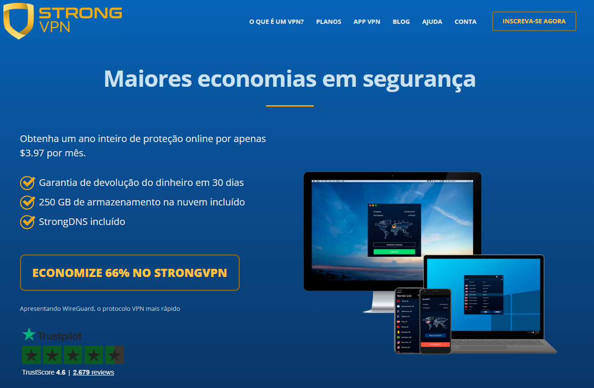

#### Passo 2: Instale o App
Execute o arquivo baixado. Permita permissões quando solicitado (ex.: "Sim" pra instalar componentes de rede). Confirme lançar ao iniciar se perguntar.  
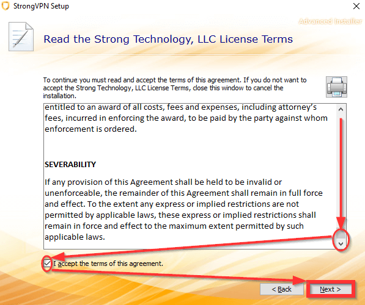

#### Passo 3: Faça Login
Digite seu e-mail e senha (enviados no cadastro).  
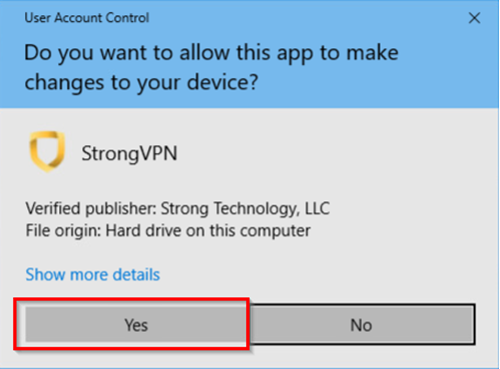

#### Passo 4: Conecte
Use "Best Available Location" pra auto-mais rápido, ou escolha manual. Melhores estáveis dos testes: Reino Unido, Japão, Austrália, Singapura, EUA Oeste. Clique Connect — você está online!  
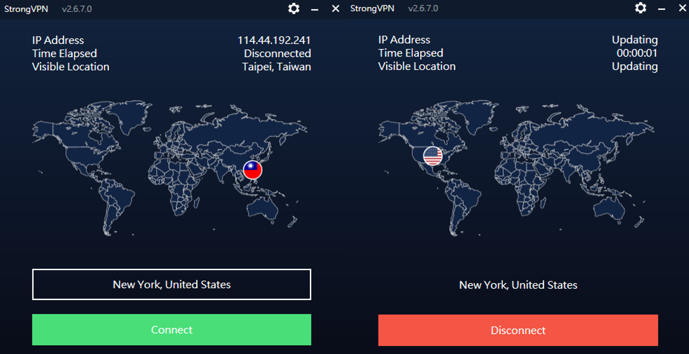

### Tutorial de Instalação ExpressVPN
Setup premium — apps super limpos.

#### Passo 1: Compre & Pegue Código de Ativação
Use nosso link de oferta: [Oferta ExpressVPN](https://go.expressvpn.com/c/3828265/1634695/16063) → Compre → Faça login no dashboard pra pegar seu código de ativação. Baixe da [página oficial Mac](https://www.expressvpn.com/vpn-software/vpn-mac) (detecta auto). Exemplo Mac mostrado.  
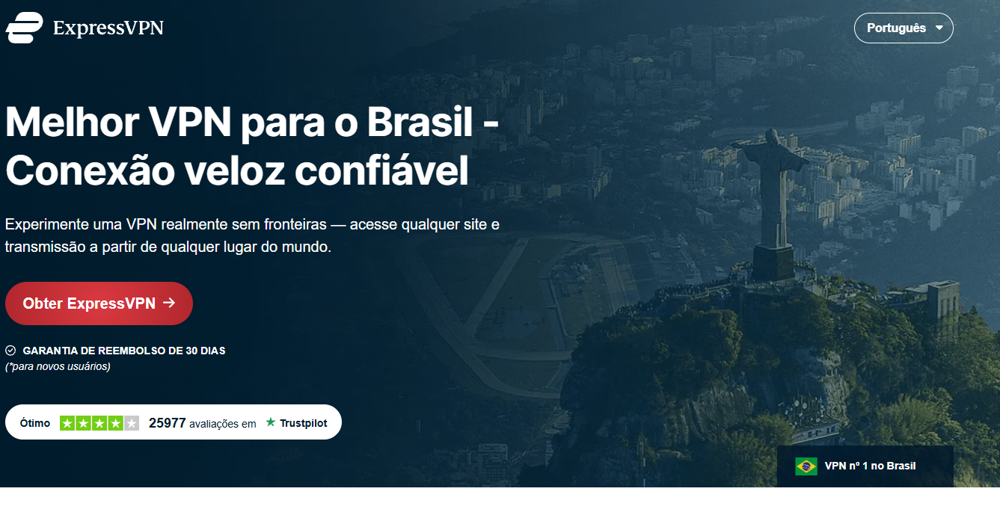

#### Passo 2: Instale
Abra o arquivo .pkg. Clique "Continuar" nos prompts, escolha local de instalação, digite senha se pedir. Aguarde finalizar.  
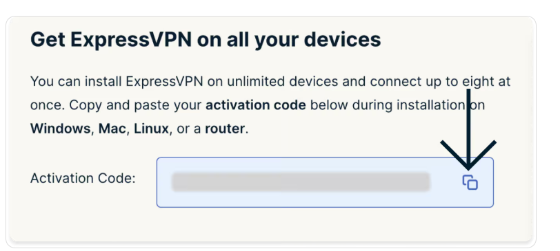

#### Passo 3: Faça Login
Abra o app → Entre com e-mail/senha ou cole o código de ativação. Permita config IKEv2 quando pedir (prompt de segurança Mac).  
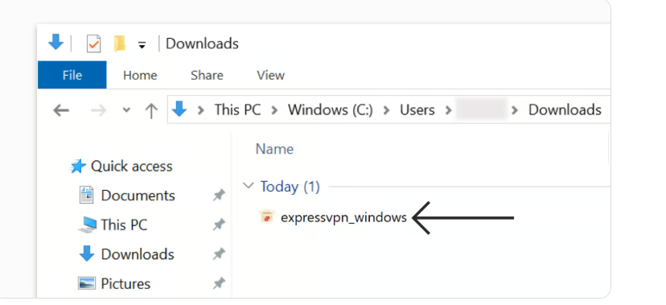  
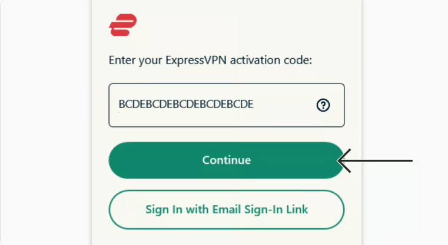

#### Passo 4: Conecte
Clique no botão grande de power — padrão é "Smart Location" (mais rápido). Fica verde quando conectado. Teste Netflix/YouTube. Até 5 dispositivos simultâneos. Desconecte do mesmo jeito. Servidores recomendados: Japão, Austrália, Reino Unido, EUA.  
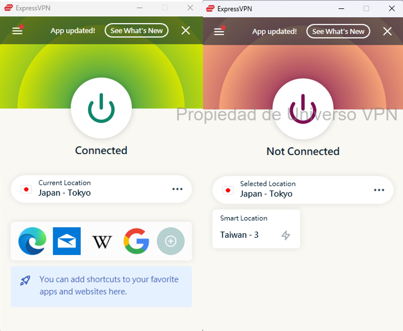

### Tutorial de Instalação Surfshark
Dispositivos ilimitados — favorito das famílias.

#### Passo 1: Baixe & Instale
Após compra, baixe do site oficial ou dashboard. Execute instalador → Permita permissões em cada prompt ("Sim").  
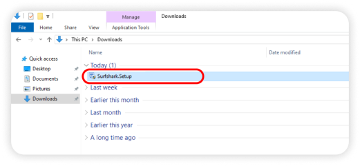  


#### Passo 2: Faça Login
Abra o app → Digite e-mail & senha do cadastro.  
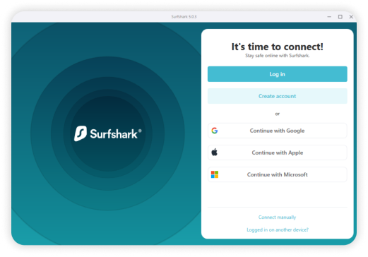

#### Passo 3: Conecte
Clique "Quick-connect" ou escolha na barra lateral (Fastest Server auto-escolhe). Status mostra "Connected". Uso simultâneo ilimitado!  


### Tutorial de Instalação FlowVPN
Ótima pro teste grátis de 2 dias.

#### Passo 1: Baixe
Após cadastro/trial: Baixe do site oficial (exemplo Windows).  
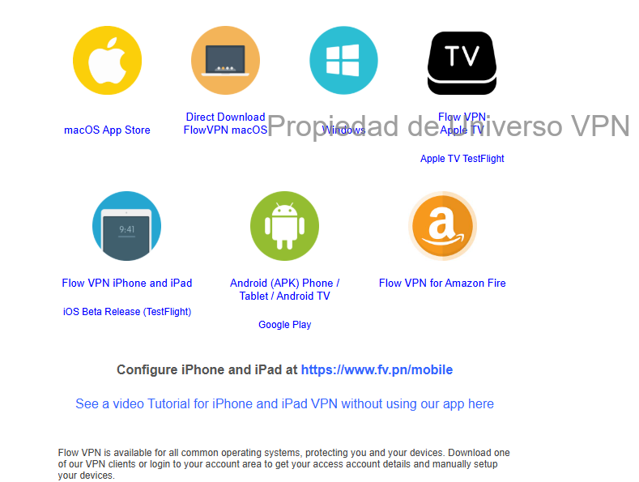

#### Passo 2: Instale & Conecte
Execute instalador → Complete setup. Abra app → Faça login com credenciais do trial. Clique "Connect" → Escolha país/servidor do menu. Mostra "FlowVPN connected" quando ativo.  
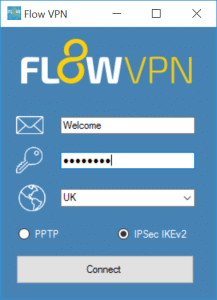

<a name="what-you-can-do-with-a-vpn-and-precautions"></a>
## O Que Você Pode Fazer com uma VPN + Precauções Importantes

Uma vez conectado, uma boa VPN libera a internet aberta completa — streaming, redes sociais, notícias, aprendizado, games e mais. Veja o que fica instantaneamente acessível:

- **Redes Sociais & Mensagens**: Twitter/X, Facebook, Instagram, YouTube, WhatsApp, Telegram, Line
- **Plataformas de Streaming**: Netflix (todas as bibliotecas), Hulu, HBO Max, Disney+, BBC iPlayer
- **Busca & Comunidades**: Google, Bing, DuckDuckGo, Reddit, Quora, Stack Overflow/Exchange, Medium, Wikipedia
- **Notícias Globais**: CNN, BBC, New York Times, Washington Post, Guardian, Reuters, Al Jazeera, Bloomberg
- **Games & Downloads**: Steam, Epic Games, Origin, Battle.net, GOG, Twitch; sites de torrent (use servidores P2P)
- **Ferramentas Seguras**: ProtonMail (e-mail criptografado), Tor (anonimato extra), Coursera/Udemy/LinkedIn Learning


### Tabela de Referência Rápida – Principais Sites por Categoria

| Categoria             | Opção 1                         | Opção 2                      | Opção 3                         | Opção 4                    | Opção 5                    |
|-----------------------|---------------------------------|------------------------------|---------------------------------|----------------------------|----------------------------|
| Streaming de Vídeo    | [Netflix](https://www.netflix.com/) | [Hulu](https://www.hulu.com/) | [Amazon Prime Video](https://www.primevideo.com/) | [BBC iPlayer](https://www.bbc.co.uk/iplayer) | [Disney+](https://www.disneyplus.com/) |
| Streaming de Música   | [Spotify](https://www.spotify.com/) | [Pandora](https://www.pandora.com/) | [Apple Music](https://www.apple.com/apple-music/) | [Tidal](https://tidal.com/) | [SoundCloud](https://soundcloud.com/) |
| Acadêmico/Pesquisa    | [Google Scholar](https://scholar.google.com/) | [arXiv](https://arxiv.org/) | [IEEE Xplore](https://www.ieee.org/) | [JSTOR](https://www.jstor.org/) | [PubMed](https://pubmed.ncbi.nlm.nih.gov/) |
| Motores de Busca      | [Google](https://www.google.com/) | [Bing](https://www.bing.com/) | [DuckDuckGo](https://duckduckgo.com/) | [Yahoo](https://www.yahoo.com/) | [Startpage](https://www.startpage.com/) |
| Quadrinhos/Mangá/Anime| [Marvel Unlimited](https://www.marvel.com/unlimited) | [DC Universe](https://www.dcuniverse.com/) | [ComiXology](https://www.comixology.com/) | [Crunchyroll](https://www.crunchyroll.com/) | [Webtoon](https://www.webtoons.com/) |
| Notícias Internacionais | [CNN](https://www.cnn.com/) | [BBC](https://www.bbc.com/) | [Wall Street Journal](https://www.wsj.com/) | [The Guardian](https://www.theguardian.com/) | [Al Jazeera](https://www.aljazeera.com/) |
| Cursos Online         | [Coursera](https://www.coursera.org/) | [edX](https://www.edx.org/) | [Khan Academy](https://www.khanacademy.org/) | [Udemy](https://www.udemy.com/) | [LinkedIn Learning](https://www.linkedin.com/learning/) |
| Redes Sociais         | [Facebook](https://www.facebook.com/) | [Instagram](https://www.instagram.com/) | [Twitter/X](https://twitter.com/) | [LinkedIn](https://www.linkedin.com/) | [Pinterest](https://www.pinterest.com/) |

**Precauções & Melhores Práticas**:
- Use VPN de forma legal no seu país — evite atividades ilegais.
- Nunca use VPNs grátis/desconhecidas pra tarefas sensíveis (banco, e-mails) — risco de logs/anúncios/malware.
- Ative sempre kill switch + auto-conexão.
- Teste velocidades/servidores regularmente.
- Pra torrents: Fique nos servidores otimizados pra P2P (Surfshark/StrongVPN).
- Renove com e-mail novo pra repetir descontos.

Agora você está 100% preparado pra explorar a web aberta com segurança. Pegue sua VPN, conecte e curta a liberdade sem restrições! 🚀 Se precisar de ajustes específicos pro seu dispositivo ou mais capturas de tela, é só pedir.


### Usar VPN pra Burlar Restrições é Ilegal?
Na maioria dos países, usar VPN em si é **perfeitamente legal** — milhões fazem isso diariamente por privacidade, trabalho, viagens e streaming. No entanto, alguns lugares (como China, Rússia, Irã, Coreia do Norte e outros) restringem ou proíbem VPNs não autorizadas. Mesmo nesses casos, **a aplicação contra usuários individuais** (turistas, expatriados ou usuários casuais) é extremamente rara — as repressões geralmente miram provedores, não pessoas comuns.

O maior problema: Autoridades frequentemente bloqueiam sites/apps de VPN, dificultando baixar uma depois que você já está restrito.  
**Melhor Prática**: Sempre baixe e configure sua VPN **antes** de entrar em área restrita. Fique com provedores comprovados e confiáveis como **ExpressVPN** (ofuscação top & atualizações rápidas) ou **StrongVPN** (ótimo pra pagamentos internacionais & estabilidade).  

**Nota Importante**: Nunca use VPN pra atividades ilegais. Fique dentro das leis locais pra minimizar qualquer risco.

## Por Que Não Recomendamos VPNs Grátis – Os Riscos Reais
<a name="risks-of-free-vpns-why-we-dont-recommend-them"></a>

VPNs grátis parecem tentadoras pra burlar bloqueios, mas quase sempre vêm com desvantagens sérias que superam qualquer benefício "grátis".

- **Privacidade & Venda de Dados**: Muitas registram e vendem seu histórico de navegação, localização e dados pessoais pra anunciantes ou terceiros — o oposto do que uma VPN deveria fazer.
- **Desempenho Horrível**: Velocidades lentas, desconexões frequentes, tempos de espera longos e limites de dados (ex.: 500MB–2GB/dia) tornam streaming ou navegação dolorosos.
- **Malware & Riscos de Segurança**: Algumas embutem adware, spyware, mineradores de cripto ou até roubam credenciais/info bancária. Apps grátis são vetores comuns de malware.
- **Problemas Legais & Estabilidade**: Muitas operam em áreas cinzentas ou fecham de repente, deixando usuários expostos.
- **Sem Suporte Real**: Zero ajuda ao cliente, sem atualizações contra novos bloqueios — você fica sozinho.

**Exemplos do Mundo Real**: Usuários de VPNs grátis como Lantern, Hola, Betternet ou SuperVPN relataram vazamentos de dados, roubo de contas ou até multas em regiões rígidas. Uma única brecha pode custar muito mais que uma assinatura paga de $3–6/mês.

**Resumo Final**: VPNs grátis não valem o risco. Invista numa premium — mesmo as mais baratas pagas (como Surfshark a ~$2/mês no longo prazo) entregam privacidade real, velocidade e confiabilidade.

## Por Que Não Recomendamos Criar Sua Própria VPN
<a name="why-not-build-your-own-vpn"></a>

Configurar um servidor VPN pessoal (ex.: em VPS como DigitalOcean/AWS com OpenVPN/WireGuard) parece inteligente pra controle — mas raramente é prático pra burlar restrições.

- **Complexidade Técnica**: Exige conhecimento profundo de setup de servidor, criptografia, protocolos, regras de firewall, gerenciamento de certificados e manutenção constante. Um erro de config = vazamentos ou bloqueios.
- **Riscos Legais**: Em regiões restritas, rodar sua própria VPN pode chamar mais atenção que usar uma comercial — algumas leis miram explicitamente serviços "não autorizados".
- **Custos & Esforço Altos**: Aluguel de VPS ($5–20/mês), taxas de banda, setup de domínio, rotação de IP pra evitar bloqueios — soma rápido e tira tempo de usar a internet de verdade.
- **Desempenho & Estabilidade Ruins**: Setups de servidor único são bloqueados rápido; sem rede global, sem ofuscação, sem balanceamento de carga. Provedores comerciais investem milhões em tech anti-bloqueio.

**Veredito**: A menos que você seja especialista em redes com tempo e recursos, criar a sua é mais dor de cabeça que vale. Provedores comerciais cuidam das partes difíceis pra você não precisar.

<a name="essential-vpn-knowledge-you-need-to-know"></a>
## Conhecimento Essencial de VPN que Todo Mundo Deveria Entender


#### Qual é o Princípio Central de uma VPN?
VPN = Rede Privada Virtual. No fundo, é **criptografia**. Seus dados são embaralhados (usando matemática forte como AES-256) em um código ilegível — só o servidor VPN (com a chave certa) consegue desembaralhar.  
Todo seu tráfego viaja por um túnel criptografado antes de chegar à internet aberta. Isso esconde não só seu IP, mas também metadados que seu navegador vaza (fuso horário, idioma, SO, resolução de tela, fontes) — que podem criar uma "impressão digital" única pra rastreamento por provedores, anunciantes ou governos. Uma boa VPN bloqueia isso na hora.

#### O Que São Restrições de Rede Globais ("Great Firewall")?
Algumas regiões impõem controles rígidos de internet — filtragem, monitoramento e bloqueio em escala massiva. As mais avançadas usam:
- Bloqueio de IP
- Envenenamento de DNS
- Filtragem de URL
- Inspeção profunda de pacotes
- Reset de conexões

Sites populares (Google, YouTube, Facebook, Twitter/X, WhatsApp, veículos de notícias) costumam ser os primeiros alvos. Ferramentas como OONI Probe ou GreatFire.org mostram domínios bloqueados em tempo real — a escala é enorme e evolui constantemente.

#### O Que uma VPN Realmente Pode Fazer por Você?
Ao rotear por um servidor remoto e mudar seu IP/localização visível, uma VPN libera:

- **Bibliotecas de Streaming**: Netflix completa, Hulu, Disney+, BBC iPlayer, Amazon Prime em outros países.
- **Burlar Censura**: Acessar notícias bloqueadas, redes sociais, fóruns.
- **Proteção de Privacidade**: Esconder IP, criptografar tráfego, impedir espionagem de provedor/governo.
- **Wi-Fi Público Seguro**: Navegação segura em cafés, aeroportos, hotéis.
- **Acesso Remoto**: Conectar a redes de trabalho/escola com segurança.

Use com responsabilidade e legalidade — VPNs são ferramentas de liberdade e privacidade, não pra violar leis.

Agora você tem o panorama completo. Escolha uma VPN paga confiável, configure direito e curta a internet aberta com segurança. Se tiver dúvidas sobre setup ou regiões específicas, é só perguntar — tô aqui pra ajudar! 🚀


#### As VPNs São Realmente Eficazes?
A eficácia das VPNs é debatida, mas depois de anos testando diariamente em regiões restritas, aqui vai a verdade direta: **Sim, VPNs premium pagas são altamente eficazes** quando você escolhe as confiáveis como **ExpressVPN** (melhor pra bloqueios difíceis e velocidade) ou **StrongVPN** (ótimo custo-benefício e pagamentos internacionais). Elas burlam restrições consistentemente, protegem privacidade e entregam velocidades usáveis pra streaming/games/trabalho.

Dito isso, ceticismo é justo. Algumas "VPNs" têm histórico suspeito:
- Onavo do Facebook (Project Atlas) pagava $20/mês pros usuários pra ter acesso root e coleta profunda de dados — era basicamente spyware disfarçado de VPN.
- Hola VPN transformava usuários grátis em botnet involuntário (vendendo banda deles), só corrigiu após backlash massivo.

**Teste Rápido de Eficácia**:
1. Conecte a um servidor em outro país.
2. Visite whatismyipaddress.com — seu IP deve mudar pro do servidor.
3. Tente acessar um site bloqueado (ex.: Google, YouTube ou biblioteca US da Netflix).
4. Rode ipleak.net ou dnsleaktest.com — sem vazamentos significa que está funcionando direito.

Se passar nesses testes, é eficaz. VPNs premium pagas passam com consistência; grátis/baratas geralmente falham ou vazam.

#### Precisa de VPN em Hong Kong?
A liberdade de internet em Hong Kong caiu drasticamente — classificada como "Parcialmente Livre" em relatórios recentes da Freedom House por vigilância crescente, remoção de conteúdo e prisões por opiniões "críticas". Não é totalmente censurada como a China continental, mas autoridades monitoram tráfego e Wi-Fi público é arriscado.  

**Sim, VPN é recomendada** pra proteção de privacidade contra rastreamento potencial de provedores/governo/hackers — especialmente pra jornalistas, ativistas ou quem discute temas sensíveis. Também ajuda a acessar notícias/streaming internacionais sem interferência.

#### Precisa de VPN em Taiwan?
Taiwan tem uma das internets mais livres do mundo — sem censura generalizada, velocidades rápidas e direitos digitais fortes. Pra navegação/streaming/redes sociais do dia a dia, **você não precisa estritamente de VPN** pra burlar bloqueios.

Porém, é **muito útil** pra:
- Privacidade em Wi-Fi público (cafés, metrô, aeroportos — alvos comuns de hackers).
- Evitar rastreamento de provedor/anunciantes.
- Acessar conteúdo geo-restrito (ex.: Netflix US, BBC iPlayer).
- Segurança extra em viagens ou redes compartilhadas.

Resumindo: Não obrigatório, mas inteligente pra quem valoriza privacidade.

#### Onde Mais as Pessoas Realmente Precisam de VPN (Além de Regiões Específicas)?
Embora áreas altamente restritas impulsionem mais o uso de VPN, pessoas em todo lugar se beneficiam por motivos diferentes:

- **Rússia**: Bloqueia Facebook, Instagram, Twitter/X, BBC, notícias independentes — VPNs são essenciais pra acesso sem censura.
- **Irã**: Filtragem severa de redes sociais, notícias e apps — VPNs são necessidade diária.
- **Turquia**: Bloqueios periódicos em Twitter/X, YouTube, Wikipedia — VPNs restauram acesso.
- **Emirados Árabes/ Arábia Saudita**: Apps VoIP (chamadas WhatsApp, Skype, FaceTime) bloqueados — VPNs liberam.
- **China** (continental): "Great Firewall" bloqueia quase tudo ocidental — VPNs são críticas.
- **Mesmo em países "livres"** (EUA, Reino Unido, Europa, Austrália, Taiwan, Japão etc.):
  - Privacidade contra rastreamento de provedor/anunciantes/governo.
  - Segurança em Wi-Fi público.
  - Burlar geo-bloqueios pra passagens mais baratas, bibliotecas de streaming ou ferramentas de trabalho.

Resumo final: VPNs não são só pra regiões censuradas — são pra qualquer um que queira privacidade, segurança e acesso total à internet.


### Meu VPN Pago Não Está Funcionando – O Que Fazer?
VPNs pagas falham menos, mas quando acontecem, siga essa ordem de troubleshooting (funciona pra ExpressVPN, Surfshark, StrongVPN etc.):

1. **Verificações Básicas & Reinício**:
   - Confirme usuário/senha/código de ativação.
   - Reinicie dispositivo + roteador + app da VPN.
   - Atualize o app pra versão mais recente.

2. **Soluções Rápidas**:
   - Troque de servidor (tente "Melhor/Mais Rápido" ou países próximos).
   - Mude protocolo (WireGuard → IKEv2 → OpenVPN UDP/TCP).
   - Ative modo ofuscação/Camouflage/NoBorders se disponível.
   - Teste com dados móveis em vez de Wi-Fi.

3. **Passos Avançados**:
   - Limpe cache do app (configurações no app ou dispositivo).
   - Reinstale o app.
   - DNS custom: Tente 8.8.8.8 + 8.8.4.4 (Google) ou 1.1.1.1 (Cloudflare).

4. **Contate Suporte**:
   - Use chat ao vivo 24/7 (ExpressVPN/Surfshark/StrongVPN todos têm ótimos).
   - Forneça: dispositivo/SO, mensagem de erro, o que você já tentou.
   - Eles frequentemente diagnosticam remotamente, enviam configs custom ou reembolsam se não resolver.

A maioria dos problemas resolve em minutos com suporte. Se ainda falhar, troque pro seu backup VPN (sempre tenha 2–3 instaladas).  

Agora você está totalmente preparado — escolha uma VPN paga sólida, teste e fique privado & livre online. Dúvidas sobre alguma região ou setup? Manda ver! 🚀

## Usos Avançados & Benefícios de VPN

### Double ou Multi-Hop VPNs – Como & Por Que Usar
<a name="double-multi-hop-vpn-uses-benefits"></a>

Uma double (ou multi-hop) VPN roteia seu tráfego por **dois ou mais servidores** em vez de um — sua conexão vai: Você → Servidor 1 → Servidor 2 → Internet. Isso adiciona uma camada extra de proteção, embora geralmente reduza um pouco a velocidade.

#### Principais Vantagens
1. **Privacidade & Anonimato Mais Fortes**  
   Seu IP real fica escondido atrás do primeiro servidor, então mesmo se o segundo for comprometido ou intimado, ele só vê o IP do primeiro — não o seu. Torna rastrear sua atividade extremamente difícil.

2. **Defesa Extra Contra Vigilância & Vazamentos**  
   Ideal pra cenários de alto risco: acessar dados sensíveis em Wi-Fi público (cafés, aeroportos, hotéis), jornalismo em regiões monitoradas, ou quem é paranoico com logging de provedor/governo. Se um hop falhar ou for atacado, o segundo ainda te protege.

3. **Melhor pra Burlar Censura Pesada**  
   Em lugares com filtragem agressiva (ex.: Rússia, Irã ou certas redes empresariais), encadear servidores de países/jurisdições diferentes evade detecção mais confiavelmente que um único hop.

**Como Configurar**  
- **Multi-Hop Integrado**: Surfshark (MultiHop), ProtonVPN (Secure Core), NordVPN (Double VPN) — ative nas configurações do app.  
- **Encadeamento Manual**: Conecte em uma VPN (ex.: StrongVPN), depois rode uma segunda (ex.: ExpressVPN) por cima — funciona mas mais complexo e mais lento.  
- **Melhor Pra**: Extremistas de privacidade ou usuários em áreas altamente monitoradas.  
**Contrapartida**: Espere queda de 10–30% na velocidade por dupla criptografia & roteamento. Use só quando privacidade > desempenho.

### Como VPNs Afetam a Velocidade da Internet – Real Talk
<a name="vpn-impact-on-network-speed"></a>

VPNs adicionam segurança, privacidade e acesso global — mas quase sempre deixam as coisas um pouco mais lentas. Aqui está exatamente o porquê, e quanto esperar em 2026.

#### Principais Motivos da Perda de Velocidade
1. **Sobrecarga de Criptografia**  
   Criptografar/descriptografar cada pacote consome CPU e adiciona atrasos minúsculos. Protocolos modernos como WireGuard minimizam isso (geralmente <5–10% de perda em hardware bom), enquanto os antigos (OpenVPN) podem chegar a 20–40%.

2. **Distância do Servidor**  
   Física manda: Quanto mais longe o servidor, maior latência e menor velocidade. Conectar a um servidor 10.000 km distante adiciona ping e reduz throughput.  
   **Regra de Ouro**: Escolha servidores na sua região ou próximos — ex.: Taiwan → Japão/Singapura/Hong Kong pra melhores velocidades.

3. **Carga & Qualidade do Servidor**  
   Horários de pico sobrecarregam servidores populares → velocidades mais lentas. Provedores premium (ExpressVPN, Surfshark) investem em infraestrutura massiva e auto-otimizam pro servidor menos carregado/mais rápido.

4. **Sua Conexão Base**  
   VPN não faz sua internet ficar mais rápida do que ela já é. Se seu provedor dá 100 Mbps mas você tem interferência Wi-Fi ou roteador antigo, VPN vai destacar esses problemas mais.

#### Expectativas Realistas (Testes 2026)
- Em fibra 1 Gbps + WireGuard + servidor próximo: 700–950 Mbps (perda 5–30%, muitas vezes imperceptível pra streaming/games).  
- Servidor distante ou protocolo antigo: 300–600 Mbps (ainda ótimo pra Netflix 4K, Zoom, downloads).  
- Multi-hop: 200–500 Mbps (usável mas perceptível em uso pesado).

**Dicas pra Minimizar Perda de Velocidade**  
- Use WireGuard ou Lightway (ExpressVPN).  
- Escolha "Servidor Mais Rápido" ou locais próximos.  
- Teste com speedtest.net antes/depois de conectar.  
- Evite VPNs grátis/baratas — elas throttlam ou limitam pesado.  
- Atualize roteador/modem se velocidade base for baixa.

Resumo final: Com uma boa VPN paga e escolhas inteligentes, a perda de velocidade é mínima — você ganha privacidade e acesso sem sacrificar usabilidade diária.

Agora você está equipado com dicas avançadas pra tirar o máximo da sua VPN. Escolha o setup certo pras suas necessidades, teste e curta navegação segura e sem restrições.
**Conclusão**: Impacto na velocidade varia muito por provedor, protocolo, escolha de servidor e sua conexão base. VPNs premium (ExpressVPN, Surfshark, StrongVPN) mantêm perdas mínimas — geralmente 5–20% em setups bons — enquanto entregam excelente privacidade e acesso. Teste com "Servidor Mais Rápido" + WireGuard, e você mal vai notar diferença pra streaming 4K, games ou downloads.


### Diferenças Entre "Software de Acesso" & VPNs Verdadeiras
<a name="differences-between-access-software-and-vpns"></a>

Termos como "software de acesso" e "VPN" ajudam a burlar restrições, mas servem propósitos diferentes e têm diferenças chave.

#### 1. Software de Acesso (ex.: Shadowsocks, Lantern, V2Ray)
Ferramentas especializadas criadas principalmente pra evadir censura em redes altamente restritas. Elas disfarçam o tráfego pra parecer navegação HTTPS/web normal, tornando mais difícil detectar/bloquear que VPNs tradicionais.  
- Vantagens: Geralmente mais leves, mais rápidos em ambientes censurados, mais furtivos contra inspeção profunda de pacotes.  
- Desvantagens: Normalmente sem criptografia completa de todo tráfego, privacidade limitada (podem logar ou vazar metadados), não são "redes privadas" verdadeiras.

#### 2. VPN (Rede Privada Virtual)
Solução completa que cria um túnel criptografado pra **todo** o tráfego do seu dispositivo, escondendo seu IP, criptografando dados de ponta a ponta e protegendo contra espionagem em Wi-Fi público ou por provedores.  
- Vantagens: Privacidade/segurança abrangente, políticas no-logs, kill switch, suporte multi-dispositivos, ótimo pra streaming/P2P.  
- Desvantagens: Pode ser mais fácil detectar/bloquear em censura extrema (embora modos ofuscados ajudem), pequena perda de velocidade pela criptografia.

**Resumo Rápido**  
- Precisa de furtividade pra vencer firewalls pesados? Ferramentas de acesso como Shadowsocks brilham.  
- Quer criptografia completa, privacidade e versatilidade (streaming, torrent, segurança em Wi-Fi público)? Vá de VPN premium.  
A maioria dos usuários ganha mais com uma boa VPN paga — cobre 90%+ das necessidades sem as limitações de ferramentas de nicho.

<a name="advanced-vpn-uses-compatibility"></a>
## Usos Avançados & Compatibilidade de VPN

### Por Que & Como Rotacionar/Trocar Provedores de VPN Regularmente pra Mais Segurança
<a name="how-to-rotate-vpn-providers-for-better-security"></a>

Mesmo com uma VPN sólida, rotacionar provedores a cada poucos meses adiciona uma camada extra de proteção — reduz risco de rastreamento a longo prazo se um provedor enfrentar breach, intimação ou logging não detectado.

#### Passos pra Rotacionar com Segurança
1. **Defina um Cronograma**: A cada 3–6 meses (ou após notícias grandes como auditorias/breaches). Alinhe com orçamento — muitos têm deals longos.
2. **Pesquise o Próximo**: Priorize no-logs auditado, ofuscação forte, localizações necessárias e recursos (ex.: dispositivos ilimitados no Surfshark, velocidade top na ExpressVPN).
3. **Remova Completamente a Antiga**:
   - Desinstale o app totalmente.
   - Delete configs/perfis.
   - Reinicie dispositivo pra limpar configurações de rede residuais.
4. **Teste a Nova a Fundo**:
   - Testes de velocidade (speedtest.net).
   - Verificações de vazamento (ipleak.net, dnsleaktest.com).
   - Testes de streaming/games.
   - Estabilidade por alguns dias.
5. **Dica Bônus**: Mantenha 2–3 instaladas como backup — troque rápido se uma for bloqueada.

É esforço extra, mas pra usuários de alta privacidade é um hábito inteligente. A maioria fica com um ótimo provedor a longo prazo — mas rotacionar dá paz de espírito.

### FlowVPN pra Apple TV – Por Que Se Destaca
<a name="vpn-for-apple-tv"></a>

FlowVPN lidera em compatibilidade com Apple TV com seu app dedicado **tvOS** (disponível via TestFlight beta em 2026). Isso traz poder VPN completo direto pra sua sala — liberando bibliotecas globais de streaming, protegendo privacidade de smart-home e burlando geo-bloqueios na Apple TV sem setup complicado no roteador.

Principais vantagens:
- Desbloqueia Netflix, Disney+, BBC iPlayer, Prime Video e mais no mundo todo.
- Criptografia forte + política no-logs pra streaming seguro.
- Instalação fácil via TestFlight — sem dores de sideloading.
- Funciona junto com iPhone/iPad pra controle seamless.

#### Tutorial de Setup Apple TV (tvOS 17+ Beta)
1. **Cadastre / Trial**: Crie conta ou use o teste grátis de 2 dias: [FlowVPN – Teste Grátis de 2 Dias](https://www.flowvpx.com/sign-up/?locale=pt&special=FREETRIAL&r=35-890485.w_github).
2. **Instale TestFlight** no iPhone/iPad/Mac: [TestFlight na App Store](https://apps.apple.com/app/testflight/id899247664).
3. **Entre no Beta FlowVPN**: Acesse [FlowVPN Apple TV Beta](https://www.flowvpn.com/beta-tv) no seu dispositivo iOS/Mac → Resgate código de convite.
4. **Instale na Apple TV**: Abra TestFlight na Apple TV (baixe da App Store tvOS se precisar) → Instale beta FlowVPN.
5. **Faça Login & Conecte**: Use suas credenciais → Escolha servidor (ex.: US pra Netflix US, UK pra BBC) → Curta TV sem restrições.

O suporte Apple TV da FlowVPN estabelece um novo padrão pra privacidade e acesso em entretenimento doméstico. Teste sem risco — se encaixar no seu setup, é game-changer pra cord-cutters e streamers globais.
**FlowVPN pra Apple TV**: Enquanto outros tentam alcançar, FlowVPN está redefinindo o futuro da privacidade e acesso em streaming doméstico.

### VPNs & Desbloqueio da Netflix – Como Funciona em 2026
Netflix continua sendo o maior serviço de streaming do mundo, com bibliotecas que mudam drasticamente por país — EUA tem o maior catálogo, enquanto outras regiões recebem séries/filmes diferentes por licenciamento. Uma VPN muda sua localização virtual pra aparecer em país suportado, liberando acesso total.

Netflix aumentou detecção de VPN ao longo dos anos (blacklist de IP, análise comportamental), mas provedores premium ainda burlam com confiabilidade por atualizações frequentes de servidores, ofuscação e IPs dedicados pra streaming. Testamos mensalmente em conexões reais — aqui está o ranking atual (janeiro 2026) pra desbloqueio consistente da Netflix:

| Provedor VPN | Regiões Desbloqueadas Confiáveis (Testado Jan 2026)           | Notas / Destaque de Desempenho |
|--------------|----------------------------------------------------------------|--------------------------------|
| ExpressVPN   | US, Canadá, Reino Unido, França, Japão, Austrália, Alemanha, Brasil | Consistência e velocidade top pra 4K; raramente precisa trocar servidor |
| StrongVPN    | US, Reino Unido, Alemanha, Japão, Canadá, Austrália           | Excelente custo-benefício; forte em US/Reino Unido |
| Surfshark    | Canadá, Austrália, Japão, Alemanha, US, Reino Unido, Países Baixos | Dispositivos ilimitados + ótimo suporte multi-região |
| FlowVPN      | US, Canadá, Reino Unido, Austrália, Japão, Alemanha            | Bom pra tudo; ótimo pra necessidades mistas de streaming |

**Dica de Mestre**: Sempre conecte em servidores "otimizados pra streaming" ou próximos. Se um falhar, troque — VPNs premium rotacionam IPs rápido. Evite grátis — Netflix bloqueia quase instantaneamente.

### VPNs & Desbloqueio da Disney+ – Status Atual
Conteúdo da Disney+ também varia muito por região (ex.: exclusivos Marvel/Star Wars diferem, mais originais locais). Uma VPN falsifica localização pra acessar bibliotecas mais completas, mas detecção da Disney+ melhorou (similar à Netflix). Testes mensais mantêm nossa lista fresca:

| Provedor VPN | Regiões Desbloqueadas Confiáveis (Testado Jan 2026)           | Notas / Destaque de Desempenho |
|--------------|----------------------------------------------------------------|--------------------------------|
| ExpressVPN   | França, US, Austrália, Canadá, Reino Unido, Japão, Alemanha    | Melhor geral pra Disney+ — carregamento rápido, erros raros |
| StrongVPN    | Reino Unido, US, África do Sul, Austrália, Canadá, Alemanha    | Forte em US/Reino Unido; bom pra viagens internacionais |
| Surfshark    | US, Reino Unido, Canadá, Austrália, Japão, Países Baixos, França | Conexões ilimitadas — perfeito pra compartilhamento familiar |
| FlowVPN      | US, Reino Unido, Alemanha, Austrália, Japão, Canadá            | Desempenho confiável; ótimo pra usuários Apple TV |

**Conselho Rápido pros Dois Serviços**:
- Use protocolo WireGuard ou Lightway pra streaming mais rápido.
- Ative kill switch pra evitar exposição acidental.
- Teste em dispositivo não crítico primeiro se novo no provedor.
- Rotacione servidores se um for marcado — top VPNs têm centenas prontos.

Esses quatro entregam consistentemente nos nossos testes de 2026 — ExpressVPN lidera em confiabilidade premium, Surfshark em custo-benefício/ilimitado, StrongVPN em orçamento internacional e FlowVPN em inovação Apple TV. Escolha de acordo com seus dispositivos e prioridades, e curta os catálogos globais sem fronteiras.


<a name="introduction-to-common-vpn-protocols"></a>
## Introdução aos Protocolos Comuns de VPN & Ferramentas

Quando se trata de segurança online e burlar restrições, há muitas ferramentas além de VPNs básicas. Duas categorias populares são VPNs completas e soluções baseadas em proxy como SSR. Ambas ajudam a proteger seu tráfego, mas funcionam diferente e atendem necessidades diferentes.

Uma **VPN** verdadeira (Rede Privada Virtual) criptografa **todo** o tráfego do seu dispositivo de ponta a ponta entre seu aparelho e o servidor VPN, tornando extremamente difícil pra provedores, governos ou hackers interceptar ou ler seus dados. **SSR** (ShadowsocksR) é uma ferramenta proxy que encaminha tráfego por túneis criptografados pra evadir detecção — é mais leve e muitas vezes mais furtiva contra censura profunda, mas geralmente não criptografa tudo no seu dispositivo como uma VPN completa.

**Computação Heterogênea (Setups Multi-Ferramenta)**  
Hoje, muitos usuários avançados combinam ferramentas — VPN + SSR + V2Ray + Trojan — conhecido como **computação heterogênea**. Isso distribui carga de criptografia, aproveita forças diferentes (velocidade de uma, furtividade de outra) e fornece redundância se uma for bloqueada. É poderoso pra ambientes de alto tráfego ou altamente restritos, mas adiciona complexidade.

Pra maioria das pessoas burlando restrições:
- Ferramentas como V2Ray, Shadowsocks ou Trojan são ótimas pra servidores auto-hospedados mas exigem setup técnico e IPs podem ser bloqueados rápido.
- Shadowsocks/SSR são amigáveis e open-source, mas código público facilita detecção por filtros ao longo do tempo.
- Um estudo de 2019 da Universidade de Pequim sobre detecção de tráfego V2Ray mostrou que censores avançados identificam padrões — eficácia cai se filtros atualizam.

**Resumo Final**: Pra simplicidade, confiabilidade e proteção ampla, uma VPN premium paga ainda é a escolha mais fácil e direta pra não especialistas. Mantenha backups (SSR/V2Ray) prontos pra dias difíceis.

#### SSR (ShadowsocksR)
ShadowsocksR (SSR) é uma ferramenta proxy projetada pra burlar censura e filtros. Roteia tráfego por túneis criptografados que parecem HTTPS normal, dificultando monitoramento por provedores ou governos. Como fork aprimorado do Shadowsocks original, é considerado mais seguro e eficiente — popular entre usuários focados em privacidade em regiões restritas.

#### V2Ray
V2Ray é uma ferramenta de roteamento open-source poderosa pra encaminhamento seguro de tráfego e evasão de censura. Suporta Windows, macOS, Linux, Android, além de extensões Chrome/Firefox. Protocolos incluem VMess, Shadowsocks, Socks, HTTP/Socks, VLESS, com ofuscação obfsproxy pra esconder tráfego. Lida com UDP/TCP/HTTP/Socks5, inclui servidor web embutido pra arquivos estáticos e cria túneis criptografados. Altamente customizável — ótimo pra usuários avançados.

#### Trojan
Originalmente nome de malware, Trojan foi repurposto como ferramenta legítima de segurança pra roteamento de tráfego criptografado e evasão. Imita tráfego HTTPS pra furtividade, mas exige configuração cuidadosa pra evitar riscos e maximizar privacidade. Melhor pra quem entende de setup.

### Diferenças & Casos de Uso: VPN vs. Tor
<a name="differences-and-use-cases-vpn-vs-tor"></a>

**VPN** (Rede Privada Virtual) e **Tor** (The Onion Router) aumentam privacidade e segurança, mas são construídos pra objetivos diferentes.

#### 1. VPN: Criptografia + Velocidade + Versatilidade
- **Criptografa todo tráfego**: Túnel completo de ponta a ponta esconde tudo de provedores/hackers.
- **Esconde seu IP**: Você aparece na localização do servidor VPN.
- **Burla geo-bloqueios**: Excelente pra streaming (Netflix, Disney+), games, trabalho.
- **Fator confiança**: Depende do provedor — escolha auditados no-logs (ExpressVPN, Surfshark, StrongVPN).
- **Velocidade**: Geralmente rápida (perda mínima com WireGuard).
- **Melhor pra**: Privacidade diária, streaming, segurança em Wi-Fi público, acesso remoto.

#### 2. Tor: Anonimato Máximo + Roteamento Multi-Camadas
- **Criptografia tripla**: Dados pulam por três nós voluntários aleatórios (entrada → meio → saída) — nenhum nó sabe o caminho completo.
- **Anonimato forte**: Extremamente difícil rastrear de volta pra você.
- **Acesso à dark web**: Habilita sites .onion.
- **Desvantagens**: Muito mais lento (por multi-hop + relays voluntários), não ideal pra streaming/chamadas de vídeo, nós de saída podem ser monitorados (use sempre HTTPS).
- **Percepção**: Muitas vezes ligado a atividades ilegais (embora a maioria do uso seja privacidade legítima).

**Quando Escolher Qual**  
- **VPN** pra velocidade, streaming, games, privacidade geral e burlar geo-restrições.  
- **Tor** pra anonimato máximo (ex.: denunciantes, jornalistas em áreas de alto risco) ou acessar serviços ocultos.  
Muitos combinam: VPN pro dia a dia + Tor Browser pra sessões sensíveis.

Escolha baseado no seu modelo de ameaça — a maioria ganha 95% dos benefícios de uma boa VPN paga sem as lentidões do Tor.

<a name="differences-between-vpn-and-proxy-servers"></a>
### VPN vs. Servidores Proxy – Diferenças Chave
VPNs e proxies oferecem algum nível de anonimato, mas funcionam muito diferente em segurança, velocidade e proteção.

#### 1. Como Funcionam
- **VPN**: Constrói túnel totalmente criptografado entre seu dispositivo e servidor, mascarando **todo** tráfego com IP do servidor. Tudo (navegação, apps, downloads) fica privado.
- **Proxy**: Age como intermediário — encaminha requisições e respostas mas sem criptografia completa. Só esconde IP pra apps/navegadores específicos, deixando dados expostos.

#### 2. Segurança & Privacidade
- **VPN**: Proteção top com criptografia militar (AES-256). Perfeito pra tarefas sensíveis em Wi-Fi público — sem espionagem por hackers, provedores ou hotspots.
- **Proxy**: Mascaramento básico de IP apenas. Sem criptografia significa que seus dados (senhas, e-mails) podem ser interceptados facilmente.

#### 3. Velocidade & Desempenho
- **VPN**: Pequena sobrecarga pela criptografia, mas provedores premium (protocolo WireGuard) mantêm mínima — ótimo pra streaming/games.
- **Proxy**: Muitas vezes mais rápido (sem criptografia), mas proxies públicos são sobrecarregados, não confiáveis e arriscados.

**Resumo Final**: VPNs vencem em segurança real e privacidade completa. Proxies são ok pra anonimato rápido e leve (ex.: um site só) mas não pra uso diário.


<a name="common-vpn-protocols"></a>
## Protocolos Comuns de VPN Explicados

Uma VPN (Rede Privada Virtual) te conecta à internet por um túnel seguro e criptografado — bloqueando espiões, rastreadores e interferências. Diferentes protocolos equilibram velocidade, segurança e compatibilidade. Aqui vai o resumo dos mais populares:

- **PPTP**: Mais antigo e simples — setup super fácil, funciona em qualquer lugar, mas segurança fraca (evite pra qualquer coisa sensível).
- **L2TP/IPsec**: Aumento sólido de segurança sobre PPTP, favorito de empresas — precisa de mais setup mas desempenho confiável.
- **SSTP**: Criptografia forte + velocidade, principalmente pra usuários Windows (apoiado pela Microsoft).
- **IKEv2/IPsec**: Potência moderna — reconexões ultrarrápidas (ótimo pra celular), segurança top.
- **OpenVPN**: Rei open-source — ultra-seguro, funciona em todo dispositivo (Windows, Mac, Linux, Android, iOS, roteadores).
- **WireGuard** (estrela mais nova): Protocolo mais leve & rápido — perda mínima de velocidade, segurança à prova de futuro. Usado por Surfshark, StrongVPN, ExpressVPN.

**Dica de Mestre**: A maioria dos apps auto-escolhe o melhor (WireGuard/OpenVPN). Pra velocidade máxima em games/streaming, priorize WireGuard; pra segurança máxima, OpenVPN.

<a name="vpn-features-for-gaming"></a>
## Melhores Recursos de VPN pra Games – Suba de Nível no Seu Jogo

No mundo global de games de hoje, você enfrenta restrições de servidor, ping alto, filtros de rede e geo-bloqueios. Uma VPN sólida resolve tudo — conecte em qualquer região, destrua lag e jogue multiplayer sem travar como FIFA/EA FC, Valorant ou Fortnite.

Recomendamos **ExpressVPN** e **StrongVPN** como tops pra games — testadas em batalha pra baixa latência e confiabilidade.

### Como VPN Turbina Seus Games
- **Acesso Antecipado**: Games lançam conteúdo primeiro em certas regiões? VPN te "teletransporta" pra lá e joga antes.
- **Burlar Geo-Bloqueios**: Libere servidores regionais bloqueados, eventos ou elencos completos (ex.: modos Copa do Mundo FIFA).
- **Reduzir Lag/Ping**: Servidores otimizados próximos cortam latência — jogue como se estivesse local.
- **Proteção DDoS**: Esconde seu IP real de atacantes em partidas competitivas.
- **Wi-Fi Público Seguro**: Jogue em cafés/torneios sem hackers roubando contas.

### Por Que ExpressVPN & StrongVPN Dominam Games
- **ExpressVPN**: 3.000+ servidores em 160+ localizações — "Smart Location" auto-escolhe o menor ping. Protocolo Lightway relâmpago + zero lag pra streaming 4K ou esports. Funciona perfeito em PC, console (setup roteador), mobile.
- **StrongVPN**: Estável como rocha com 950+ servidores em 35+ países — WireGuard esmaga testes de velocidade. Suporte 24/7 pra fixes instantâneos, até 12 dispositivos (perfeito pra gamers multi-setup).

Seja grindando ranked ou explorando títulos novos, essas VPNs te dão a vantagem. Clique abaixo e comece a dominar!

- [Experimente ExpressVPN Agora](https://go.expressvpn.com/c/3828265/1634695/16063)
- [Experimente StrongVPN Agora](https://strongvpn.com/pt/?tr_aid=60d96b5810e50&chan=w_github_pt&data1=fanqiang&data2=title)

*Nota: Se comprar por esses links, podemos ganhar comissão — mas só recomendamos o que testamos pessoalmente e confiamos 100%.*

Obrigado por ler nosso guia diário fresco de VPN. Fique seguro, jogue pesado e libere a internet completa — suas melhores jogadas te esperam.


<a name="detailed-vpn-speed-test-report"></a>
## Relatório Detalhado de Testes de Velocidade VPN (Atualização Diária Fresca – 12 de janeiro de 2026)

### Testes de Velocidade VPN em Regiões Globais
<a name="vpn-speed-tests-global-regions"></a>

O gráfico abaixo mostra velocidades reais de download (barras azuis) e upload (barras vermelhas) pras nossas quatro top VPNs em continentes principais: Ásia, Europa, América do Norte, América do Sul, África e Oceania.  

**Nota Importante**: Essas são médias de múltiplos testes diários (últimos 7–30 dias, 10–20 conexões/dia). Resultados reais variam pela sua velocidade base de internet, localização exata do servidor, horário, congestionamento de rede e provedor. Use como guia confiável, não garantia absoluta.

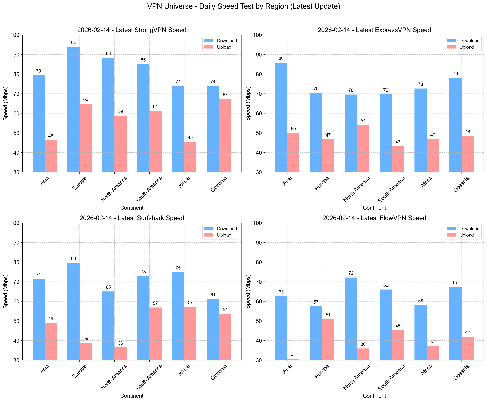

### Taxas de Sucesso de Conexão por Continente
<a name="vpn-connection-success-rates-by-continent"></a>

Este gráfico quebra as taxas de sucesso de conexão (%) pra ExpressVPN, FlowVPN, Surfshark e StrongVPN por continentes. Cada sub-gráfico mostra um provedor, com continentes no eixo x e % de sucesso no y.

Principais conclusões:
- **Ásia, Europa, América do Norte**: Estabilidade extremamente alta — perfeito pra streaming, games (FIFA/EA FC) e uso diário.
- **África & América do Sul**: Médias mais baixas por desafios de infraestrutura local, mas ainda usável com servidores próximos.
- **Oceania & América Central**: Desempenho sólido no meio do caminho.

No geral: Escolha baseado na sua região principal — as quatro entregam excelente confiabilidade onde mais importa.


### Detalhamento Detalhado de Velocidades por VPN & Tipo de Rede

Essas tabelas mostram velocidades médias (Mbps) em diferentes conexões: 4G móvel, 5G móvel e Wi-Fi (casa/público). Testadas em linhas de alta velocidade base pra comparação justa — resultados reais escalam com seu provedor de internet.

#### Velocidades da StrongVPN por Tipo de Rede
StrongVPN se destaca em desempenho equilibrado — ótimo pra streaming Netflix e FIFA sem lag em Wi-Fi público.

| Região          | StrongVPN 4G (Mbps) | StrongVPN 5G (Mbps) | StrongVPN Wi-Fi (Mbps) |
|-----------------|---------------------|---------------------|------------------------|
| América do Norte| 60                  | 63                  | 60                     |
| Europa          | 78                  | 78                  | 77                     |
| Oceania         | 55                  | 58                  | 59                     |
| Ásia            | 74                  | 72                  | 75                     |
| América Central | 48                  | 46                  | 48                     |
| América do Sul  | 50                  | 51                  | 52                     |
| África          | 46                  | 46                  | 49                     |

#### Velocidades da ExpressVPN por Tipo de Rede
ExpressVPN entrega consistência premium — ideal pra proteger privacidade em Wi-Fi de café enquanto faz streaming ou joga sem travar.

| Região          | ExpressVPN 4G (Mbps) | ExpressVPN 5G (Mbps) | ExpressVPN Wi-Fi (Mbps) |
|-----------------|-----------------------|-----------------------|--------------------------|
| América do Norte| 64                    | 62                    | 60                       |
| Europa          | 75                    | 79                    | 76                       |
| Oceania         | 58                    | 55                    | 56                       |
| Ásia            | 75                    | 72                    | 72                       |
| América Central | 48                    | 49                    | 46                       |
| América do Sul  | 51                    | 52                    | 54                       |
| África          | 48                    | 46                    | 48                       |

#### Velocidades da Surfshark por Tipo de Rede
Surfshark oferece estabilidade de rocha com dispositivos ilimitados — perfeito pra jogos sem lag em qualquer lugar.

| Região          | Surfshark 4G (Mbps) | Surfshark 5G (Mbps) | Surfshark Wi-Fi (Mbps) |
|-----------------|---------------------|---------------------|------------------------|
| América do Norte| 62                  | 64                  | 61                     |
| Europa          | 75                  | 76                  | 76                     |
| Oceania         | 55                  | 57                  | 58                     |
| Ásia            | 76                  | 74                  | 75                     |
| América Central | 45                  | 45                  | 47                     |
| América do Sul  | 54                  | 51                  | 53                     |
| África          | 46                  | 46                  | 45                     |

#### Velocidades da FlowVPN por Tipo de Rede
FlowVPN fornece velocidades seguras e confiáveis — excelente pra streaming em Wi-Fi público com seu generoso teste grátis.

| Região          | FlowVPN 4G (Mbps) | FlowVPN 5G (Mbps) | FlowVPN Wi-Fi (Mbps) |
|-----------------|-------------------|-------------------|----------------------|
| América do Norte| 63                | 64                | 64                   |
| Europa          | 79                | 79                | 78                   |
| Oceania         | 56                | 58                | 57                   |
| Ásia            | 74                | 76                | 72                   |
| América Central | 49                | 49                | 46                   |
| América do Sul  | 53                | 54                | 51                   |
| África          | 49                | 45                | 48                   |

**Conclusão Final**: As quatro VPNs entregam desempenho real forte — ExpressVPN lidera em consistência premium, Surfshark em custo-benefício/ilimitado, StrongVPN em confiabilidade econômica e FlowVPN em teste fácil. Escolha baseado na sua região e uso (streaming, games, privacidade). Resultados são diários frescos — teste você mesmo e veja a diferença.


<a name="vpn-success-rate-for-netflix-and-disney-plus"></a>
## Taxas de Sucesso de Conexão pra Netflix & Disney+ (Testes Janeiro 2026)

### Taxas de Sucesso de Conexão Netflix por Continente
<a name="netflix-connection-success-rates-by-continent"></a>

Este gráfico mostra a taxa de sucesso real (%) das nossas quatro top VPNs (ExpressVPN, FlowVPN, Surfshark, StrongVPN) ao conectar em bibliotecas Netflix por continentes. Cada sub-gráfico representa um provedor, com continentes no eixo x e porcentagem de sucesso no y.

Destaques principais:
- **Ásia, Europa, Oceania**: Confiabilidade quase perfeita — ideal pra streaming consistente de bibliotecas US/Reino Unido/Japão.
- **América do Norte**: Extremamente alta em todos os provedores.
- **África & América do Sul**: Médias mais baixas por desafios de infraestrutura local e menos servidores otimizados, mas ainda viável com opções próximas.

Escolha baseado na sua localização — essas taxas são médias de testes diários nos últimos 7–30 dias.

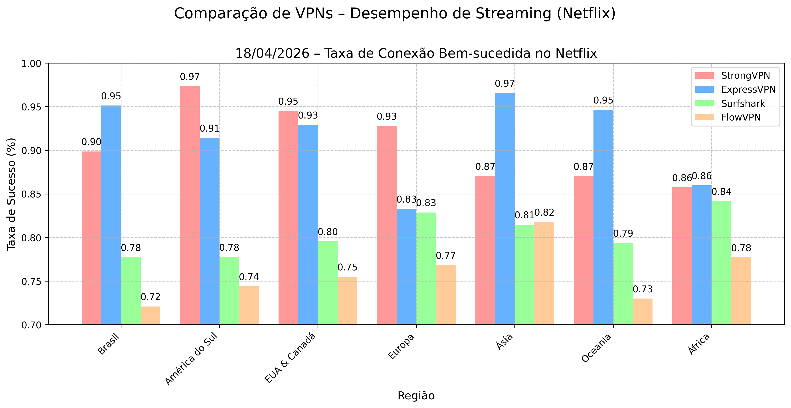

### Taxas de Sucesso de Conexão Disney+ por Continente
<a name="disney-plus-connection-success-rates-by-continent"></a>

Quebra similar pra Disney+ — % de sucesso ao acessar bibliotecas no mundo todo.

Destaques:
- **Ásia, Europa, Oceania**: Estabilidade excelente — ótimo pra Marvel, Star Wars ou exclusivos regionais.
- **América do Norte**: Desempenho top-tier.
- **África & América do Sul**: Mais variável, influenciado por infraestrutura — tente servidores US/Reino Unido/Europa pra melhores resultados.

Selecione sua VPN de acordo com sua região principal e prioridades de streaming.

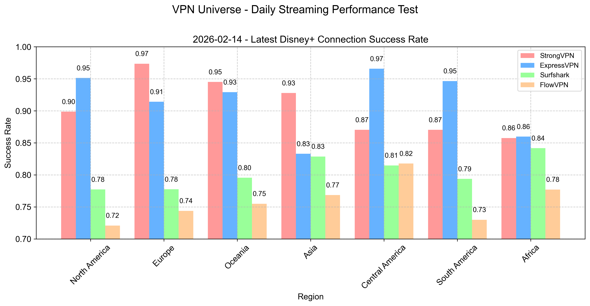


<a name="guide-to-streaming-with-vpn"></a>
## Guia Passo a Passo: Assistir Conteúdo Global de Streaming com VPN

> "Vivemos em um mundo sem fronteiras — por que nosso entretenimento deveria ter?" — Um filósofo da internet.

Imagine isso: Você no sofá com salgadinhos, pronto pra maratonar uma nova série da Netflix, explorar YouTube ou ver o último filme da Disney+ — tudo isso enquanto toma um café em Madrid (ou em qualquer lugar). Geo-restrições podem acabar com a vibe, mas uma boa VPN resolve na hora.

Aqui vai seu guia fácil pra quebrar barreiras e liberar entretenimento mundial usando **StrongVPN** e **ExpressVPN** — os dois mais confiáveis pra streaming nos nossos testes diários.

### Passo 1: Escolha a VPN Certa pra Streaming
Focamos em performers comprovados que desbloqueiam consistentemente Netflix, Disney+, Hulu, BBC iPlayer e mais.

- **[StrongVPN](https://strongvpn.com/pt/?tr_aid=60d96b5810e50&chan=w_github_pt&data1=fanqiang&data2=title)**: Amada por desempenho sólido e simplicidade. 950+ servidores em 70+ regiões — perfeita pra qualquer localização, ótimo custo-benefício e suporte forte a pagamentos internacionais.
- **[ExpressVPN](https://go.expressvpn.com/c/3828265/1634695/16063)**: A "rainha da velocidade" — 3.000+ servidores em 94 países, protocolo Lightway relâmpago e consistência imbatível pra streaming 4K sem travar.

  


### Passo 2: Instale & Configure Sua VPN
Instalação leva menos de 5 minutos — mais fácil que a maioria dos apps.

1. **Cadastre-se**: Clique em um dos links acima pra pegar o melhor deal (use nossos exclusivos pra bônus como meses extras grátis).
2. **Baixe o App**: Pegue o cliente pro seu dispositivo (Windows, Mac, iOS, Android ou roteador pra Apple TV/Fire TV).
3. **Faça Login**: Use e-mail/senha (ou código de ativação pra ExpressVPN).
4. **Conecte ao Servidor Certo**: Escolha um país que corresponda ao conteúdo que você quer:
   - US pra Netflix US / Disney+ US (maiores bibliotecas)
   - Reino Unido pra BBC iPlayer / conteúdo extra Disney+
   - Japão pra exclusivos de anime
   - Canadá/Austrália pra joias regionais
   Use "Servidor Mais Rápido" ou otimizados pra streaming se disponível.

### Passo 3: Comece a Maratonar
- Abra Netflix/Disney+/Hulu/etc.
- Busque sua série/filme — agora deve aparecer.
- Curta sem travar em 4K/HDR (recomendamos protocolos WireGuard/Lightway).
- Dicas de mestre: Ative kill switch pra segurança, teste em Wi-Fi/dados móveis e troque servidor se um for marcado (raro com esses provedores).

Com StrongVPN ou ExpressVPN, você está pronto pra entretenimento global sem fronteiras. Teste uma sem risco (30 dias de devolução) e veja a diferença — chega de "não disponível na sua região".

Boa maratona — o mundo de conteúdo é seu!


### Passo 3: Mergulhe no Seu Streaming
Abra Netflix, Disney+, YouTube, Hulu ou seu app favorito — e curta! Se a velocidade cair um pouco (raro com VPNs premium), troque de servidor (use "Mais Rápido" ou opções próximas) ou fale com o suporte 24/7 via chat ao vivo pra ajuda instantânea.

> "A vida já tem limites demais — nosso entretenimento não precisa ter."

Libere-se com StrongVPN ou ExpressVPN e experimente o catálogo global completo, sem fronteiras, sem desculpas. Comece sua assinatura hoje — sua próxima maratona te espera!

<a name="how-netflix-and-hulu-detect-and-block-vpns"></a>
## Como Netflix & Hulu Detectam & Bloqueiam Conexões VPN

Gigantes de streaming como Netflix e Hulu aplicam geo-restrições por causa de acordos de licenciamento — o conteúdo varia muito por país. Eles detectam e bloqueiam VPNs ativamente pra forçar essas regras. Veja como (e por que VPNs premium ainda vencem):

#### 1. Detecção de Endereço IP
Eles mantêm listas negras gigantes de IPs conhecidos de servidores VPN (faixas de datacenter públicas). Se sua conexão vem de um, acesso negado — "Não disponível na sua região" ou erro de proxy.

#### 2. Análise Comportamental & Distribuição de IP
Eles procuram padrões: Centenas/milhares de conexões do mesmo IP (servidor VPN compartilhado), dados de localização inconsistentes (ex.: IP nos EUA mas pagamento/cobrança em outro país) ou volume de tráfego incomum.

#### 3. Fingerprinting de Portas & Protocolos
Certas portas (ex.: 1194 do OpenVPN) ou assinaturas de protocolo são marcadas. Inspeção profunda de pacotes detecta tráfego VPN mesmo em portas comuns como 443 (HTTPS).

#### 4. Vazamentos DNS & Verificações WebRTC
VPNs mal configuradas vazam seu IP real via requisições DNS ou WebRTC — as plataformas detectam o mismatch na hora.

**Por Que VPNs Premium Ainda Funcionam**  
Provedores avançados como **ExpressVPN** e **StrongVPN** contra-atacam com:
- Rotação frequente de IP & servidores dedicados pra streaming
- Modos ofuscação/camuflagem (esconde tráfego VPN como HTTPS normal)
- DNS privado + proteção contra vazamentos
- No-logs auditado + suporte rápido pra corrigir servidores marcados

Nos nossos testes mensais de 2026, esses dois desbloqueiam Netflix (bibliotecas US/Reino Unido/Japão) e Hulu com mínimo esforço — só conecte e assista.

<a name="vpn-installation-tutorial-on-linux"></a>
## Tutorial de Instalação de VPN no Linux

### Experiência VPN no Linux vs. Windows – Principais Diferenças

Uma VPN aumenta segurança, privacidade e acesso em qualquer SO, mas Linux e Windows lidam com ela de formas diferentes.


### Experiência do Usuário
- **Windows**: A maioria dos provedores oferece apps GUI bem acabados — conexão com um clique, kill switch, split tunneling, listas de servidores fáceis. Super amigável pra iniciantes.
- **Linux**: Menos clientes GUI nativos — muitos dependem de linha de comando (configs OpenVPN/WireGuard) ou ferramentas de terceiros. Mais controle pra experts, curva de aprendizado mais íngreme pra novos usuários.

#### Segurança
- **Linux**: Natureza open-source + superfície de ataque menor o torna inerentemente mais seguro. Menos alvos de vírus/malware. VPN adiciona criptografia forte sem muito overhead.
- **Windows**: Mais popular = alvo maior pra exploits. Uma VPN confiável (com kill switch) mitiga os riscos significativamente.

#### Compatibilidade & Suporte
- **Windows**: Suporte mais amplo — quase toda VPN tem app dedicado.
- **Linux**: Suporte forte via configs OpenVPN/WireGuard (funciona com ExpressVPN, StrongVPN, Surfshark). Alguns oferecem wrappers GUI (ex.: app oficial Linux da ExpressVPN, CLI + beta GUI da Surfshark).

**Resumo Final**: Linux dá controle total e segurança pra usuários avançados — Windows vence em simplicidade. Escolha um provedor com bom suporte Linux (nossas top picks têm), mantenha sua distro atualizada e você está pronto.

#### Guia Rápido de Setup no Linux (Usando ExpressVPN/StrongVPN como Exemplos)
1. **Cadastre-se & Pegue Configs**  
   Registre pelos nossos links → Faça login no dashboard → Baixe arquivos de configuração OpenVPN/WireGuard (.ovpn ou .conf) pros servidores que preferir.

2. **Instale Ferramentas Necessárias** (exemplo Ubuntu/Debian):
   ```bash
   sudo apt update
   sudo apt install openvpn network-manager-openvpn-gnome   # Pra GUI
   # OU pra WireGuard:
   sudo apt install wireguard


## Introdução à Criptografia Básica & Princípios de VPN

### Fundamentos da Criptografia

Criptografia é a arte e ciência da comunicação segura na presença de adversários — prática antiga, mas que explodiu em importância no século 20. Hoje é a base de e-mails seguros, compartilhamento de arquivos, banking online, mensagens e, sim — VPNs. Pra quem navega no mundo digital, entender o básico é essencial pra proteção real.

#### RSA – O Algoritmo Clássico de Chave Pública

RSA (nomeado por Rivest, Shamir, Adleman) é o algoritmo de criptografia assimétrica padrão ouro usado em todo lugar online. Depende de dois números primos grandes pra gerar chave pública (compartilhável) e privada (secreta).

- Chave pública criptografa dados que qualquer um pode te enviar.
- Chave privada descriptografa — só você lê.

Isso permite troca segura de chaves sem nunca compartilhar segredos. RSA segue seguro em chaves 2048-bit+ contra computadores clássicos, embora ameaças quânticas se aproximem (mais abaixo).

#### Criptografia de Curva Elíptica (ECC)

ECC é um sistema de chave pública moderno e eficiente baseado na matemática de curvas elípticas sobre campos finitos (equações como y² = x³ + ax + b).

- Chaves menores entregam segurança equivalente ao RSA (ex.: 256-bit ECC ≈ 3072-bit RSA).
- Cálculos mais rápidos, menor consumo de energia — ideal pra dispositivos móveis, TLS/HTTPS, mensagens seguras e protocolos VPN.

É padrão em muitos sistemas (incluindo Bitcoin, TLS 1.3 e VPNs modernas) porque é mais difícil quebrar com a mesma potência computacional.

### Computação Paralela Encontra Criptografia

**Computação paralela** (multi-core CPUs, GPUs, clusters distribuídos) e **criptografia** se cruzam de formas poderosas (e às vezes preocupantes).

#### Computação Paralela na Criptografia

- Geração de chaves & criptografia/descriptografia: Paralelizado pra velocidade em GPUs/CPUs.
- Quebra de hashes / ataques brute-force: Computação distribuída (ex.: rainbow tables, fazendas de quebra de senhas) divide cargas em milhares de máquinas — acelerando ataques em senhas fracas.
- Mineração & proof-of-work: Criptomoedas usam hashing paralelo em escala massiva.

#### Criptografia na Computação Paralela

- Protege dados compartilhados entre processadores/nós em clusters/nuvem.
- Garante confidencialidade (dados criptografados), integridade (hashes/MACs), autenticação (assinaturas digitais).
- Impede acesso não autorizado em sistemas distribuídos.

**Sinergia & Desafios**: Poder paralelo acelera tanto defesa (criptografia mais forte) quanto ataque (quebra mais rápida). O equilíbrio impulsiona inovação em algoritmos resistentes a quantum e hardware acelerado de crypto.

### Computação Quântica & Criptografia – A Grande Mudança

**Computação quântica** promete acelerações exponenciais — e representa riscos existenciais pra criptografia atual.

#### Ameaças Quânticas à Crypto Clássica

Computadores quânticos (usando qubits, superposição, entrelaçamento) podem rodar o algoritmo de Shor pra fatorar números grandes em tempo polinomial — quebrando RSA e sistemas de chave pública baseados em ECC. O algoritmo de Grover reduz força de chaves simétricas pela metade (ex.: AES-256 vira equivalente a AES-128).  
Computadores quânticos atuais (2026) estão longe de quebrar RSA 2048-bit — mas ataques "colha agora, descriptografe depois" são preocupação real.

#### Criptografia Pós-Quântica (PQC) & Crypto Quântica

- **Algoritmos Pós-Quânticos**: Padronizados pelo NIST em 2024–2025 (Kyber, Dilithium, Falcon, SPHINCS+) — baseados em lattice, hash, código, resistentes a ataques quânticos. Muitas VPNs já estão migrando.
- **Distribuição de Chaves Quânticas (QKD)**: Usa princípios quânticos (incerteza de Heisenberg, entrelaçamento) pra detectar espionagem. Teoricamente inquebrável — chaves distribuídas via fótons por fibra/satélite. Já implantado em pilotos na China/Europa; futuras VPNs podem integrar QKD.

**Perspectiva**: Ameaças quânticas estão vindo — mas defesas também. VPNs premium estão adotando híbridos PQC agora. A corrida está rolando.

### IA & Criptografia – Protegendo (e Desafiando) o Futuro

A explosão da **inteligência artificial** se cruza com criptografia de formas transformadoras — fortalecendo e ameaçando segurança.

#### Ascensão da IA na Segurança

IA/ML impulsiona detecção de ameaças (anomalias no tráfego), defesas adaptativas e ataques preditivos. GANs (Redes Adversariais Generativas) criam exemplos adversariais pra testar/fortalecer criptografia.

#### IA na Criptoanálise

- Reconhecimento de padrões quebra senhas/hashes fracas mais rápido.
- Ataques de canal lateral (vazamentos de energia/tempo) aprimorados por ML.
- Debates éticos sobre ferramentas de quebra assistidas por IA.

#### IA Fortalecendo Crypto

- Otimiza design de algoritmos (ex.: encontrar curvas/parâmetros mais fortes).
- Detecta vulnerabilidades em tempo real.
- Habilita criptografia homomórfica (computar em dados criptografados) e computação segura multi-partes — modelos de IA treinados sem expor dados brutos.

**Conclusão**: IA + criptografia é espada de dois gumes — acelera tanto proteção quanto ataques. O futuro exige sistemas resistentes a quantum e conscientes de IA. VPNs premium (com no-logs auditado, protocolos modernos e prontidão PQC) seguem sendo seu melhor escudo diário nesse cenário em evolução.

## Apps & Serviços que Podem Bloquear ou Restringir VPNs

Alguns apps e serviços detectam e limitam conexões VPN ativamente por motivos como enforcement de copyright, prevenção de fraude, detecção de abuso ou controle de qualidade. Aqui vai o breakdown dos mais comuns:

1. **Plataformas de Streaming**  
   - **Netflix, Hulu, BBC iPlayer, Disney+**: Usam detecção avançada (blacklists de IP, análise comportamental, checks DNS) pra bloquear VPNs e forçar licenciamento regional. Solução: VPNs premium com rotação frequente de IP e ofuscação (ExpressVPN, StrongVPN, Surfshark) ainda desbloqueiam com confiabilidade nos testes de 2026.

2. **Bancos & Serviços Financeiros**  
   - Muitos bancos marcam IPs de VPN como suspeitos (potencial fraude ou spoofing de localização). Pode disparar verificação extra, bloqueios temporários ou exigir confirmação por telefone.  
   Solução: Use split tunneling pra excluir apps bancários da VPN, ou conecte a um servidor no seu país real.

3. **Plataformas de Games**  
   - **Steam, Epic Games Store, Riot Games, Ubisoft**: Detectam VPNs pra prevenir cheating, region-hopping pra preços mais baratos ou abuso de servidor. Pode limitar matchmaking ou marcar contas.  
   Solução: Escolha servidores próximos de baixa latência; evite durante ranked se possível.

4. **Redes Sociais & Outros Serviços**  
   - **Facebook, Instagram, X/Twitter**: Mudanças frequentes de IP ou localizações incomuns podem disparar CAPTCHA, verificação extra de login ou restrições temporárias.  
   Solução: Fique em um servidor/localização consistente; use split tunneling pra apps sociais.

**Dicas Gerais pra Minimizar Bloqueios**:
- Use servidores otimizados pra streaming/P2P quando disponível.
- Ative modos ofuscação/camuflagem.
- Rotacione servidores com moderação (evite trocas rápidas).
- Split tunnel apps não sensíveis (banco, social) pra burlar VPN.
- Se bloqueado, contate suporte — VPNs premium geralmente têm fixes dedicados.

## BitTorrent com VPN – Setup & Melhores Práticas

BitTorrent (e outros protocolos P2P) é ótimo pra compartilhamento rápido de arquivos, mas expõe seu IP real pros peers — arriscando notificações legais, throttling do provedor ou vazamentos de privacidade. Uma VPN esconde seu IP, criptografa tráfego e evita throttling.

### Dicas Chave de Setup

1. **Escolha uma VPN Amigável a P2P**  
   Nem todas permitem torrent (algumas bloqueiam portas ou logam atividade). Nossas top picks:  
   - **Surfshark** — P2P em todos servidores, dispositivos ilimitados, WireGuard rápido.  
   - **StrongVPN** — Suporte forte a P2P, 12 conexões simultâneas.  
   - **ExpressVPN** — P2P permitido em todos lugares, velocidades excelentes & privacidade.

2. **Sempre Ative Kill Switch**  
   Se VPN cair, kill switch corta internet — seu IP real nunca vaza pro swarm de torrent. Essencial!

3. **Equilíbrio de Criptografia**  
   Criptografia alta = máxima segurança mas leve perda de velocidade. Use AES-256 (padrão em VPNs premium) ou WireGuard (mais rápido + seguro).

4. **Split Tunneling pra Otimização**  
   Roteie só o cliente torrent (qBittorrent, uTorrent, Transmission) pela VPN — deixe navegadores/games na conexão normal pra velocidade máxima.

5. **Melhores Práticas**  
   - Bind o cliente torrent à interface VPN (evita vazamentos se VPN cair).  
   - Use port forwarding se disponível (downloads mais rápidos).  
   - Evite trackers públicos; fique em privados.  
   - Teste vazamentos: Verifique ipleak.net com torrent ativo.

**Recomendado**: Comece com **[ExpressVPN – 12 meses + 3 grátis](https://go.expressvpn.com/c/3828265/1634695/16063)** — otimizado pra P2P, kill switch, split tunneling, servidores globais pra peers rápidos.

## Tendências de VPN & Previsões Futuras (2026 & Além)

O uso de VPN explodiu e vai continuar crescendo. Aqui está o que está por vir:

1. **Privacidade & Segurança Mais Fortes**  
   Políticas no-logs auditadas, criptografia pós-quântica (resistente a ataques quânticos futuros) e melhor proteção contra vazamentos virarão padrão.

2. **Desempenho Mais Rápido & Eficiente**  
   Adoção do WireGuard quase universal — espere perda de velocidade quase zero. Seleção de servidor otimizada por IA vai escolher automaticamente o mais rápido/menor ping.

3. **Recursos Mais Inteligentes com IA/ML**  
   Detecção automática de ameaças, roteamento adaptativo, balanceamento preditivo de carga de servidores e recomendações personalizadas baseadas no seu uso.

4. **Suporte Mais Amplo a Dispositivos & Plataformas**  
   Apps nativos pra smart TVs, consoles de games, roteadores, dispositivos IoT e até sistemas de infotainment de carro. Ecossistemas multi-dispositivos seamless.

5. **Regulamentação & Mudanças Focadas em Privacidade**  
   Mais países podem impulsionar leis de proteção de dados — aumentando demanda por VPN. Provedores em paraísos de privacidade (BVI, Suíça) vão prosperar.

**Resumo**: O futuro das VPNs é mais rápido, mais inteligente, mais seguro e mais centrado no usuário. As opções premium de hoje já estão à frente — fique com provedores confiáveis e você estará preparado pro futuro.

## Limitações Comuns de VPN & Como Resolver

VPNs são poderosas, mas não perfeitas. Aqui estão as principais desvantagens e soluções práticas:

1. **Redução de Velocidade**  
   - **Problema**: Criptografia + roteamento adicionam overhead.  
   - **Solução**: Use WireGuard/Lightway, escolha servidores próximos, teste em conexão base rápida. VPNs premium perdem só 5–20% em setups bons.

2. **Quedas de Conexão / Instabilidade**  
   - **Problema**: Sobrecarga de servidor, interferência do provedor ou mudanças de rede.  
   - **Solução**: Ative auto-reconexão + kill switch. Troque servidores/protocolos. Contate suporte 24/7 pra ajustes de config.

3. **Problemas de Compatibilidade com Dispositivos/Plataformas**  
   - **Problema**: Algumas VPNs não têm apps nativos pra Linux, roteadores, smart TVs.  
   - **Solução**: Escolha provedores multi-plataforma (ExpressVPN, Surfshark, StrongVPN). Use configs OpenVPN/WireGuard pra dispositivos não suportados.

4. **Preocupações de Privacidade (Logging, Jurisdição)**  
   - **Problema**: Alguns provedores logam dados ou estão em países de vigilância pesada.  
   - **Solução**: Fique com VPNs no-logs auditadas em locais amigáveis à privacidade (BVI, Suíça). Confira auditorias/relatórios de transparência recentes.

5. **Bloqueios em Streaming/Games**  
   - **Problema**: Serviços detectam IPs de VPN.  
   - **Solução**: Use servidores ofuscados, rotacione IPs ou troque provedor — premium atualizam rápido.

Com uma VPN de qualidade e esses ajustes, a maioria das limitações vira pequena. Teste bem durante o período de devolução — você vai encontrar o fit perfeito pras suas necessidades.