# 翻墻軟體中國VPN推薦，推薦四款以下好用(每日最近更新測速：`2025年09月22号`更新) 含性價比比較，只剩四款能用 - 墻宇宙

<!-- 
 -->

## 喜歡本文的朋友，歡迎點右上方的star以及folk本文檔案，讓大家對翻墻有更深的認識，一起為自由而努力

### 直接看 價格性價比結論 墻宇宙 VPN價格 測速比較圖

### 我整理出的四個VPN的特色以及差異，包含最優惠的購買方式

| 推薦的VPN | 最優惠買法(時間) | 一個月價格(美金)  | 總價 | 特色 | 支付保(Alipay) |
| ------------- | ------------- | ----- | ----- | ----- | ----- | 
| <a rel="nofollow noopener" href="https://strongtech.org/cn/exclusive/?tr_aid=60d96b5810e50&chan=w_github&data1=fanqiang&data2=title" target="_blank">StrongVPN</a>    | 一次買一年 | 4.5 | 54 | cp值最高 | 支援 |
|  <a rel="nofollow noopener" href="https://www.flowvpx.com/sign-up/?locale=zh-cn&special=FREETRIAL&r=35-890485.w_github">FlowVPN(免費試用兩天)</a> |  一次買一年    |    $4.17 | 50 | 免費試用兩天 | 支援 |
| <a rel="nofollow noopener" href="https://go.expressvpn.com/c/3828265/1462855/16063">Expressvpn (買12個月送三個月)</a>   | 一次買一年(可用15個月)     |  5.33 | 6.67 X 12 = 80 | 最高級 速度穩定度最高 | 不支援|
| <a rel="nofollow noopener" href="https://get.surfshark.net/aff_c?offer_id=323&aff_id=5585&source=w_github&aff_sub=fanqiang">Surfshark</a> | 一次買兩年    |    $2.30 | 55 |  無限多設備 | 不支援 |

### 墻宇宙 VPN價格 比較圖 怎樣購買最便宜 (中國翻墻VPN購買的最佳策略)

- 如果打算一次購買一年，對於速度並不是太要求，建議買<a href="https://strongtech.org/cn/exclusive/?tr_aid=60d96b5810e50&chan=w_github&data1=fanqiang&data2=title">strongvpn</a>，只要43美金(隔一年再用一個新email使用本站優惠瑪)
- 如果打算一次購買兩年，對於速度並不是太要求，建議買<a href="https://get.surfshark.net/aff_c?offer_id=323&aff_id=5585&source=w_github&aff_sub=fanqiang">surfshark</a>，只要55美金(隔一年再用一個新email使用本站優惠瑪)
- 如果打算一次買一年且對速度要求很高，當然建議買<a rel="nofollow noopener" href="https://www.xvbelink.com/?offer=3monthsfree&a_fid=wall101&chan=w_github">Expressvpn (買12個月送三個月)</a>(隔一年再用一個新email使用本站優惠瑪)。一個月大概6美金
- 如果只是想要念paper，速度上不那麽要求，可以考慮<a href="https://www.flowvpx.com/sign-up/?locale=zh-cn&special=FREETRIAL&r=35-890485.w_github">flowvpn</a>

經由我研究和多方的測試，針對不同地區蒐集到的VPN的測速資料，做成以下圖片給大家參考。Expressvpn速度穩定度最高，strongvpn次之，surfshark和flowvpn差不多。就看大家的購買策略。以下是我針對 四款VPN在台灣，日本，南韓，等常見地區的平均，經過多次測試並且畫出標準差(error bar)。考量到價格跟速度比較，
我認為:

VPN使用者極度重視連接速度 - 如果VPN讓你的網速變得龜速，那麽它很可能不會被經常使用，導致更多裝置在沒有保護的情況下上網。如今，VPN的最常見用途之一就是串流媒體，因此能夠無緩沖地載入高清和4K內容比以往任何時候都更重要。在我們的評測過程中，我們在1Gbps的線路上測試每一種VPN服務。我們使用許多工具來測量速度，包括Ookla SpeedTest網站和CLI，nPerf，Netflix的Fast等等。然後，我們取每個工具結果的平均值(中位數)，以產生準確的速度範圍。我們在早晚各重複這些測試以確保準確性。

以下是我們的VPN速度測試結果：

| VPN服務 | WireGuard/專有協議 | OpenVPN |
| --------- | ----------------- | ------- |
| ExpressVPN | 600Mbps | 400Mbps |
| FlowVPN | 650Mbps | 380Mbps |
| StrongVPN | 500Mbps | 350Mbps |
| Surfshark | 800Mbps | 300Mbps |

#### 墻宇宙 VPN 速度測試圖，包含上傳跟下載速度。

針對這樣測速，我們不只每天更新，並起從今天起，過去**七天，14天，一個月，三個月**的測速，都經過平均，每天都坐至少10-20次的連線測試。關於我們設備的細節，可以參考本文末尾。橫線代表標準差。

過去 **7天，14天，30天，90天(三個月)** 的測速

從2025年09月22号 回推7天, 14天, 30天, 90天的測速。

- **如果打算一次購買一年，對於速度並不是太要求，建議買<a href="https://strongtech.org/cn/exclusive/?tr_aid=60d96b5810e50&chan=w_github&data1=fanqiang&data2=title">strongvpn</a>，只要43美金(隔一年再用一個新email使用本站優惠瑪)，一個月大概4美金** 
- **如果打算一次買一年且對速度要求很高，當然建議買<a rel="nofollow noopener" href="https://www.xvbelink.com/?offer=3monthsfree&a_fid=wall101&chan=w_github">Expressvpn (買12個月送三個月)</a>(隔一年再用一個新email使用本站優惠瑪)。一個月大概6美金**

## 科學上網基本知識

### 什麽是科學上網?

首先必須要來介紹防火牆的基本知識
#### 防火牆基本知識 (什麼是防火墻)

中國防火墻是一項全國性的政策，號稱在保護中國企業和國家機密以及基礎設施免受網絡攻擊。該計劃由中國公安部 (MPS) 監督，官方稱該項目為金盾。
由於擔心中國政府正在利用網絡安全作為控制該國公民可以訪問哪些信息的理由。被防火墻封鎖的網站包括Facebook、YouTube、Instagram、Vimeo、Spotify、Snapchat 和 Tumblr。
紐約時報、CNN、路透社和金融時報，Instagram，路透社，Snapchat，華爾街日報

被防火墻阻止的網站通常看起來好像遇到了技術問題。瀏覽器通常會返回錯誤代碼，表示未找到頁面（404錯誤）、需要重置連接或頁面已超時。防火墻通過多種方式阻止和重定向互聯網流量，包括DNS 中毒、IP 地址阻止、分析和過濾 URL、數據包檢查和過濾、重置連接和阻止VPN。
與其他幾個國家一樣，政府會標記某些關鍵字以監控活動。多個消息來源證實，截至 2019 年 4 月，中國已屏蔽所有語言 URL 的維基百科

#### 為什麽要翻墻？

原因很簡單:如果沒有用VPN要 <a href="https://wallzhihu.com/best-vpn-china/">翻墻</a>
，在中國遠程工作會變得很困難，因為 Slack、Microsoft OneDrive 和 Dropbox 等公司常用的作業應用程序都被禁止。整個 Google 套件（包括 Gmail 和 Google Drive）也無法使用。其他被禁止的社交網絡包括 Facebook、YouTube、Instagram、Vimeo、Spotify、Snapchat 和 Tumblr。這會使與你和你朋友家人保持聯系變得非常困難。 

大多數西方新聞網站也是禁止訪問的。其中包括紐約時報、CNN、路透社和金融時報。在中國被禁止的網站和服務列表是不斷變化的

#### 科學上網的由來
VPN 技術如何幫助規避互聯網審查？

虛擬專用網絡(VPN)可以幫助您繞過中國的互聯網審查制度，通過欺騙互聯網服務提供商認為您位於中國境外。 
雖然在中國使用 <a href="https://dr-wall.com/best-vpn-china/">VPN</a> 在技術上是非法的，但對使用 VPN 的遊客或商人的起訴幾乎聞所未聞。
但是，有一些重要的考慮因素。首先，在您到達中國之前下載 VPN 至關重要，因為大多數 VPN 網站在中國都被禁止使用，這並不奇怪。其次，我們建議使用久經考驗的 VPN，例如ExpressVPN或strongVPN。這些供應商不斷證明他們可以通過中國的互聯網防火墻。為了不被發現，大家常利用: 科學上網、梯子、機場等詞匯來替代VPN、翻墻等詞來避開互聯網審查。

總的來說，大陸網民使用特定的工具去訪問海外網站的這個過程就叫作“翻墻”或者“科學上網”，而這些特定的工具我們一般稱之為“翻墻軟件”或者“翻墻VPN”或者“翻墻工具”或者”科學上網工具“。

#### VPN的其他好處: 為什麽要隱藏 IP 地址？
IP 地址就像街道地址一樣。它公開識別你的實際位置，並且對你來說是獨一無二的。但是，你的 IP 地址也可能對你不利——第三方可能會使用它來監視你的活動和跟蹤你的位置，現在通過用VPN服務器的 IP 地址交換你的 IP 地址，VPN廠商會立即加密你的連接並在幾秒鐘內隱藏你的真實在線身份。VPN的私有、安全網絡將安全地匯集你的流量，使其完全不受第三方的影響。

#### VPN的其他好處二: 使用公共 Wi-Fi 可能會有風險
無論你是在咖啡店、機場還是酒店，公共場所通常都會提供免費 Wi-Fi 的便利。然而，這些繁忙的熱點帶來了巨大的風險：將你的數據暴露給黑客。
雖然公共 Wi-Fi 很容易訪問，但在沒有 VPN 的情況下使用它時被黑客入侵的風險會非常高。與你在同一網絡上瀏覽的任何人都可以在未經你同意的情況下訪問你的私人信息。你的銀行和金融信息
，工作溝通訊息，電話號碼，電子郵件和短信數據都有一定的風險。只要你連接到VPN的安全網絡，你就可以在熱點在線瀏覽時安心使用你的wifi數據。

### 常見的主流翻墻軟件協議
以下是與翻墻相關的幾個專業術語。了解這些術語可以幫助您在選擇翻墻時獲得更好的基本信息，並且更多可以是整個組織中最徹底和詳細的專業分類 - 包括實踐。如果你只是想快速翻墻，可以直接看翻墻推薦軟件。

**VPN**
知道如何翻墻成功的同伴可能聽說過 VPN 一詞，以了解 VPN 與什麽連接。 VPN目前是一種加密策略，可以保護客戶的IP、區域和個人數據不被泄露。 VPN 可以被視為一種偽裝（如果從學術上講，加密更重要的話）。在屏蔽（加擾）客戶端 IP、IP 和個人數據後，他們可以通過防火墻到達一些墻外世界。
同時，多數人頻繁使用 VPN 背後的動機並不是來通過防火墻（就像我在Covid期間同時看到許多遠端工作者VPN 一樣）。然而這類傳統VPN的已經不足以應付中國政府利用強大的國家優勢制造的超級防火墻，傳統的VPN在中國已經沒有機會了。

## 國產VPN推薦功能總結2025年09月22号測試

以下是我從數百個VPN中實際測試過的一些中國最好的VPN。實際測速對比，可以參考下方測速報告段落。我在中國從事與美國的貿易工作多年。 我用過很多互聯網推薦的翻墻軟件。我認為一個好的軟件應該包括以下功能：

- 高安全性（非中國公司，盡量不要設在中國）
- 連接穩定
- 越快越好
- 更多節點（可連接更多國家）
- 簡單易用（一鍵翻墻）
- 擁有最強的加密隱私安全功能
- 支持同時連接多個設備
- 兼容性強：包括可以同時使用windows、linux、android等設備的設備
- 7天24小時中文客服
- 有30天退款機制
- 有多種支付方式
- 價格正常（公平合理），CP值正常

### 1.<a rel="nofollow noopener" href="https://strongtech.org/cn/exclusive/?tr_aid=60d96b5810e50&chan=w_github&data1=fanqiang&data2=title" target="_blank">StrongVPN–性價比最高</a>
### StrongVPN推薦
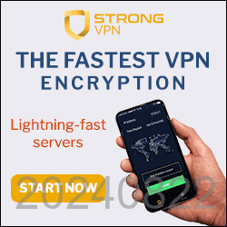

StrongVPN屬於最近興起的歐美VPN。與歐美最大的ExpressVPN相比，價格便宜很多，最低每月3.5美元（12個月計劃-每月3.5美元（總費用43.99美元）。ExpressVPN費用接近6美元不僅如此， StrongVPN支持支付寶，ExpressVPN不支持。還有一個工程團隊不斷更新和修覆節點。如果你只是想在線觀看YouTube或Facebook，我推薦StrongVPN。StrongVPN網站聲稱它是“最好的多媒體VPN”，並且建議支持 Netflix、Hulu、ABC、HBO 和 Sky Go 等服務。

StrongVPN 擁有適用於 Windows、Mac、iOS、Android 和 Amazon Fire TV 的應用程序，例如 Chrome 瀏覽器擴展程序，以及路由器、Fire TV、Kodi 等的設置指南。 StrongVPN 在超過 35 個國家的 46 個城市提供超過 950 台 P2P 友好服務器。您可以通過 L2TP、SSTP、OpenVPN、IKEv2 甚至現在的 WireGuard 協議進行連接，並通過電子郵件和實時聊天獲得 24/7 客戶支持以及 30 天退款保證。沒什麽花哨的，但規格很不錯，對大多數人來說綽綽有余。

strongvpn設計了一個全球網絡，其中包括 950 多台服務器，支持 30 多個國家和 46 個城市，並提供 59,500 個 VPN。真正在線隱私的零日志記錄: StrongVPN 是業內少數可以承諾零日志記錄的 VPN 之一。因為strongvpn擁有自己的服務器，所以有能力控制誰和什麽可以訪問你的數據。絕不會將您的私人信息或活動交到任何第三方手中。strongvpn對將您的數據出售給出價最高者不感興趣。只是想幫助您保持安全。

#### STRONGVP 的速度到底有多快？
連接速度幾乎與服務的隱私和安全性同樣重要，這是許多用戶會做出決定的關鍵。我們在兩個1Gbps的連接（美國和英國）上測試了StrongVPN，並使用了多個速度測試站點和服務來準確判斷VPN能提供的速度。
然後，我們使用了多種服務來測試速度，包括SpeedTest的網站和命令行應用程序、SpeedOf.me和nPerf。
在美國使用OpenVPN的情況下，速度達到了230-240Mbps。雖然這不是最快的，但仍然非常有用。使用IKEv2的速度在美國則達到了260-280Mbps，相當令人印象深刻 —— 僅次於ExpressVPN。
然而，如果你希望最大限度地提高速度，我們強烈建議使用新的WireGuard協議 - 因為這將使StrongVPN變成一個快速的VPN，但並非最快。在美國，我們獲得了大約270-300Mbps的穩定速度，而在英國，幾乎每次測試的速度都在450Mbps左右。
值得注意的是，在我們今年早些時候的測試中，這兩個速度都接近600Mbps，因此你可能會發現在你所在的地點速度更快。最快的VPN提供商（例如NordVPN）的速度超過800Mbps —— 並不是任何擁有100Mbps線路的人都能察覺到這種差異。

**12個同時連接**一次最多可以在十二台設備上使用 StrongVPN

### Strongvpn 的特色

介紹StrongVPN的功能：

- 廣泛的平台支持 適用於 iOS、Android、macOS、Windows 等的應用程序
- 最多支持 12 個同時連接
- 解鎖 Netflix、Amazon Prime Video、Disney Plus
- 250GB SugarSync 存儲空間，包年套餐
- 超過 8000 台服務器
- 可以通過 L2TP、SSTP、OpenVPN、IKEv2 甚至 WireGuard 協議進行連接
- 只要你在購買後 30 天內提出要求，你就會收到全額退款
- 如果你有任何問題或困難，熟練的技術人員團隊將隨時為你提供幫助。我們提供 24/7 客戶支持，確保及時解決所有問題
- StrongVPN的隱私政策：在您使用VPN服務時，您的數據不會被跟蹤或存儲
- 價格比ExpressVPN、Surfshark等歐美VPN便宜。最近，測試節點的速度和數量已經超過了ExpressVPN。
- 支持支付寶。(接受所有主要信用卡、PayPal、支付寶)
- 高穩定性
- 每月只需3.50 美元（12 個月計劃 – 每月 3.50 美元（總成本 43.99 美元）

| 功能/規格 | StrongVPN |
| :-------: | :------- |
| 客戶端平台 | Windows、Mac、Linux、Android、iOS、DDWRT、macOS、GLiNet 路由器、Android TV |
| 支持的協議 | OpenVPN、L2TP/IPsec、SSTP 和 WireGuard |
| 服務器數量 | 950+ |
| 國家數量 | 35+ |
| 注冊國家 | 美國 |
| 付款方式 | 信用卡、PayPal、支付寶 |
| 需要實名嗎？ | 無 |
| 加密協議 | WireGuard、OpenVPN、IKEv2、L2TP、SSTP |
| 數據使用 | 無限制帶寬 |
| 使用 | 無限制 |
| 同時連接的設備數量 | 12 |
| 客戶支持 | 電子郵件、實時聊天、電話 |
| 隱私政策 | 無日志記錄 |

### 2 <a rel="nofollow noopener" href="https://www.xvbelink.com/?offer=3monthsfree&a_fid=wall101&chan=w_github">Expressvpn (買12個月送三個月)</a>
### Expressvpn-買12個月送三個月

### Expressvpn 的特色

VPN市場有很多競爭，但 ExpressVPN 在其中脫穎而出：它擁有專業的功能，提供的方式比其他任何人都多。
一流的平台支持包括適用於 Windows、Mac、Android、iOS、Linux 和其他操作系統的應用程序，更不用說許多路由器的自定義固件，以及 Apple TV、Fire TV、PlayStation、Chromebook、Kindle 的詳細手動設置指南等等。一組強大的核心功能提供了多層保護。例如，ExpressVPN 通過使用自己的 DNS 服務器來保護您的互聯網流量。高端加密技術甚至可以防止最先進的攻擊者窺探您的活動。即使 VPN 掉線，也沒有問題：高質量的終止開關會立即激活以阻止您的互聯網連接並確保您的安全。

該公司提供由 3,000 多台服務器組成的龐大網絡，遍布 94 個國家的 160 個城市。歐洲和美國的覆蓋範圍最好，但 ExpressVPN 在亞洲也有很多地點和幾個在其他地方很少出現的國家。例如，僅亞太地區就有 27 個國家——Mozilla VPN在其整個網絡中只有大約 30 個國家。ExpressVPN是全球最大的VPN公司，提供自有資源快速更新，ExpressVPN擁有超寬網絡（3000多台服務器的安全網絡），提供，快速，連接Netflix和幾乎所有內容，支持種子下載，絕對記錄用戶日志記錄，幾乎所有人都可以使用。 每次當前監控的百分比總是在穩定區域同步更新。在國內達到九成翻墻成功機率，是墻體成功率最高的歐美公司。它屬於最高級別的VPN，唯一的問題是價格有點高。

ExpressVPN 的隱私保護使用工業級加密。Diffie-Helman 密鑰交換可以安全地建立與遠程服務器的鏈接，而 AES-256-GCM 支持可以保護您的數據免受即使是裝備最精良的攻擊者的攻擊，而強大的 HMAC 身份驗證可以防止數據被實時更改。DNS 支持是另一個亮點。ExpressVPN 不僅提供 DNS 泄漏保護以防止有關您的在線活動的數據從VPN 隧道泄漏，而且還在其每台服務器上運行自己的私有、零知識、256 位加密 DNS。與一些較小的提供商相比，這是一個主要優勢，在最壞的情況下，它們可能會將您的 DNS 流量重定向到 OpenDNS 或其他一些第三方服務。除了在 DNS 服務器上登錄的風險外，使用未加密的 DNS 使攻擊者有機會攔截您的請求、過濾它們、阻止甚至更改它們——使用 ExpressVPN 的方法在很大程度上消除了所有問題。

特點如下：

- 多達 160 個地點，遍布 94 個國家/地區
- 非常多的用戶
- 每次開機，總能快速更新服務器
- 30天內無條件退款
- **24/7** 客戶服務
- 適用於 Windows、Mac、Android、iOS、Linux 和其他操作系統的應用程序
- 還包括 Apple TV、Fire TV、PlayStation、Chromebook、Kindle
- ExpressVPN 提供各種貨幣的支付方式，甚至比特幣
- 工業級加密

還有一些方法可以節省一些現金。注冊我們的獨家優惠可以買一年得ExpressVPN訂閱 多增加三個月的免費服務，為您提供 15 個月的服務，每月有效 6.67 美元。

如果您決定注冊，您會發現各種各樣的支付方式，包括卡、PayPal、比特幣和許多其他參與者（支付寶、Yandex Money、WebMoney 等）。

**安裝 Android 或 iOS 應用程序可以獲得 7 天的試用期，ExpressVPN 的 30 天退款保證也讓您可以安全地為自己檢查服務**

**如果您決定取消，該過程也非常簡單。您不必向公司證明您的決定是合理的。您可以完全使用該服務 30 天，如果您不滿意，或者只是改變主意，只需告訴 ExpressVPN，您將獲得退款。完全不需要擔心。**

| 特性 | ExpressVPN |
| ---- | ---------- |
| 伺服器數量 | 3000+ |
| 伺服器國家 | 94 |
| 支援的平台 | Windows, Mac, iOS, Android, Linux, BlackBerry, Kindle Fire, Nook, routers, consoles (MediaStreamer), Amazon Fire TV Stick, Apple TV, Boxee, Chromebook, Windows Phone |
| 同時連接數 | 5 |
| 分割通道技術 | 是 |
| 斷開開關技術 | 是 |
| 支援的協議 | Lightway, OpenVPN UDP, OpenVPN TCP, L2TP/IPSec, IKEv2 |
| 註冊國家 | 英屬維京群島 |
| 支援 | 24/7即時聊天，電子郵件，知識庫 |

### 3 <a rel="nofollow noopener" href="https://get.surfshark.net/aff_c?offer_id=323&aff_id=5585&source=w_github&aff_sub=fanqiang">Surfshark (具有無限多設備連接)</a>
### Surfshark VPN 沖浪鯊 推薦

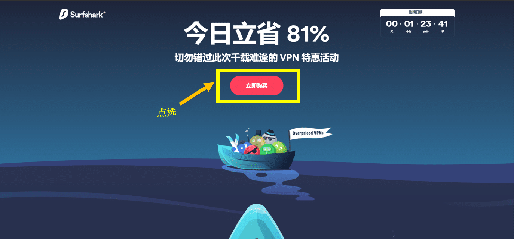

Surfshark 是一款高度精致且功能強大的 VPN，可與最好的優質提供商競爭，同時提供極具吸引力的價格點。我們發現終止開關存在一些非常小的問題，而且 OpenVPN 的速度並不是最好的，但是以這個價格，你找不到更好的 VPN。Surfshark 在網絡上受到廣泛推薦，成立於 2018 年，是一項相對較新的服務，已經引起了轟動，現在它能與最大的VPN提供商一較高下，被認為是市場上最好的 VPN之一。
Surshark具有豐富的功能，幾乎可以在任何地方運行，並且擁有最有價值的VPN之一。該網絡擁有 3,200 多台服務器，分布在 65 個國家的 160 多個地點。

有 Windows、Mac、iOS、Android 和 Linux 應用程序，以及 Chrome、Firefox 和現在的 Edge 擴展程序，以及一個用於遊戲機、智能電視等的解鎖智能 DNS 系統的網站。

加密方面使用強大的 AES-256-GCM 加密、WireGuard、OpenVPN 和 IKEv2 支持、無日志策略以及在 VPN 連接斷開時會自動啟動保護您的設備的終止開關。與ExpressVPN一樣，Surfshark 位於英屬維爾京群島，該公司指出，這表示他不會需要保留用戶操作日志。Surfshark 的無日志政策 表示該服務不會收集您的“IP 地址、瀏覽歷史記錄、使用的帶寬、會話信息、網絡流量或連接時間戳”。公司保留的關於您的唯一數據是您的電子郵件地址和賬單信息

Surfshark可以解除對 Netflix的封鎖，而且還列出了近20 個國家/地區包含美國、法國、日本、意大利、澳大利亞等都可以訪問美國 Netflix。Surfshark 也可以觀看美國亞馬遜 Prime 和 Disney Plus

### Surfshark VPN 的特色
- 介紹性優惠超級便宜
- 全新的安全審核讓您高枕無憂
- 出色的流媒體性能
- Surfshark 的支付方式支持信用卡、PayPal、加密貨幣、Amazon Pay 和 Google Pay。
- 客戶支持非常有用
- Surfshark 在 65 個位置擁有 3,200 多台健康的服務器和無限的同時連接，加上行業標準的 AES-256-GCM 加密
- **無限多台設備連接**
- 如我您注冊後發現該公司不適合您，您有 30 天退款保證的保護。
- Surfshark 最大的吸引力在於它的價格，在撰寫本文時，**2 年計劃的價格為每月 2.30 美元。是我見過最便宜的VPN廠商**
- Surfshark Nexus 將在 2022 年和 2023 年提供新功能，**IP Rotator 每隔幾分鐘就會自動更改您的 IP 地址，而無需斷開連接。**

### 4 <a rel="nofollow noopener" href="https://www.flowvpx.com/sign-up/?locale=zh-cn&special=FREETRIAL&r=35-890485.w_github">FlowVPN(免費試用兩天)</a>
### FlowVPN-推薦-免費用兩天

### FlowVPN 的特色(兩天免費試用)

- 超級棒的兩天免費試用
- 便宜好用，適合學生使用
- 屬中囯VPN，穩定度速度輸歐美VPN廠商，參考我上面測速照片。
- 支援支付寶上網，有中文介面跟客戶服務
- 支持的協議包括 IPSec IKEv1、IPSec IKEv2、Wireguard、OpenVPN、L2TP 和 PPTP。
- flowvpn自定義 SSL 和 FlowTCP 協議。
- 覆蓋全球 60 多個國家/地區的 100 多台服務器，包括英國、美國、香港和澳大利亞。
- 適用於 Mac、iPad、iPhone、Android 和 Windows
- 在最多 4 台設備上同時使用
- FlowVPN 為學生和教職員工提供學生折扣

### 分析和對比市面上不同VPN提供商的隱私政策

當選擇VPN服務提供商時，隱私政策是一個重要的考慮因素。不同的VPN服務提供商可能有不同的隱私政策，這可能影響到你的數據和隱私安全。以下是對ExpressVPN，StrongVPN和Surfshark的隱私政策的一個比較。

#### ExpressVPN

ExpressVPN是一家在隱私方面具有強烈承諾的VPN服務提供商。它位於英屬維爾京群島，這使得它不受嚴格的數據保留法的影響。ExpressVPN嚴格地執行無日志政策，這意味著它不會記錄你的網絡活動或你連接到VPN時的IP地址。

#### StrongVPN

StrongVPN是一家在美國的VPN服務提供商，它也承諾不記錄用戶的網絡活動。然而，由於美國的數據保留法可能更加嚴格，這可能對StrongVPN的隱私保護造成一些影響。盡管如此，StrongVPN仍然承諾，除非法律要求，否則它不會與第三方分享用戶的數據。

#### Surfshark

Surfshark是一家位於英屬維爾京群島的VPN服務提供商，和ExpressVPN一樣，也承諾不記錄用戶的網絡活動。Surfshark的隱私政策非常明確，它詳細列出了它收集的信息以及這些信息的用途。Surfshark也承諾，除非法律要求，否則不會與第三方分享用戶的數據。

以下是對這三家公司的隱私政策的比較：

|   | ExpressVPN | StrongVPN | Surfshark |
|---|---|---|---|
| 基本地位 | 英屬維爾京群島 | 美國 | 英屬維爾京群島 |
| 記錄網絡活動 | 不記錄 | 不記錄 | 不記錄 |
| 分享數據與第三方 | 無，除非法律要求 | 無，除非法律要求 | 無，除非法律要求 |

總的來說，當選擇VPN服務時，你應該詳細閱讀每家公司的隱私政策，並考慮他們如何保護你的數據和隱私。

## strongvpn手把手-支付保alipay-購買教學
strongvpn的特點就是有支付保(alipay)喜歡支付保的付款的朋友，建議使用strongvpn，或是flowvpn

第一步驟: 前往本站的專屬優惠 <a rel="nofollow noopener" href="https://strongvpn.com/?tr_aid=60d96b5810e50&chan=w_github&data1=pc-vpn&data2=table" target="_blank">StrongVPN</a>，點選start now (參照下圖)

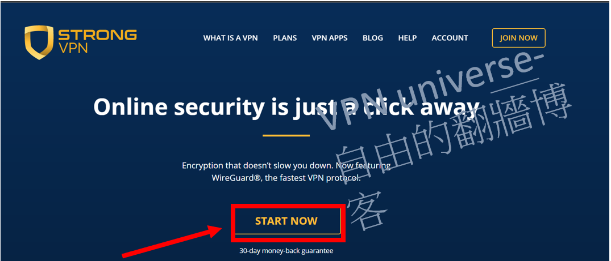

第二步驟: 如果你開啟後發現你沒辦法購買，因為你正在使用其他VPN，這時候可以先透過註冊flowvpn(註冊方式可以參考下方的flowvpn安裝教學)，flowvpn有兩天免費試用，你可以先使用他來購買strongvpn。

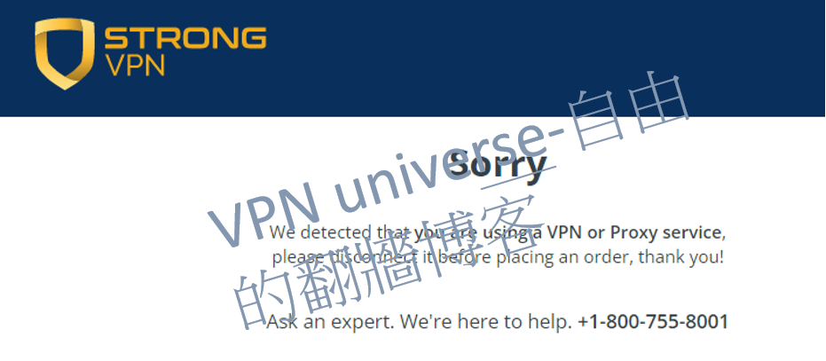

註冊完flowvpn以後，選擇UK，你會發現你就可以購買囉。左邊的一次買一年只要43美金，(注意: 這個方式只能使用12個月，如果要續約，建議重新辦一個email,再回來使用這個優惠瑪。)

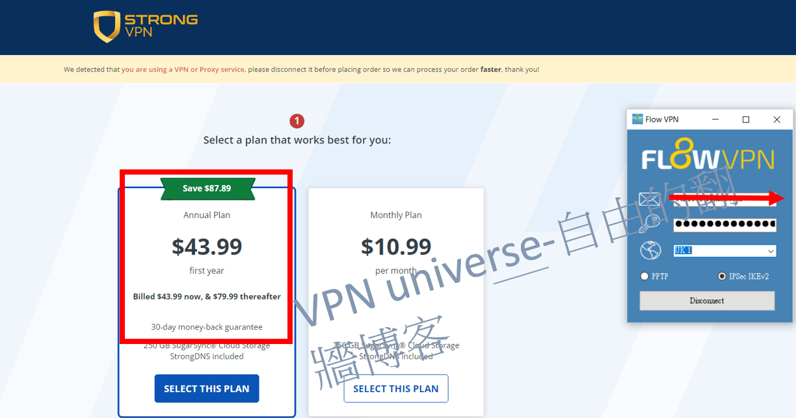

第三步驟: 往下滑，選擇alipay付款，或是國內銀行卡，包含visa或是master card(海外卡也可以)，還有paypal可以用

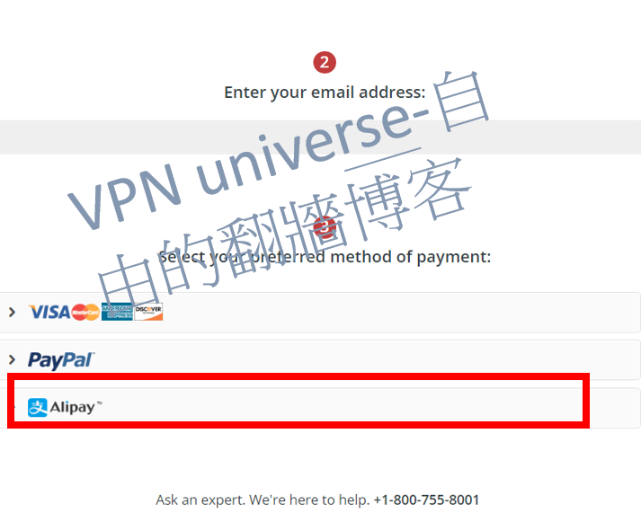

### 移動設備（Android / iOS)上的StrongVPN設置教程

不論你是Android用戶還是iOS用戶，以下是如何在移動設備上設置StrongVPN的步驟：

#### 1. 購買和注冊StrongVPN

首先，你需要訪問<a rel="nofollow noopener" href="https://strongtech.org/cn/exclusive/?tr_aid=60d96b5810e50&chan=w_github&data1=fanqiang&data2=title" target="_blank">StrongVPN</a>，選擇一個合適的套餐，並創建一個賬戶。

#### 2. 在Android設備上安裝和設置StrongVPN

- 打開Google Play Store，搜索StrongVPN。
- 點擊"Install"下載和安裝StrongVPN應用。
- 安裝完成後，打開StrongVPN應用，輸入你的用戶名和密碼，然後點擊"Login"。
- 你可以點擊"Best Available Location"自動連接到最佳服務器，或者點擊"Choose Location"手動選擇你想連接的服務器。

#### 3. 在iOS設備上安裝和設置StrongVPN

- 打開App Store，搜索StrongVPN。
- 點擊"Get"下載和安裝StrongVPN應用。
- 安裝完成後，打開StrongVPN應用，輸入你的用戶名和密碼，然後點擊"Sign In"。
- 你可以點擊"Best Available Location"自動連接到最佳服務器，或者點擊"Choose Location"手動選擇你想連接的服務器。

現在，你已經在你的移動設備上設置了StrongVPN，你可以享受安全、私密和無阻礙的互聯網體驗了！

## expressvpn線上優惠瑪購買教學-如何購買ExpressVPN

要注意: expressvpn 不支援支付寶，喜歡支付保的付款的朋友，建議使用strongvpn，或是flowvpn。
Expressvpn 支援: 國內銀行卡購買ExpressVPN，包含visa或是master card(海外卡也可以)，還有比特幣，還有paypal可以用。因為expressvpn 是海外網站，所以你可能需要翻牆才能訪問。關於這點，可以參考我的鏡像站連上網站的方法。

### 第一步: 前往優惠連結<a rel="nofollow noopener" href="https://www.xvbelink.com/?offer=3monthsfree&a_fid=wall101&chan=w_github">Expressvpn 優惠</a>:點選: get expressvpn (底下的紅框框)

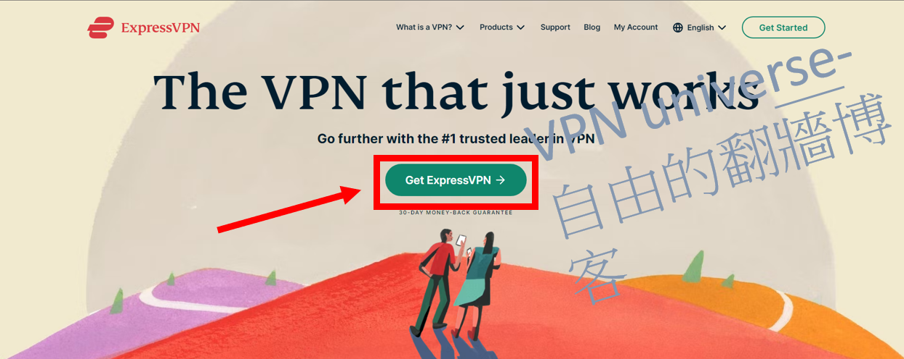

| 訂閱時長 | 總費用 | 每月費用 |
| ---- | ---- | ---- |
| 1個月 | $12.95 | $12.95 |
| 6個月 | $59.95 | $9.99 |
| 12個月 | $99.95 | $8.32 ($6.67 使用 <a rel="nofollow noopener" href="https://www.xvbelink.com/?offer=3monthsfree&a_fid=wall101&chan=w_github">Expressvpn 3個月優惠套餐</a> 購買 ) |

### 第二步: 你可以看到 買一年送三個月得連結，所以你只要付12個月的錢，但可以使用15個月(注意: 這個方式只能使用15個月，如果要續約，建議重新辦一個email,再回來使用這個優惠瑪。)

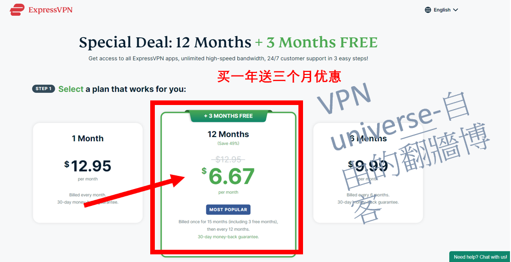

### 第三步: 輸入的電子郵件和付款方式。(Expressvpn 支援: 國內銀行卡購買ExpressVPN，包含visa或是master card(海外卡也可以)，還有比特幣，還有paypal可以用)，千萬不要打錯。不然你就收不到驗證碼了。

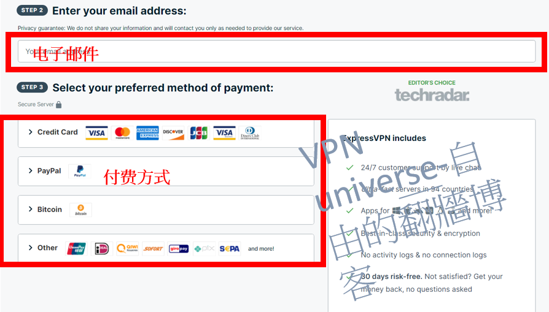

### 跨設備-PC, 手機, 平板-使用ExpressVPN的設置教程

以下是關於如何在不同設備（PC，手機，平板）上設置ExpressVPN的簡單步驟。

#### 1. 購買和注冊ExpressVPN

首先，你需要訪問<a rel="nofollow noopener" href="https://www.xvbelink.com/?offer=3monthsfree&a_fid=wall101&chan=w_github">Expressvpn</a>，選擇適合你的套餐，然後創建一個賬戶。

#### 2. 在PC上安裝和設置ExpressVPN

- 訪問ExpressVPN官網，登錄你的賬戶，然後下載適合你PC操作系統的ExpressVPN應用。
- 打開安裝文件，按照提示完成安裝。
- 打開ExpressVPN應用，輸入你的用戶名和密碼，然後點擊"Sign In"。
- 你可以選擇"Smart Location"自動連接到最佳服務器，或者手動選擇你想連接的服務器。

#### 3. 在手機上安裝和設置ExpressVPN

- 在你的手機上，訪問ExpressVPN官網，登錄你的賬戶，然後下載適合你手機操作系統的ExpressVPN應用。你也可以在App Store或Google Play商店搜索ExpressVPN進行下載。
- 打開應用，輸入你的用戶名和密碼，然後點擊"Sign In"。
- 你可以選擇"Smart Location"自動連接到最佳服務器，或者手動選擇你想連接的服務器。

#### 4. 在平板上安裝和設置ExpressVPN

- 在你的平板上，訪問ExpressVPN官網，登錄你的賬戶，然後下載適合你平板操作系統的ExpressVPN應用。你也可以在App Store或Google Play商店搜索ExpressVPN進行下載。
- 打開應用，輸入你的用戶名和密碼，然後點擊"Sign In"。
- 你可以選擇"Smart Location"自動連接到最佳服務器，或者手動選擇你想連接的服務器。

現在，你已經在你的所有設備上設置了ExpressVPN，你可以享受安全，私密和無阻礙的互聯網體驗了！

## surfshark手把手購買教學
### 第一步: 前往surfshark優惠瑪: <a rel="nofollow noopener" href="https://get.surfshark.net/aff_c?offer_id=323&aff_id=5585&source=w_github&aff_sub=fanqiang">Surfshark (具有無限多設備連接)</a> 點選: get (參考下方教學圖片)

### 第二步: 你可以看到 一次買兩年的優惠連結，所以你只要付24個月的錢，一個月不到3美金 (注意: 這個方式只能使用24個月，如果要續約，建議重新辦一個email,再回來使用這個優惠瑪。)

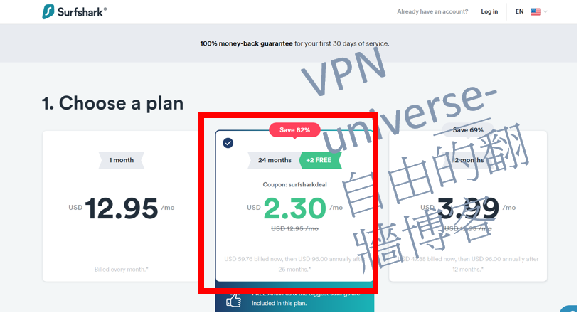

### 第三步: 輸入的電子郵件和付款方式。(Surfshark 支援: 國內銀行卡包含visa或是master card(海外卡也可以)，還有比特幣，還有paypal可以用)，千萬不要打錯。不然你就收不到驗證碼了。

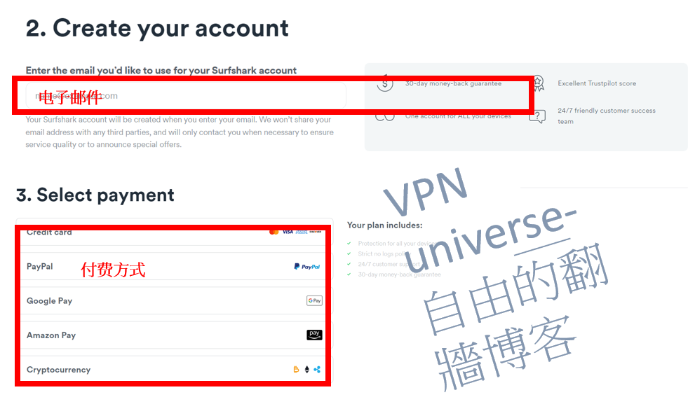

## flowvpn免費試用兩天-手把手購買教學

### 第一步驟: 按照上面的方式購買完成以後，到<a href="https://www.flowvpx.com/download/">flowvpn官方網站</a> 下載自己的使用設備
有windows, mac, android, iOS 可供選擇。

### 第二步驟: 打開安裝檔案，輸入帳號密碼，即可開始使用。

### 第一步: 到 <a rel="nofollow noopener" href="https://www.flowvpx.com/sign-up/?locale=zh-cn&special=FREETRIAL&r=35-890485.w_github">FlowVPN(免費試用兩天)</a> 輸入電子郵件跟密碼 (千萬不要出錯)

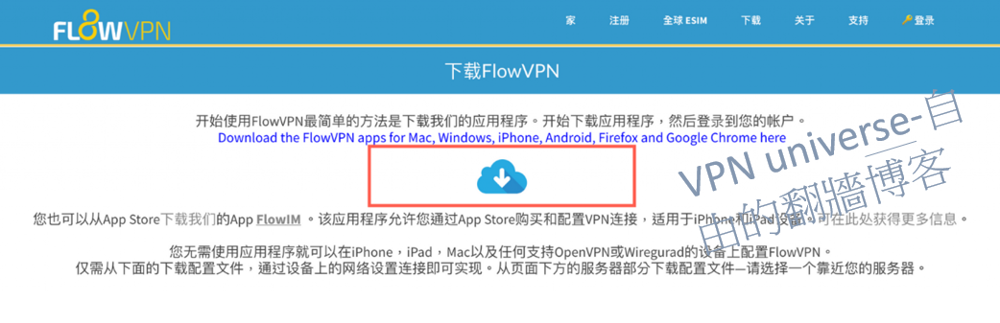

### 第二步: 通過人機驗證: 這裡選狗的照片

### 第三步: 就可以下載flowvpn (支援: 國內銀行卡包含visa或是master card(海外卡也可以)，還有alipay)

## 中國特殊時期的VPN連接問題-敏感時期

究竟何為敏感時期？

從曙光破曉的一刻，到晚霞漫天的那個瞬間，我們都在探索這個問題的答案。敏感時期，是一種源於中國的特殊語境，這個時期內的網路連接將面臨無數挑戰，不論你使用什麼類型的科學上網軟件，都可能遭遇連接困難、掉線問題，如同你在冰天雪地中尋找溫暖的火源，卻只能遭遇滑板和冰凍。中國的互聯網在這個時期就如同處於封閉的禁地，訊息的出入口如同被一張大網籠罩，即使你只是試圖訪問一些並未被封鎖的外國網站，也可能需要耐心等待如同老鼠等待奶酪一樣的漫長。然而，即使在如此艱難的時刻，我們也看到了希望的曙光。從過去兩年的狀況來看，對翻牆軟件的打擊並未明顯加強，這更像是一場喵星人與老鼠的狩獵遊戲，而這個遊戲在未來幾年將會持續進行。就如同蠢蠢欲動的火山，一旦爆發，部分知名的VPN廠商將會透過更新客戶端或線路的方式恢復訪問，但中小型的翻牆軟件恢復的速度則如同烏龜與兔子的比賽，或許需要等待幾個月，甚至可能像走馬換將一樣消失在人群中。

任何宣稱在中國任何時期都能正常使用的翻牆軟件，都像是用甜言蜜語試圖引誘你的狐貍！每年都會有那麼幾次，網路連接變得如同走鋼絲一樣困難的時期。

### 大型會議期間
根據過去幾年的觀察，大型會議期間的外網網路連接像是被鋼鐵鏈鎖住的獅子，即使你使用頂級的VPN或其他科學上網工具，也可能會遭遇失效的問題，能夠連接的節點如同荒漠中的綠洲，難以尋找。有些VPN軟件可能透過切換到L2TP-IPsec協議後得以使用，但速度卻像是乘風破浪的船只，難以保證。此外，一些VPN軟件也可能需要使用OpenVPN手動設定才能使用，如同你需要解開一個神秘的魔法陣。在這個時候，我們建議你放下手中的鼠標，關掉螢幕，像是個觀察家一樣看看央視直播，了解國家大事，和你的朋友一起討論，享受生活的美好。

### 每年六月上旬
並不是每年的這個時間都會如同走過荊棘叢林一樣困難。這個時間段可能是西方人最熱衷於為中國“慶祝”的一個“節日”。五眼聯盟的自由民主的網路電台將會播放各種各樣的圖片和視頻，以此來提醒人們的記憶，如同老司機開車一樣熟悉的路。所有的大型社交媒體都會在這個時期給予相互的支持，就像是打開了一扇通往新世界的大門。我們的政府面對這樣的壓力，只能選擇封閉網路，避免更多的困擾。

### 突發事件
沒有人能夠預知何時會有黑天鵝事件降臨，就如同沒有人能預知何時會遭遇風暴。這種事情一般會在國際上的重大事件發生時出現，比如新冠肺炎疫情爆發、俄羅斯與烏克蘭的沖突等。當你在某個時間點發現許多科學上網軟件無法翻牆時，那麼一定有某種事情正在發生，也許我們並不知道是什麼，也許是國家的網路正在升級，也可能是突發事件，或者是西方媒體的新一輪輿論攻勢，甚至可能是某處有大事將要發生。這時候，我們能做的就是等待，如同在寒冷的冬季等待春天的來臨。網路連接恢復正常後，我們將繼續過我們的日常生活：工作、賺錢、享受美食。

最近，中國的網路管制如同升級的風暴，使得各種翻牆方法都出現了連接不穩定、速度變慢等問題。不僅如此，關於VPS IP被封鎖的討論也如同滾雪球一樣多了起來。然而，如同燈塔一樣的ExpressVPN和StrongVPN精簡特供版客戶端等仍然處於可用狀態，詳細信息可參見下方的VPN推薦指南。

### 為什麼不推薦自己建造伺服器 自己架設VPN?

您可能想要設置自己的 VPN 服務器的原因有很多。 也許您想提高安全性或訪問受地理限制的內容。 但是，出於多種原因，我們不建議您構建自己的 VPN 服務器。 首先，它很貴。 您需要投資強大的硬件和軟件，並且需要為可靠的互聯網連接付費。 其次，它很耗時。 設置和維護 VPN 服務器是一個覆雜的過程，需要大量的技術專長。 最後，風險很大。 如果您不小心，您的數據可能會面臨惡意軟件和數據泄露等風險。 出於這些原因，我們建議使用商業 VPN 服務，而不是設置您自己的服務器。

### 為什麽不在自己的計算機 上建立VPN（建立自己的梯子）來翻墻呢？
有人會擔心，海外VPN不依賴大眾。看到老王VPN、Lantern VPN等案例後，被警察叫去喝茶，所以想自己建VPN，自己架服務器。在這里，我強烈建議不要建立在自己的計算機VPN建立翻墻軟體，原因如下。
- 1 雖然網上有很多流行的開源協議如SSR、V2ray、木馬等搭建天梯，但如果你有一定的技術實力，可以考慮自己做，但很可能會浪費很多時間。原因很簡單，因為這些開源軟件，中國的開發者也能看到，他能看到你的代碼，他肯定早就和你打過交道了。以前的藍光VPN開源軟件一開始可以用，現在不能用了。
- 2 其次，需要自己花錢架設服務器。服務器非常昂貴，需要維護。你必須永遠不能斷電，所以你的家庭服務器必須一直打開。你可以成功翻墻。更新防火墻後，您還必須一起更新算法。為什麽要自己造輪子？
- 3 你只要在國內搭建或是賣翻墻工具就是明確違法行為，違反《中華人民共和國計算機信息網絡國際聯網管理暫行規定》)，就算你只是個人使用，保證違法。如果你再分享給朋友使用，你就明確違法，這就不單單只是被公安叫去喝茶罰500這麽簡單

### 不推薦使用任何破解軟件
出於多種原因，不推薦使用破解軟件。 破解軟件通常不穩定且充滿錯誤。 此外，破解軟件通常缺乏與官方版本相同級別的客戶支持和保護。 破解軟件還會使您的計算機面臨病毒和其他惡意軟件的風險。 最後，許多生產破解軟件的公司實際上是騙局。 他們可能會承諾免費或打折訪問他們的軟件，但是一旦你下載它，你可能會發現它不像宣傳的那樣工作。 簡而言之，破解軟件通常是一項糟糕的投資。 你最好把錢花在軟件的官方版本上，或者找到一個免費的替代品。

### 翻墻軟件中國VPN推薦
總結一下，繞過防火墻的方法有很多，但以我自己的經驗，購買付費 VPN 仍然是大多數用戶的最佳選擇。本文推薦的VPN不僅適用於Windows用戶，還可以安裝在手機、平板等操作系統上。這些VPN基本上使用起來非常方便。
而且雖然我們說的是VPN技術，但是現在大部分主流的VPN都包含了SSR、Trojan、V2ray等開源方式，所以基本上是所有技術的融合。
最後，讓我們談談免費 VPN。我不建議您使用任何免費的計算機 VPN。首先，能不能上網是個問題，而且你可能安裝了惡意挖礦軟件，會給你的信息安全帶來很大的隱患，所以真心建議大家不要貪小便宜，你甚至可能會被要求喝茶。你可以看到我提到的老網VPN和藍燈VPN的案例。
如果您對電腦VPN有任何疑問，請在下方留言，我會一一解答。

## 中國翻墻VPN黑名單-千萬不要入坑-不要使用

### 熊貓VPN
熊貓VPN是翻墻軟件市場的後起之秀。 PandaVPN又叫“熊貓VPN”，公司成立於2018年，總部位於塞舌爾共和國， 官網是：pandavpn.pro 。 主要服務對象為中國大陸網民和在海外的華人華僑。但據我所知，PandaVPN在國內翻墻效果並不穩定。且網站雖然號稱支持支付寶、微信、銀聯卡等國內付款方式。且有7天退款保障。但有許多網友表示，七天退款非常困難，就算申請退款，也幾乎沒有人回信。而且把國家設置在奇怪的小國家，有另外一位博主: [墻博士](https://dr-wall.com/pandavpn/)，仔細研究過熊貓VPN的連接和公司地址。可以發現付款的公司地址和塞舌爾共和國不一致，讓大家感到非常擔心。建議不要使用。

### 藍燈VPN
藍燈(Lantern)是一款用於突破網絡審查的開源代理軟件，過去效能很好，然而這幾年，藍燈VPN為中國最危險的VPN之一，2019年初，廣東省警方對藍燈用戶以“擅自創建、使用非法定信道進行國際聯網”，違反《中華人民共和國計算機信息網絡國際聯網管理暫行規定》之依據進行處罰，罰款人民幣一千元。並且該處罰在“廣東公安執法信息公開平台”進行公示。所以藍燈VPN基本上已經被中國政府破解，基本上已經不能在使用了。建議大家不要再嘗試，否則被叫去喝茶。
這點可以參考:[Lantern翻墻被抓新聞](https://www.williamlong.info/archives/5573.html)

另一個事件為:
中國年輕一代更因此被稱為“信息柏林墻內長大的新世代”。一則官方通告顯示，浙江省舟山市一名男子就因為“翻墻”查找資料，就被警察上門“查水表”。
中共官方網站“浙江政務服務網”日前發布公告稱，張韜在2019上半年至2010年11月間，通過百度搜索到翻墻軟件Lantern後下載安裝，並多次利用Lantern“非法”訪問維基百科查詢資料，24日遭警方逮捕。
這點可以參考: 
[Lantern翻墻被抓新聞](https://www.soundofhope.org/post/437092)

### ProtonVPN
Proton VPN在2018年以前也是一個很火紅的VPN，然而近年來由於防火牆更新的緣故，Proton VPN已經被墻，無法再使用，很多網友也提到 Proton VPN 連不上等問題，之所以勸大家不要再入坑，就是因為Proton vpn在中國早就已經不能使用，proton vpn的官網網站自己已經承認: 自己的軟體服務商已經在中國被墻，所以不需要再花時間嘗試了。在此捷圖為證。

### 極光VPN
極光VPN為另一款市面上號稱免費pc端VPN，雖然啦，大家都號稱免費，但你假如實際使用會發現，你基本上只能免費用一次，這一次就只有兩個小時，一旦超過兩小時，你的帶寬就會大跌。證實我之前所說，免費電腦VPN，只要是免費就保證一個噱頭，免費的電腦VPN都有貓膩。多數就是昧著良心賺錢。所以不推薦大家安裝。 既然正版已經不可靠了，何況是付費版或是破解版，為了自身的安全問題，小心被叫去喝茶，請網友不要嘗試。使用這些電腦VPN，輕則不能翻墻，重則個人資料外洩，像是信用卡資料，網站帳號密碼，電子郵件等重要資訊外洩，所以請網友千萬不要使用如下的翻墻軟件。

### 光年VPN
早在從2025年09月22号`開始，就有很多網友反映光年VPN就出現了各種跑路的跡象：光年VPN的服務器無法連接，光年VPN客服無法聯繫上，光年甚至從谷歌商店和蘋果商店被消失。直接不需要再使用了。

### 老王VPN

網路上出現了一款老王VPN，又稱作Wang VPN，這幾年非常火紅，然後跟藍燈VPN一樣，這款VPN非常非常危險。號稱免費，然後近年至少有兩起因為老王VPN而被公安叫去喝茶的紀錄。

(1)
四川遂寧市男子蔣鵬，因擅自翻墻瀏覽境外網站，包括在YouTube觀看視頻、在Twitch觀看直播和在亞馬遜購物等，被警方給予行政處罰。違法行為人蔣鵬，男，現查明，蔣鵬在其使用的手機上安裝“Turbo VPN”“ThunderVPN”“老王VPN”“免費SS”4款翻墻軟件，使用翻墻軟件在YouTube應用上觀看視頻，在Twitch上觀看直播以及在亞馬遜上購物，以上事實有違法行為人蔣鵬供述與申辯，蔣鵬使用“TurboVPN”瀏覽記錄等證據證實。 消息來源: 遂寧男子瀏覽境外網站被行政處罰。消息參考: [老王VPN翻牆被抓](https://twitter.com/speechfreedomcn/status/1211095986908516352?lang=zh)

(2)2019年5月，陜西省安康市網友楊某某使用老王VPN、螞蟻VPN兩款軟件翻墻被行政警告，並處以500元罰款
[老王VPN翻牆被抓](https://chinadigitaltimes.net/chinese/659157.html)

### 神燈VPN(加速器)怎麽樣

大家可以查了一下神燈VPN的官網，你會發現沒有太多東西。 看起來我不知道他的公司設在哪里，不像我搜索 ExpressVPN 時那樣。 可查到：ExpressVPN 是一家位於英屬維爾京群島的 VPN 服務提供商。 我也知道。StrongVPN 於 1994 年從加利福尼亞州，而且Surfshark是一家位於英屬維爾京群島的 VPN 服務公司。 看任何一家的VPN官網，基本上至少有30頁文章，關於什麽是VPN，VPN協議，還有很多關於他們VPN服務的白皮書。且這類VPN有很多博客文章，也有支持和聯系方式。 這基本上是一個好的 VPN 供應商應該具備的。 不管有沒有辦法翻墻，至少你需要有足夠的信息。 大家可以去 神燈加速器官網看看。 基本沒有信息，能同時連接多少個？ 段落不詳細討論，僅是部分網友的評論。 顯然太少了。

### Astrillvpn

Astrillvpn算是很貴的VPN。在我們開始談論 AstrillVPN 是否適合通過防火墻之前，我們先來看看以下幾點我認為是不足的地方。

首先價格太高了：
Astrill VPN非常昂貴，一年一個月要10美元，而StrongVPN每月3美元，ExpressVPN 15個月每月7美元，即使你只購買六個月，每月9美元，Surfshark每月只需6美元，7美元，兩個只需3美元 年。 這根本就是是整個 VPN 市場上最貴的一款。

並非所有網站都可以訪問（沒有退款機制）：
如果這麽貴的話，應該是極速的，可以解封很多網站，但是AstrillVPN可以瀏覽Netflix，但是一些像huhu這樣的網站就不行了。 最重要的是，與ExpressVPN、Surfshark VPN相比，StrongVPN有1個月的退款，而Astrill VPN只有7天的試用期（而且不退款）。 千萬不要使用。

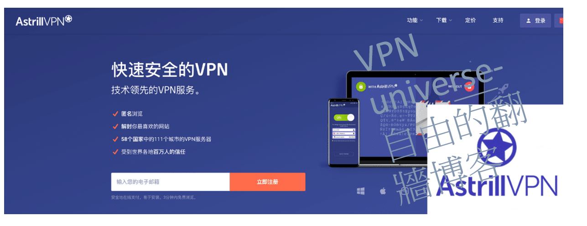

### NordVPN

NordVPN是一款非常有名非常多人使用的歐美VPN。很可惜 NordVPN 的官方網站在中國無法使用。NordVPN 總部位於巴拿馬，沒有參與五眼或十四眼聯盟，因此該公司承諾不保留用戶日志。 從這個角度來看，它屬於非中文VPN，這是一個很好的條件。 NordVPN 也與其他 VPN 相同，具有適用於 Windows、macOS 和 Linux 的桌面應用程序，以及適用於 Android 和 iOS 以及 Android TV 的移動應用程序。 不僅如此，NordVPN也很擅長營銷，Nord與很多youtuber合作過，口碑非常高。 很遺憾，2018年之後，技術逐漸落後，在我看來是一個遺憾。

### VyprVPN
如果您看到其他人推薦 VyprVPN，請不要再使用了。 VyprVPN 目前在中國的表現相對較差。 我個人的經驗是2年前在中國還不錯，但是從那以後速度和穩定性都下降了。 但是，由於其隱私和安全功能，VyprVPN 對於印度來說仍然是一個不錯的選擇。 此外，VyprVPN 還可以提供對印度被封鎖網站和內容的訪問。

### 佛跳牆VPN
有讀者問我佛跳牆VPN怎麽樣？ 使用可靠嗎？ 根據我之前的測試結果以及和使用過的用戶的交流，穩定性和安全性都不是很好，不建議使用。 雖然名字叫VPN，但我覺得底層還是基於SS，DNS會泄露，不能很好的保護隱私數據。 我上個月花了6.99美元買了一個月的佛跳牆VPN套餐。 上網後發現有些網站打不開。 我聯系了客服，他們說是政府規定的。 一個星期後，佛跳牆VPN經常斷線，所以放棄了。 所以，從我個人的角度來看，不推薦使用佛跳牆VPN。 VPN 最初是為了方便而犧牲安全性的工具。 如果我們要追求安全，除了VPN之外，我們還需要其他工具。 佛跳牆VPN可能很方便，但它的安全性並沒有得到很好的保證。

### IVacy加強版

2023年5月的實測結果，連接成功率和速度堪憂，表現欠佳。目前狀況來看，使用效果並不理想。

**注意**：如果你是Windows客戶端的用戶，有個小技巧可以試試。你可以請求客服向你提供"China Prime"版本的客戶端進行登錄，這是專門為中國用戶設計的版本，可能會有不錯的效果。

IVacy VPN在業界別具一格，它並不限制用戶的在線設備數量。這一特性在VPN服務供應商中堪稱少見，許多其他VPN供應商都會對在線設備數量進行限制。

#### IVacy: 聚焦中國市場

IVacy在全球70多個地區都設有服務器，同時，它對中國市場的關注度也相當高。這點在它的中文支持上表現得尤為明顯。

#### 安全性和匿名性: 軍用級別的加密技術

IVacy采用軍用級別的加密技術，用戶可以通過VPN實現IP匿名隱藏以及DNS隱藏等，以最大限度地保護自己的隱私安全。

#### 掉線切換機制: 高效的網絡切換

雖然在使用過程中，VPN掉線是無法避免的，但是IVacy實現了高效的網絡切換。通過多個服務器的切換，保證了隱私和匿名性。

#### 7*24小時技術支持: 時刻在線解答你的問題

無論在使用過程中遇到何種問題，你都可以在任何時刻聯系他們的客戶服務團隊。他們的服務團隊全天候在線，隨時準備幫你解決問題。

### PureVPN：老牌服務商，但是體驗一般
PureVPN在2023年1月的測試中，雖然可用，但並無特別亮點，給人的體驗感一般。部分節點可以連接，但網速只能說湊合。對於想翻墻回國的用戶來說，不太推薦使用這款VPN，因為其在中國的服務器已被去除。不過，據群友反映，近期PureVPN在國內的表現相較於之前有所提升。如果你有興趣，可以試試，如果體驗不佳，可以直接申請退款。

PureVPN是一家成立於2006年的老牌服務商，總部位於英屬維爾京群島，一個許多VPN大廠選擇設立地址的地方，因為這里的政策對於互聯網數據的加密保護相對寬松。在全球的106個地區擁有超過6500台服務器，雖然線路眾多，但並非所有節點在中國都能用。在中國的網絡速度、穩定性上，相較於其他幾家VPN服務商，PureVPN的表現一般。就我去年的體驗來說，客戶端VPN線路連不上的時間加起來有2個月左右，約占全年的80%。但如果你在敏感時期使用OpenVPN手動配置的話，全年可用率會更高一些。

#### 用戶友好度
PureVPN的客戶端支持中文，對國內的用戶十分友好。另一大特點是曾設有北京、上海等城市的服務器，極大地方便了海外華人瀏覽優酷、愛奇藝、酷狗音樂等有國內版權的網站。支持WireGuard協議，這點對於國內用戶還不錯。然而，中國的服務器目前已被去除，這可能會給用戶帶來不便。

#### 設備支持
PureVPN支持Windows、Mac OS、iOS（包括iPhone和iPad）、以及安卓Android等設備，並最多支持10台設備同時使用。需要特別注意的是，對於Mac用戶，我在Macbook上使用時發現Mac版本的APP在國內並不好用，軟件容易卡死，建議Mac用戶使用OpenVPN手動配置。在其他設備的APP客戶端上，我並未發現此類問題。

#### 隱私保護
PureVPN擁有多種加密協議，並提供安全的DNS機制以及其他隱私保護功能，包括保護連接斷開切換的機制，以防在連接中斷後出現數據泄露的風險。PureVPN承諾不會記錄行為日志，並且不會將數據分享給任

這個表格列出了不確定能用，價格過高，或者已經不能使用的 VPN，以幫助讀者避免選購不合適的 VPN。

| VPN 名稱 | 描述 |
| --- | --- |
| 360VPN | 不確定能用 |
| Astrill VPN | 價格太高 |
| CyberGhost | 價格太高 |
| 大象VPN | 不確定能用 |
| Flyvpn | 不確定能用 |
| GreenVPN | 不確定能用 |
| hotspot shield | 免費VPN |
| IPVanish VPN | 價格太高 |
| Kitten VPN | 不確定能用 |
| Kuto VPN | 不確定能用 |
| LetsVPN(快連VPN) | 不確定能用 |
| NordVPN | 已經不能使用 |
| Panda VPN | 不確定能用 |
| PlexVPN | 小型VPN |
| Private VPN | 不確定能用 |
| Proton VPN | 不確定能用 |
| PureVPN | 不確定能用 |
| QuickVPN | 不確定能用 |
| Shadowrocket | 不確定能用 |
| SuperVPN | 不確定能用 |
| Testflight VPN | 不確定能用 |
| Thunder VPN(閃電VPN) | 非常不穩定 |
| Turbo VPN | 不確定能用 |
| UrbanVPN | 免費VPN |
| VPN Proxy Master | 不確定能用 |
| VPN hub | 不確定能用 |
| VyprVPN | 不確定能用 |
| Windscribe | 免費VPN |
| 光年VPN | 已跑路 |
| 公主連接加速器 | 不確定能用 |
| 極光VPN | 不確定能用 |
| 海鷗網絡加速助手 | 風險VPN |
| 火箭 VPN | 不確定能用 |
| 佛跳墻VPN | 不確定能用 |
| 老王VPN | 已經有人被抓 |
| 藍燈VPN | 開源 |
| 邊緣VPN | 小型VPN |
| 狗急加速VPN | 小型VPN |
| 飛魚VPN | 小型VPN |
| 黑洞VPN | 不確定能用 |
| 螞蟻VPN | 不確定能用 |
| 789vpn(加速器) | 不確定能用 |
| 神燈VPN | 不確定能用 |
| 雲帆VPN | 不確定能用 |
| tenonvpn | 小型VPN |
| 夏時VPN | 小型VPN |

## 中國VPN推薦標準以及必要的特色

在選擇 VPN 服務時，以下是一些重要的考慮因素：

### 1. 穩定可靠的大品牌
隨著我國政策的日益嚴格和“墻”的不斷升高，一些常見的 VPN 流量，如過去的 PPTP 協議，現在已經容易被識別和封鎖。此外，一旦某些 IP 被大規模發現有特征流量，這些 IP 基本上就不能再使用了。這也是自建 SSR 存在的問題，一旦 IP 被封，通常需要付費購買新的 IP。

因此，選擇一個穩定可靠的大品牌 VPN 非常重要。這需要 VPN 服務商有強大的資金和技術支持，才能應對“墻”的不斷升級和叠代，長期保持 VPN 服務的穩定和可靠。

### 2. 個人測試和使用
本文推薦的 VPN 服務都是全球排名前 20 的大品牌，都經過了我個人的使用和測試。這與許多其他的推薦不同，那些推薦可能是沒有實際測試和使用過，或者包含了很多過期的信息。例如，有些 VPN 品牌可能已經倒閉（比如 Green 等國產品牌），或者以前在國內能用，現在卻不能用了。

我個人也是經常幾家換著用，最少要做兩手準備，以防在墻外出現尷尬的情況。

我們的 VPN 推薦是基於上述的選擇標準，建議大家在選擇 VPN 時，參考這些標準和我們的 VPN 排名，以及我分享的最新使用信息，而不是盲目付費購買。

### 1 各種操作系統均支持
如果你運行的是 Windows 或 macOS，多數人不必擔心這個問題。大多數VPN還具有適用於Android和iOS的移動應用程序。 但是，如果你運行的是Linux或其各種特別的發行版，例如 Ubuntu，則情況並非如此。大多數VPN僅提供適用於 Linux 的命令行應用程序，而Expressvpn 和strongvpn 是少數具有完整 Linux 應用程序的 VPN 之一。

### 2 多少設備同時連接
Expressvpn，StrongVPN，flowvpn，最多允許五種設備連結，surfshark則可以允許無限多台設備連接，這里要記住的一件事是，這只是你可以同時連接的設備數量。你仍然可以在無限多的設備上安裝和運行 Expressvpn，StrongVPN，flowvpn 等服務——你只是無法同時在所有設備上運行 VPN。

### 3 拆分隧道技巧
拆分隧道(英文稱作VPN split tunneling)，簡單說就是: 拆分隧道允許您選擇哪些應用程序將通過VPN運行，哪些應用程序將不受保護。比方我在國內一個瀏覽器聽愛奇異，另一個瀏覽器在看IEEE的文章(研究生的日常)，愛奇異就不需要通過VPN，IEEE則需要通過VPN，這樣讓你的平均速度的最大化。通常當你運行VPN時候，local端的速度會降低，因為中間的傳輸VPN加密需要時間。隧道拆芬可以部份解決這個問題。

### 4 帶寬(bandwidth)
這是一個經常被誤解的主題，很多博主搞不清楚帶寬限制和數據限制的差別。帶寬決定了你一次可以傳輸多少數據。簡單說，你擁有的帶寬越多，你可以傳輸的視頻質量就越高。擁有無限帶寬意味著連接到 VPN的其他人不會影響你的速度。再舉個例子: 另一方面，數據限制決定了你在特定時間段內可以使用的流量。例如，如果你的每日數據流量限制為10GB，您可以觀看兩到三部高清電影，或下載 10GB 的文件。

### 5 七天24小時 客戶支持
通常有兩種方法，ExpressVPN 等高級VPN提供商提供聊天(online chat)作為主要支持形式。更多大多數提供商允許你直接通過電子郵件溝通，strongvpn 和expressvpn都有即時聊天系統。

### 6 30天內退款保證
如果你對為你購買的VPN猶豫不決，你會很高興聽到大多數 VPN 提供30天內退款保證

## VPN 隱私功能
### 7 無日誌政策
無日志政策幾乎是VPN必要條件，簡單說: 他永遠不會記錄或存儲您的數據。但是，除了檢查VPN提供商的歷史記錄是沒有什麽好方法可以知道哪些提供商會真正的清除用戶的紀錄。過去有不少VPN號稱無紀錄，但是後面被發現 偷偷的販售使用者資料，這類VPN，我有整理在下方。大家千萬不要使用。

### 8 多元付款方式 
包含 信用卡，master card, visa card。paypal。支付保alipay，ExpressVPN甚至允許你使用比特幣等加密貨幣進行支付。

### 9 安全性高: 使用最新的加密系統
加密的原理需要用到很多數學，這裡不在詳述，VPN使用加密協議對您的數據進行加擾，並使用加密密鑰確保其安全。你很可能會看到以字母和數字組合命名的加密類型，例如 AES-256、RSA-4096。這都是不同的加密演算法，牽涉到很多代數相關的問題，簡單說 數字越大，加密協議越安全。

### 10 各種VPN協議
在VPN裡面，有各種協議，PPTP vs. OpenVPN vs. L2TP/IPsec vs. SSTP各種協議。每種協議針對不同設備跟用途各有優劣，這裡不再做詳述

### 11 VPN自動化的功能
VPN現在會自動執行VPN連接，因此你不會意外連接到不受保護的互聯網。例如，你可以選擇連接到離你最近的服務器，或你最後連接的位置。但並非所有VPN服務都提供相同的自動化功能。

### 12 VPN終止開關
VPN終止開關是另一個自動化功能，如今幾乎是標準的VPN功能。如果你的VPN由於某種原因停止工作，它會自動切斷你的互聯網連接。這可確保你始終受到安全VPN連接的保護，即使VPN突然連接中斷，你也會馬上離開互聯網。保障你的安全

## VPN服務器的分析-使用小秘訣

VPN服務器的分布，也是一個很VPN效能的關鍵因素，第一: 服務器的數量當然重要，但更重要的是它們的分布方式以及它們覆蓋的國家/地區。你離VPN服務器越近，連接速度就越快。

### 如何解決VPN連接中斷的問題

使用VPN（Virtual Private Network）時，連接中斷是一個常見的問題。這可能由多種原因導致，例如網絡質量不佳，服務器過載，甚至是防火墻的幹擾。不論原因如何，這都是一個令人沮喪的問題，尤其是當你正在進行重要的工作或看你最喜歡的節目時。但是，有一些有效的策略可以幫助你解決這個問題：

#### 1. 更換VPN服務器

有時候，VPN連接中斷的問題可能是由於你正在連接的服務器過載或質量不佳。在這種情況下，更換到另一個服務器可能是一個快速有效的解決方案。大多數VPN服務都提供多個服務器供用戶選擇，你可以試試看是否有其他服務器可以提供更穩定的連接。

#### 2. 檢查網絡連接

如果你的互聯網連接本身就存在問題，那麽VPN服務可能無法正常工作。在這種情況下，你需要解決網絡連接問題，例如，嘗試重啟路由器，或者與你的互聯網服務提供商聯系。

#### 3. 切換VPN協議

大多數VPN服務都支持多種VPN協議，例如OpenVPN，PPTP，L2TP/IPsec等。這些協議在速度，安全性和穩定性上有所不同。如果你經常遇到連接中斷的問題，你可以試試看切換到其他的VPN協議。

#### 4. 使用網絡連接監控功能

一些高級的VPN服務提供了網絡連接監控（Network Lock）或者叫做斷網殺開關的功能。這個功能能夠在你的VPN連接突然中斷時立即停止所有的網絡流量，以防止你的數據被泄露。當你的VPN連接恢覆後，網絡流量就會自動恢覆。

在解決VPN連接中斷的問題時，關鍵在於找到問題的根源。這可能需要一些時間和耐心，但是一旦你找到了解決方案，你就可以享受到無中斷的VPN服務。

### 如何確保你的VPN一直開啟並正常運行

確保VPN一直開啟並正常運行對於保持連續的網絡安全和隱私至關重要。以下是一些策略和建議：

#### 1. 選擇一個穩定的VPN服務

並非所有的VPN服務提供商都一樣，一些服務提供商可能比其他服務更穩定，有更好的客戶支持，或者有更強的基礎設施。在選擇VPN服務時，務必做好調查，並根據你的需求和預算選擇最適合你的服務。

#### 2. 使用自動啟動功能

大多數VPN應用都有自動啟動功能，這意味著當你啟動設備時，VPN會自動連接。這可以幫助確保你的VPN一直開啟。

#### 3. 使用殺開關（Kill Switch）功能

殺開關是一種特殊的VPN功能，當你的VPN連接意外中斷時，它會立即斷開你的互聯網連接，防止你的數據在未加密的狀態下傳輸。當VPN重新連接後，互聯網連接也會自動恢覆。

#### 4. 定期檢查VPN連接

雖然大多數VPN應用會在連接中斷時提供通知，但還是有一些可能不會。你可以定期檢查你的VPN狀態，或者使用一些第三方工具來監控你的VPN連接。

#### 5. 確保你的設備和應用程序保持最新

過時的操作系統和應用程序可能會影響VPN的性能和穩定性。確保你的設備和VPN應用都保持最新，可以幫助你防止這種問題。

#### 6. 選擇正確的VPN協議

不同的VPN協議在穩定性，安全性和速度方面有所不同。在網絡環境不穩定或者速度較慢的情況下，使用更穩定或更快的協議可能有助於保持VPN的連續連接。

每個人的情況和需求可能會有所不同，你可能需要根據自己的具體情況調整這些策略。在任何情況下，保持你的VPN一直開啟並正常運行都是保護你的網絡安全和隱私的重要步驟。

### 實體vs虛擬服務器
實體服務器是存在於現實世界中的硬件(硬體速度比軟體快)。它在幫助提供商端運行VPN軟件，當你使用VPN時，它就是您連接和發送流量的工具。實體服務器（在大多數情況下）比虛擬服務器更快。虛擬服務器是在實體服務器上運行的模擬服務器，可能位於不同的位置。ExpressVPN使用一些虛擬服務器為他們的用戶提供他們無法操作的國家/地區的訪問權限。例如，如果某個國家/地區已禁止 VPN(像是中國)，或者如果在那里建立硬體服務器在經濟上不可行(非洲國家)，則VPN可以使用虛擬服務器來提供對該位置的訪問。

### 媒體服務器 
媒體服務器是針對帶寬密集型任務（通常是多媒體影音平台）來進行優化的服務器。並非所有服務器的構建方式都相同，由於位於高流量位置，某些服務器的容量可能會降低。媒體服務器應該（理論上）為繁重的任務提供更好的連接，並隱藏你正在使用VPN的事實，因此媒體網站不會阻止你。

### P2P服務器
P2P（或“點對點”）網絡是您可以直接從其他用戶的計算機下載文件的地方，而不是集中式服務器。特別適合torrent的下載如，果您打算使用 VPN 進行種子下載，那麽使用專用服務器總是有幫助的。除了額外的帶寬容量，這些P2P服務器還提供額外的安全措施。

## 在中國使用VPN常見的問題
底下是網友常常問問的部分問題，我將它稍微整理如下:

### 我購買的strong VPN突然不能連線，要如何處理: 
strongvpn 是目前最受歡迎的 VPN 提供商之一，但這並不意味著它是完美的。 用戶體驗的一個常見問題是 strongvpn 丟失連接。 這可能會令人沮喪，尤其是當你正在將 VPN 用於重要的事情時。 發生這種情況的原因有幾個。 首先，strongvpn 可能在您所在的地區遇到中斷。 其次，您的互聯網連接可能不穩定。 第三，您可能超出了計劃的數據限制。 第四，您連接的服務器可能正在經歷大量流量。 如果您遇到 strongvpn 丟失連接，您應該做的第一件事是檢查您所在地區是否存在任何已知問題。 如果沒有，請嘗試重新啟動路由器和 strongvpn 客戶端。 如果這不起作用，請聯系客戶支持以幫助解決問題。

### 如果您在嘗試購買 StrongVPN 時收到“檢測到可疑活動，請聯系支持”消息 (Suspicious activity detected, please contact the support.)
如果您在嘗試購買 StrongVPN 時收到“檢測到可疑活動，請聯系支持”消息，則可能是您使用的公共代理 IP 或郵箱有問題。我們建議嘗試其他機會或聯系客戶服務尋求幫助。聯系客戶服務時，請務必提供與您合作的代理的 IP 地址，以便他們調查問題並盡快幫助解決問題。

### 防火牆升級導致expressvpn，不能連線，怎麼處理。
ExpressVPN 是一種虛擬專用網絡服務，允許用戶以更高的隱私和安全性連接到互聯網。 但是，升級墻後，ExpressVPN無法連接。 這是因為墻的例行升級導致ExpressVPN的幾個常用節點突然無法連接。 但別擔心，有一個解決方案。 用戶可以嘗試連接手機上的其他節點，也可以嘗試使用L2TP協議連接其他節點。 使用 ExpressVPN，用戶將能夠以更高的隱私和安全性享受互聯網。

### 防火牆升級導致surfshark，不能連線，怎麼處理。
Surfshack 提供了一種專用的智能上網模式，可自動將您連接到最佳位置的最快服務器。 這使其成為想要在海外訪問相關內容或網站的任何人的理想選擇。 然而，Surfshack 的一個缺點是它偶爾會失去連接。 這可能令人沮喪，但您可以采取一些措施來解決此問題。 首先，確保您使用的是最新版本的 Surfshack 應用程序。 其次，檢查您的互聯網連接並確保其穩定。 最後，如果一切都失敗了，您可以嘗試連接到不同的 Surfshack 服務器。 按照這些步驟，您應該能夠成功連接到 Surfshack 並享受它的所有好處。

### 經過15個月以後，我想要再用優惠代碼購買expressvpn? 是否可以?
如果您希望續訂 ExpressVPN 訂閱，可以通過此頁面上的折扣鏈接進行。 只需使用新的電子郵件地址創建一個新帳戶，您就有資格獲得三個月的免費。 然後，您可以直接從 ExpressVPN 網站續訂舊帳戶或購買新訂閱。 請記住，年度續訂舊帳戶沒有折扣，因此如果您走這條路線，則必須支付全價。

其他VPN續費方法與此相同。 大多數品牌為新帳戶提供折扣，因此在注冊新帳戶之前清除瀏覽器 cookie 或使用 VPN 非常重要。 這將幫助您避免被系統視為重覆注冊。 續訂訂閱時，請務必檢查可能提供的任何特別優惠或交易。 您通常可以在品牌網站上或通過搜索引擎找到這些優惠。 如果您通過第三方提供商續訂訂閱，請務必詢問他們是否提供任何折扣。 很多時候，通過第三方提供商續訂訂閱可以為您省錢。

### 使用expressVPN或strongvpn 連接後，訪問國內網站慢或者無法訪問，
對於那些尋求可靠且價格合理的 VPN 服務的人來說，StrongVPN 或expressvpn 是一個不錯的選擇。然而，SStrongVPN 或expressvpn的一個缺點是它是一個全球代理。這意味著連接後，你的數據會先發送到國外服務器，然後再傳回給你。這可能會顯著增加你的連接延遲，並使網頁瀏覽或流式視頻非常緩慢。一種解決方案是在你的計算機上安裝虛擬機並使用它來訪問 StrongVPN。通過這樣做，你可以完全避免延遲問題。此外，StrongVPN 經常提供續訂折扣，因此值得經常查看他們的網站以獲得最優惠的價格。

部分電腦讀者也主要遇到strongVPN的外網連接問題（我自己用的時候遇到過這樣的問題，但是重新連接就好了，如果一直無法上網，請咨詢官網） 回覆來自客服是： 本地網絡操作 商用DNS有限制，可能需要修改DNS服務器。比如改成114DNS或者阿里雲DNS就可以解決這個問題。修改DNS服務器：打開Strong VPN客戶端——點擊設置——點擊高級——選擇“使用自定義DNS服務器”——第一行DNS服務器地址輸入8.8.8.8——第二行輸入8.8.4 4輸入DNS服務器地址（或其他可以連接的公網DNS服務器）-save-restart strong vpn-retry connection

如果仍然無法解決，可能與您的路由器設置或你的 ISP 限制有關。您可以嘗試以下解決方案：

1) 在路由器上為 UDP 500 和 UDP 4500 配置端口轉發；
2) 在您的路由器上啟用 OpenVPN/IPSec 直通；
3) 設置您計算機的防火墻以允許來自 Strong 的所有流量

## strongvpn 的使用安裝教學

現在來解釋如何下載並使用strongvpn。按照上述方法付完錢以後，選擇你的對應設備: 有iOS, linux, windows, mac, 或android，這裡用windows系統當作教學。關於其他設備，可以參考我的其他文章。

###  第一步  StrongVPN官方網站注冊並完成購買以後，從<a href="https://dr-wall.com/go/strong?data1=strong&data2=article">StrongVPN</a> 登入用戶端後台，選擇”StrongVPN Client”，strongvpn會自動偵測你的系統。
如果系統沒有自動選擇，你可自行選擇作業系統進行軟件下載。

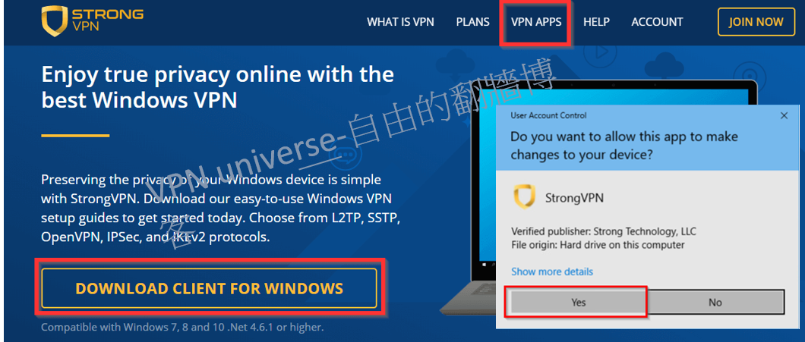

### 第二步: 下載完成後，根據指示即可安裝完成。登入需要輸入信箱與剛剛透過郵件設定好的密碼。
有時候，系統會詢問您是否允許設置 StrongVPN 應用程序，單擊彈出窗口上的“是”按鈕。偶爾也會詢問您是否允許啟動 StrongVPN 應用程序。也點"是"。即可

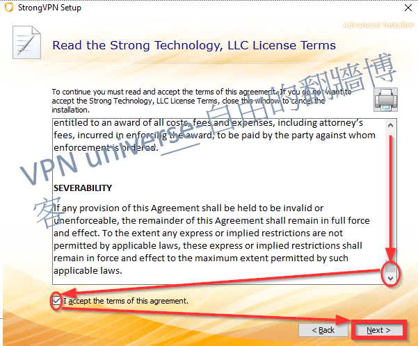

### 第三步: 輸入帳號密碼之後開啟，輸入帳號密碼登入即可使用。參考下方圖片

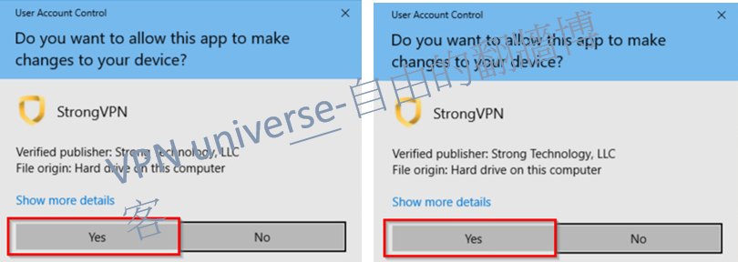

### 第四步: 智能選擇節點或是自己選擇地點
你可以透過Strongvpn內建的智慧節點選擇或自行選擇節點進行連線。我個人建議中國翻墻首選的話，目前測試起來香港台灣日本等三地效果最佳。更多細節我會在下面一一回答。

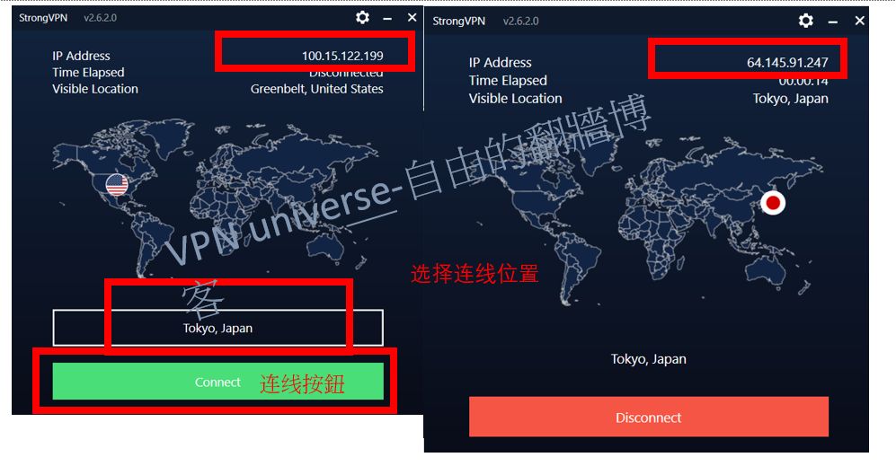

## Expressvpn 的安裝教學

現在來解釋如何下載並使用Expressvpn。按照上述方法付完錢以後，選擇你的對應設備: 有iOS, linux, windows, mac, 或android，這裡用windows系統當作教學。關於其他設備，可以參考我的其他文章。

### 第一步 記得先用<a rel="nofollow noopener" href="https://www.xvbelink.com/?offer=3monthsfree&a_fid=wall101&chan=w_github">Expressvpn 優惠</a>購買
Expressvpn 底下我用mac當作教學。 先到<a href="https://www.expressvpn.com/vpn-software/vpn-mac">官方網站</a>下載，expressvpn會自動偵測你的設備。或是登錄帳號: 轉到ExpressVPN 帳戶儀表板。如果出現提示，請輸入你的 ExpressVPN 帳號密碼 並單擊登錄

### 獲取激活碼(activation code)
要在的 Mac 電腦上使用 ExpressVPN，找到你的activation code。

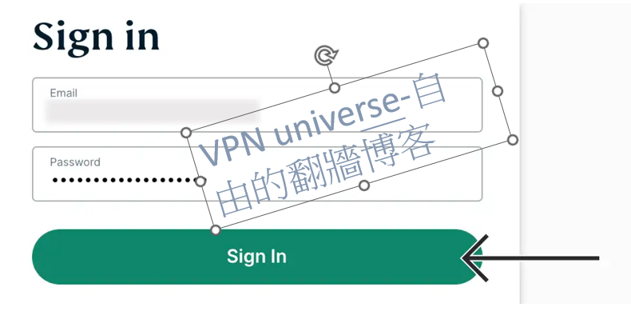

### 第二步 安裝應用程序
在電腦上找到下載的文件並打開它。彈出一個窗口。系統會問你 “是否允許運行一個程序來確定是否可以安裝該軟件。” 單擊繼續，然後繼續單擊繼續，直到到達“安裝類型”屏幕。選擇安裝local位置，點擊安裝。等待安裝完成，然後單擊關閉

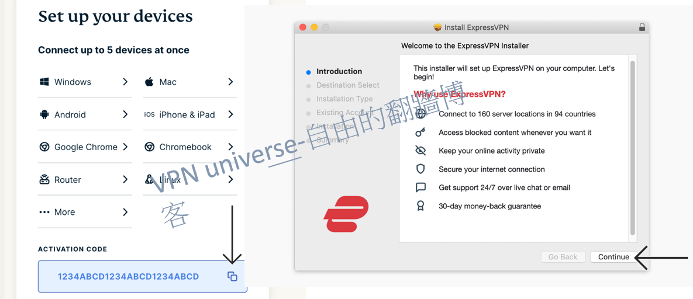

### 第三部: 登入expressvpn開始使用:
首先sign in ExpressVPN，輸入你的帳號密碼(或是剛剛的activation code)，mac系統可能會詢問你是否允許在VPN 配置中添加 ExpressVPN IKEv2，請單擊允許繼續。

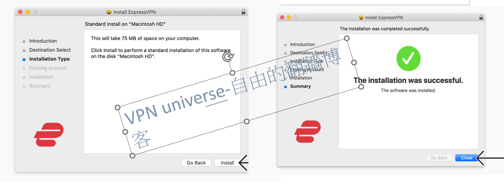

### 第四部: 使用方法
要連接到 VPN 服務器位置，請單擊中間的圈圈按鈕。. 默認情況下，ExpressVPN 會建議為自動提供最佳體驗的位置，稱為智能位置。點選以後，紅色的圈圈會變成綠色的 (顯示connected)。表示連線上了，這時候可以測試看看可否翻牆成功。

注意：每一次訂閱，最多可以同時將五台設備連接到 VPN。

要關掉vpn，就在點擊中間的按鈕，系統會回到disconnected狀態。點下方可以換國家。 自己選擇位置，在中國的朋友建議選擇香港，台灣，日本這幾個地方。更多expressvpn操作細節，請參考我的其他文章。

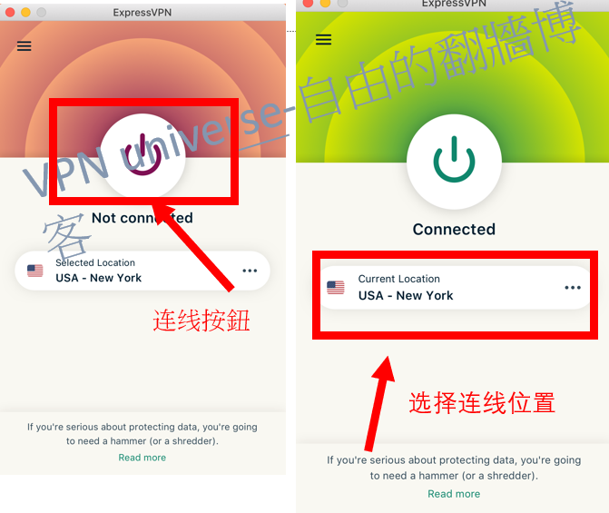

## Surfshark 的安裝教學

現在來解釋如何下載並使用Surfshark。按照上述方法付完錢以後，選擇你的對應設備: 有iOS, linux, windows, mac, 或android，這裡用windows系統當作教學。關於其他設備，可以參考我的其他文章。
### 到官方網站下載surfshark以後，進行安裝
可參考下方圖片，系統會詢問你是否安裝，都點是:

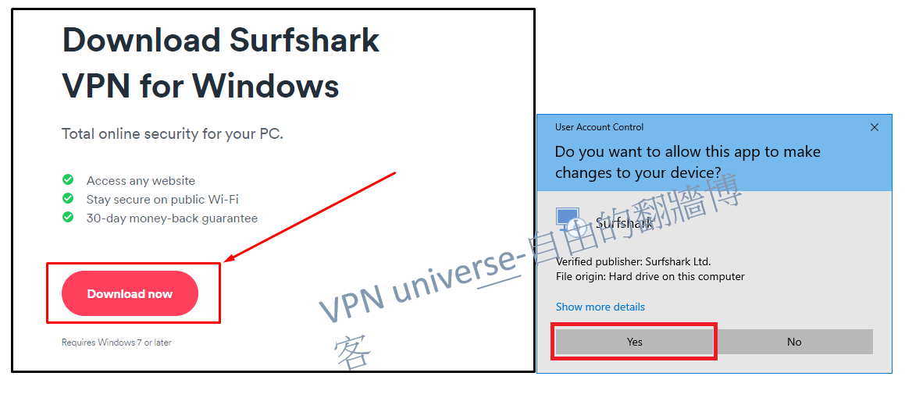

### 輸入帳號密碼

下載完成以後，打開系統，輸入帳號密碼即可登入。

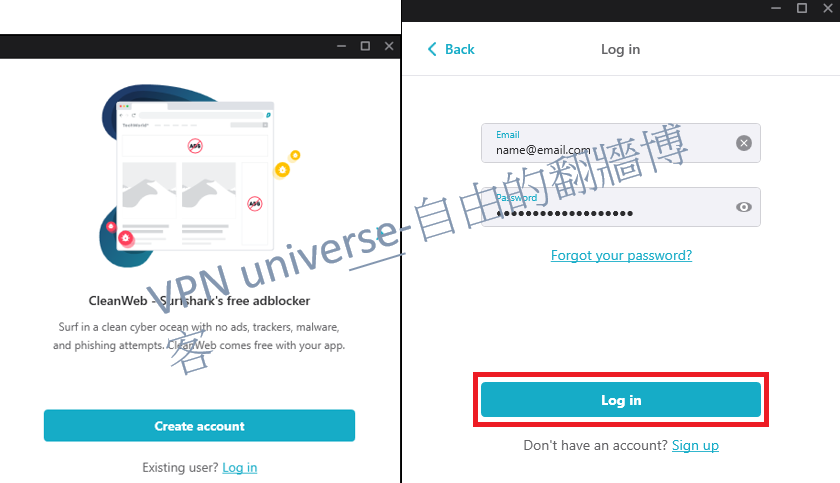

### 即可連線成功。

點選中間的connected按鈕，即可連線，這時候會出現surfshark正在運行的畫面，左邊可以選擇連線國家，請參考下方是意圖。

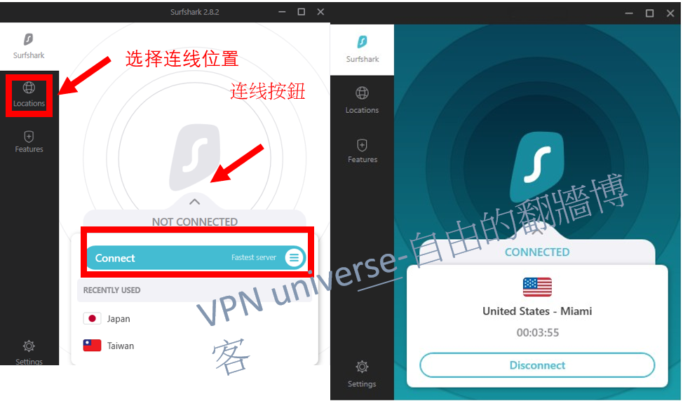

## flowvpn 的安裝教學

### 現在來解釋如何下載並使用FlowVPN。按照上述方法付完錢以後
選擇你的對應設備: 有iOS, linux, windows, mac, 或android，這裡用windows系統當作教學。關於其他設備，可以參考我的其他文章。
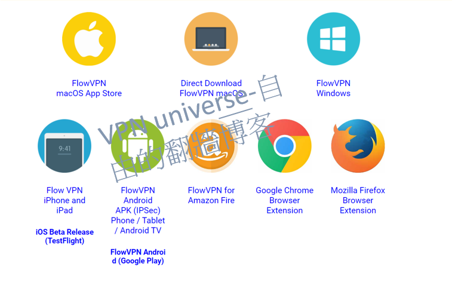

### 下載完軟體以後，點擊安裝，安裝完畢即可

### 點選連線(connect)，下方選單可以選取連線國家。參考下方圖片，連線上以後，windows電腦會出現flowvpn已經connected。
可以選擇國家

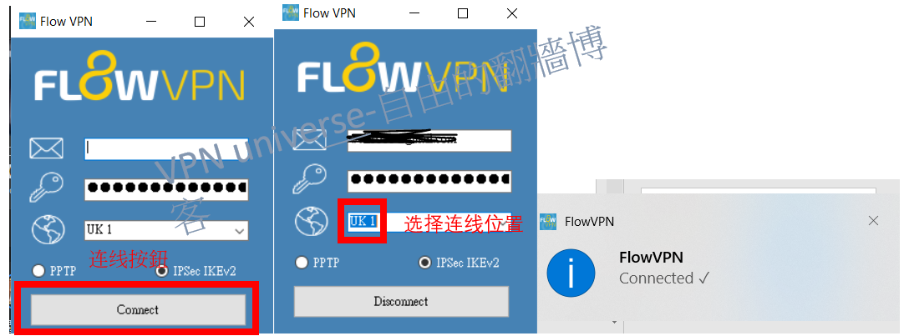

## 翻墻後可以做什麽呢

當你使用VPN翻墻後，你將會迎來一個全新的網絡世界。這個世界擁有豐富的資源，無論你是尋找豐富的娛樂內容，獲取更廣泛的新聞報道，還是進行深入的在線學習，你都可以在這個網絡世界中找到滿足你的網站和應用。為了讓你能更好地利用翻墻後的網絡，我在此提供了一份詳盡的網站和應用列表供你參考。

首先，我們來看看社交媒體類應用，如Twitter、Facebook、Instagram、YouTube、WhatsApp、Telegram、Line等，這些都是我們在生活中交流溝通的重要平台。

然後是流媒體服務，如Netflix、Hulu、HBO Max、Disney+、BBC iPlayer、HBO Now等，這些平台提供了大量的電影和電視劇資源。

接下來是搜索引擎和問答社區，包括Google、Bing、DuckDuckGo、Reddit、Quora、Stack Exchange、Medium、Wikipedia等，這些網站可以幫助我們快速地找到所需的信息。

新聞和媒體網站，如CNN、BBC、The New York Times、The Washington Post、The Guardian、Reuters、Al Jazeera、Bloomberg、Vice News等，可以讓我們獲取第一手的國際新聞。

遊戲愛好者可以通過VPN訪問Steam、Epic Games、Origin、Battle.net、GOG、Twitch等遊戲和遊戲平台。

此外，你還可以通過VPN訪問The Pirate Bay、KickassTorrents、1337x、RARBG、Torrentz2、Nyaa.si等文件分享和下載網站。

其他類型的網站還包括匿名網絡（如Tor）、匿名電子郵件（如ProtonMail）、博客和論壇（如WordPress、PHPBB）、在線教育網站（如Coursera、edX）、網上購物網站（如Amazon、eBay）等等。

請注意，雖然VPN可以幫助我們翻墻，但我們在使用的過程中，仍需要注意合法合規，盡量避免訪問那些可能涉及法律風險的網站。

以下是一份更詳細的網絡資源分類，希望對你有所幫助：

|   類別   |   選擇1   |   選擇2   |   選擇3   |   選擇4   |   選擇5   |
| :----: | :----: | :----: | :----: | :----: | :----: |
| 視頻(電影)網站 | [Netflix](https://www.netflix.com/) | [Hulu](https://www.hulu.com/) | [Amazon Prime Video](https://www.primevideo.com/) | [BBC iPlayer](https://www.bbc.co.uk/iplayer) | [Disney+](https://www.disneyplus.com/) |
| 音樂網站 | [Spotify](https://www.spotify.com/) | [Pandora](https://www.pandora.com/) | [Apple Music](https://www.apple.com/apple-music/) | [Tidal](https://tidal.com/) | [SoundCloud](https://soundcloud.com/) |
| 查閱研究資料 | [Google Scholar](https://scholar.google.com/) | [Arxiv](https://arxiv.org/) | [IEEE](https://www.ieee.org/) | [JSTOR](https://www.jstor.org/) | [PubMed](https://pubmed.ncbi.nlm.nih.gov/) |
| 搜尋引擎 | [Google](https://www.google.com/) | [Bing](https://www.bing.com/) | [DuckDuckGo](https://duckduckgo.com/) | [Yahoo](https://www.yahoo.com/) | [StartPage](https://www.startpage.com/) |
| 漫畫網站 | [Marvel Unlimited](https://www.marvel.com/unlimited) | [DC Universe](https://www.dcuniverse.com/) | [ComiXology](https://www.comixology.com/) | [Crunchyroll](https://www.crunchyroll.com/) | [Webtoon](https://www.webtoons.com/) |
| 國外新聞 | [CNN](https://www.cnn.com/) | [BBC](https://www.bbc.com/) | [The Wall Street Journal](https://www.wsj.com/) | [The Guardian](https://www.theguardian.com/) | [Al Jazeera](https://www.aljazeera.com/) |
| 線上課程 | [Coursera](https://www.coursera.org/) | [edX](https://www.edx.org/) | [Khan Academy](https://www.khanacademy.org/) | [Udemy](https://www.udemy.com/) | [LinkedIn Learning](https://www.linkedin.com/learning/) |
| 社群媒體 | [Facebook](https://www.facebook.com/) | [Instagram](https://www.instagram.com/) | [Twitter](https://twitter.com/) | [LinkedIn](https://www.linkedin.com/) | [Pinterest](https://www.pinterest.com/) |

### 翻牆違法嗎?
按照《中國計算機信息國際聯網管理暫行條例》第六條、第十四條的規定。1997 年的法規規定，個人和組織只能通過政府提供的渠道連接到國際網絡。不過中國很少執行禁止個人公民使用 VPN 的法律，而且很少有任何人因使用 VPN 而被指控犯罪的先例。話雖如此，中國當局確實讓你難以獲得有效的 VPN。VPN 提供商網站被封鎖。VPN 應用程序已從 Apple 和 Android 應用程序商店中刪除。由於防火墻中使用的服務器黑名單和 VPN 檢測技術，許多 VPN 在該國無法正常工作。

2017 年，有報道稱中國即將禁止所有 VPN。這個故事首先由彭博社報道，稱該國的三個國營互聯網服務提供商將在 2018 年 2 月阻止對所有用於繞過防火墻的 VPN 的訪問。
這份誤導性的報告在中國 VPN 用戶中引起了很大的恐慌，但被中國自己的工業和信息化部揭穿為假消息。2018年2月，VPN用戶繼續照常營業。

如果您正在中國旅行並想在手機上訪問免費網絡，請務必提前下載您的 VPN 應用程序

**只要不討論敏感信息，就不會被抓**

## 免費VPN的風險-為什麼不推薦免費VPN

虛擬專用網絡（VPN）為那些需要訪問網絡審查區域的內容的用戶提供了一個重要工具，它可以在用戶和互聯網之間建立一個加密的隧道，保護用戶的數據和隱私。然而，雖然免費的VPN服務可能看起來很吸引人，但它們卻充滿了風險。

首先，許多免費VPN服務的數據安全和隱私保護能力不足。因為提供VPN服務需要資源和成本，免費VPN服務商需要找到某種方式來維持運營。在許多情況下，這意味著他們可能會出售用戶的數據給第三方廣告商或其他利益相關者。這就使得用戶的個人信息，如瀏覽歷史、地理位置、甚至可能包括一些敏感信息被泄露。

其次，免費VPN的性能往往不佳。由於需要在大量用戶之間分享有限的資源，免費VPN通常具有較慢的速度，頻繁的斷線，以及更長的等待時間。這意味著用戶可能需要花費更多的時間等待內容加載，而且可能會在瀏覽過程中經歷許多中斷。

最後，一些免費VPN可能會在你的設備上安裝惡意軟件。這可能包括廣告軟件、間諜軟件，或者其他類型的惡意程序，它們可能會竊取你的信息，破壞你的設備，甚至將你的設備變成僵屍網絡的一部分。

因此，雖然免費VPN在初看上可能看起來是一種方便的選擇，但是長遠來看，它可能帶來更多的麻煩和風險。我們建議你選擇一個有信譽、收費、並且提供良好隱私保護政策的VPN服務。

### 免費VPN的風險：

1. **數據和隱私保護能力不足**：免費VPN可能會出售你的數據給第三方廣告商或其他利益相關者。
2. **性能不佳**：免費VPN的速度可能較慢，可能會頻繁斷線，等待時間可能會更長。
3. **安全風險**：免費VPN可能會在你的設備上安裝惡意軟件，包括廣告軟件、間諜軟件或其他類型的惡意程序。
4. **法律風險**：一些免費VPN可能存在違法行為，如未經許可的網絡接入或非法數據獲取，使用這類服務可能會導致法律問題。
5. **不穩定**：免費VPN的服務往往不穩定，可能在任何時候中斷服務，且無法保證服務質量。
6. **支持和更新問題**：免費VPN往往缺乏有效的客戶支持，以及對新的威脅和漏洞的及時更新。

### 為什麽不推薦免費的VPN？
有人會問：為什麽不推薦免費的電腦VPN？

- 1 免費電腦VPN有廣告。如果有廣告，你的速度會變慢，影響你觀看視頻的體驗。
- 2 免費電腦 VPN 通常有一個未知的公司地址。跑了，找不到人負責，盡量不要用，浪費時間
- 3 免費電腦VPN可能含有惡意軟件、木馬程序，您的個人信息可能會被竊取，包括信用卡、個人賬號密碼等信息，由於免費且不承擔任何法律責任，可能含有挖礦軟件。
- 4 根據這幾年被公安叫喝茶的經歷，都是免費的VPN外包，最著名的就是老網VPN和彩燈VPN的案例。我們再看一個公安叫來的免費VPN喝茶的例子。 .
結論：永遠不要碰任何免費的VPN。你報警喝茶的罰款就夠你買一年的ExpressVPN了。

## 為什麽不推薦自己架設VPN

為什麽不建議自己架設VPN：一份給中國翻墻者的建議
當我們談論“翻墻”，我們實際上是在談論通過某種方式訪問被中國政府封鎖的在線資源。一種常見的方式是使用虛擬專用網絡（VPN）。然而，自己架設VPN並不被推薦，原因有幾個。

首先，從技術角度來看，自己架設VPN需要相當的專業知識。這不僅包括服務器的安裝和維護，還包括數據加密、網絡安全防護以及熟悉互聯網協議。對於大多數人來說，這些都是非常覆雜的任務，可能需要大量的時間和精力去學習。
其次，自己架設VPN可能會涉及到法律風險。中國的網絡審查制度是嚴格的，一旦被發現在非法訪問封鎖的網站，可能會受到法律制裁。而使用公共的VPN服務，尤其是那些國際知名、有良好隱私保護政策的服務，可能會提供更好的匿名性和安全性。
再者，自建VPN需要一定的經濟成本。你需要租賃服務器，購買相關軟件，甚至可能需要聘請專業人員進行維護。對於大多數人來說，這可能是一項巨大的開銷。

最後，自建VPN的穩定性和速度也是一個問題。你需要考慮到服務器的地理位置，帶寬限制，以及可能的網絡擁堵等問題。而公共的VPN服務往往有大量的服務器，可以提供更好的穩定性和速度。
綜上所述，盡管自己架設VPN在某些情況下可能是一種選擇，但總的來說，它並不適合大多數人，尤其是對技術不熟悉或者沒有足夠時間和資源的人。因此，我們通常不建議自己架設VPN，而是建議使用公共的、合法的、有信譽的VPN服務。

## 你必須知道的VPN的核心知識

#### VPN的基本原理是什麽？

VPN是英文Virtual Private Network的縮寫，VPN 的一個關鍵部分是加密。數學上非常覆雜，你只要知道加密會擾亂您的數據，您只能使用正確的密鑰對其進行解密。
您的所有數據在進入互聯網之前都會通過某些加密隧道，這樣其他人無法看到這些數據。這允許您隱藏連接到網站時瀏覽器自動發送的元數據。瀏覽器攜帶大量數據，包括您的時區、內容語言、操作系統，甚至您的屏幕分辨率。盡管這些數據都不能直接識別您的身份，但整個集合可能對您來說是獨一無二的，某些人可用於通過稱為瀏覽器指紋識別的過程來識別您。政府機構、廣告商和黑客可以利用這些信息來對付您。所以這就是你為何需要VPN

#### 什麽是中國防火長城？

與其他國家采用的法規相比，中國以嚴格的互聯網信息控制政策著稱。這個工程通常被稱為“中國的巨大防火墻”(great firewall)，是由中國政府公安部管理的一項倡議。顧名思義，這個項目的重點是監控和審查通過中國在線網絡可以看到和不能看到的內容。該項目始於1998年，至今仍在通過多種方法不斷改進限制技術。OpenNet Initiative 進行了一項實證研究，得出的結論是，中國擁有“世界上最覆雜的內容過濾互聯網制度”。使用的一些技術方法是 IP 阻塞，即拒絕特定域的 IP 地址。為了了解該政策的嚴格程度 包含了美國最受歡迎的網站列表 [實證研究](https://www.example.com/my%20great%20page)。谷歌、Facebook、雅虎位列前三；在這前三名中，沒有一個是在中國被允許的。這是可以預料的，因為可以通過這些社交領域快速傳播信息。網站讓用戶可以看到他們輸入的域名在中國是否被屏蔽，是展示中國廣泛使用的過濾的便捷工具。

#### VPN可以做什麽？

通過以上對VPN的原理和防火長城的原理，有了一定了解之後，就會明白VPN可以做很多事情，那是因為它會改變你的IP地址。每台計算機在連接到互聯網時都有一個唯一的 IP 地址，這會告訴其他計算機您在世界上的哪個位置。使用 VPN，您可以在訪問 Internet 之前連接到另一台計算機（服務器），從而有效地告訴其他計算機您在不同的位置。對於大多數 VPN 服務，您實際上可以自己選擇這個偽造的位置。

有了新的 IP 地址，就有很多可能性。例如，Netflix 等流媒體平台針對世界不同地區提供不同的內容。VPN 會改變您的IP位置，允許您訪問其他國家的流媒體庫。

在極端情況下，VPN 有助於繞過部分網路審查。世界各地的一些政府機構使用地理封鎖，這是一種基於您的 IP 地址對內容進行區域鎖定以阻止網站和服務的技術。VPN 通過更改您的 IP 地址並讓您看起來像是從不同位置連接到互聯網來解決這個問題。

另一方面，VPN 消除了個人上網的責任，因此有些人將它們用於（也稱為點對點文件共享）受版權保護的內容和從事其他在線非法活動。

以下是您可以使用 VPN 執行的一些用途：

- 解鎖流媒體平台：一些流媒體平台僅在某些位置可用，並且大多數針對不同地區有不同的庫。VPN 可讓您解鎖流媒體平台並瀏覽來自世界各地的內容。
- 繞過審查：一些政府阻止其居民訪問某些網站和服務。VPN 會更改您的虛擬位置，讓您可以繞過審查並查看世界其他地方的可用內容。
- 停止在線跟蹤： VPN 服務提供加密隧道，阻止您的互聯網服務提供商和網站跟蹤您的 IP 地址、地理位置和瀏覽器元數據等數據。
- 訪問專用網絡：您可以使用 VPN 遠程連接到專用網絡。盡管您仍在使用互聯網，但 VPN 在專用網絡和開放網絡之間提供了一道屏障。

#### VPN真的有用(有效)嗎？
關於 VPN 的有效性，一直以來都有爭議，但由於我多年經驗，有一點秘訣。只要您堅持使用信譽良好的付費VPN服務，例如我這里推薦的expressvpn，Strongvpn等等，您的 VPN 就可以正常工作。

不過，有些人還是不相信，也不能怪他們。舉個例子，Facebook 提出每月向移動用戶支付 20 美元以連接到 VPN。根據 TechCrunch 的一項調查，這個 VPN（有時被稱為 Project Atlas)能使Facebook 能夠訪問移動設備的root權限，偷偷存取您的資料。

還有像 Hola 這樣的免費 VPN，它提供連接到 Luminati 網絡的免費 VPN 服務。該網絡的訂閱者每月支付費用，以使用 Hola 的免費 VPN 服務從設備訪問帶寬，實質上是在不知情的用戶硬件上創建了一個僵屍網絡。值得注意的是，自從問題浮出水面以來，Luminati 已經糾正了他們與僵屍網絡相關的問題。

如果您連接到 VPN，您可以進行快速測試以查看它是否正常工作。

#### 在香港需要科學上網嗎？ (在香港需要翻墻嗎?)

香港作為一個開放自治地區的地位正日益受到北京日益增加的幹預的威脅。它的互聯網自由地位現在已經滑落到“部分自由”排名。無論您是想保護您的數字隱私還是訪問美國 Netflix 或 BBC iPlayer 等被阻止的內容，我會建議在香港還是使用VPN(虛擬專用網絡)。
香港居民沒有中國大陸流行的那種封閉式互聯網，但這並不意味著共產黨沒有關注你的一舉一動。去年，許多人因持有主張脫離中國獨立以及批評中國政府的觀點而被捕。基於這些原因，我們建議您在香港瀏覽網頁時使用 VPN。它有助於維護互聯網上的隱私和匿名性，並使黑客和政府機構難以監視您的互聯網活動。

防火墻只延伸到中國大陸。香港、台灣和澳門保持對全球互聯網的自由開放訪問。你仍然可以在沒有 VPN 的情況下從這些地方訪問所有您喜愛的社交媒體、新聞、聊天應用程序和多媒體網站。

#### 在中國台灣需要科學上網嗎？ (在中國台灣需要翻墻嗎?)
台灣以自由、不受限制、不受審查的互聯網著稱。所以不需要，絕大多數人在家中訪問互聯網時不需要登錄 VPN 服務，無論是通過 Android 手機、Windows 計算機還是其他連接的設備。但是，VPN 是重要的隱私工具，尤其是在您瀏覽互聯網時。當你在咖啡廳使用wifi服務時候，我還是建議大家使用VPN。

#### 除了中國以外，還有哪些地方需要使用VPN？
雖然中國是VPN使用最廣泛的地方之一，但實際上在世界各地，許多人都會出於各種原因選擇使用VPN。以下是一些其他可能需要使用VPN的地區和國家：
##### 1. 俄羅斯
俄羅斯政府在網路監控和限制方面的政策與中國相似。他們已經封鎖了一些社交媒體平台和新聞網站。因此，為了突破這些限制，許多俄羅斯公民和訪客選擇使用VPN。
##### 2. 伊朗
由於嚴重的網路審查，伊朗的公民和訪客可能需要使用VPN來獲取被阻止的內容，如社交媒體和新聞網站。
##### 3. 土耳其
土耳其政府時常封鎖各種社交媒體網站，包括Twitter和YouTube。VPN對於需要訪問這些網站的土耳其人民和訪客來說是必要的。
##### 4. 阿拉伯聯合大公國(UAE)
阿聯酋的互聯網服務提供商對某些類型的服務，如VoIP進行了封鎖，這就使得Skype、WhatsApp語音和視頻通話等服務無法使用。因此，許多人選擇使用VPN來獲取這些服務。
除此之外，即使在互聯網言論自由度較高的國家，如美國和歐洲，人們也可能會選擇使用VPN來保護他們的隱私、避免網路追蹤，或者解鎖地區限制的內容（例如Netflix或其他流媒體平台的國家專屬內容）。
無論在哪里，使用VPN都是對自由網路訪問和隱私保護的重要工具。

#### 我購買的付費VPN無法上網，請問我該如何處理?
如果您在連接到 VPN 時遇到問題，可以嘗試一些方法。 
1首先，檢查以確保你的 VPN 設置正確並且你使用的是正確的登錄憑據。 如果那里一切正常，請嘗試重新啟動計算機，然後再次嘗試連接。 有時只需重新啟動您的 VPN 客戶端即可解決問題。

2如果您仍然遇到問題，下一步是聯系你的 VPN 提供商的客戶支持。 他們應該能夠幫助您解決問題並讓您快速連接。 在大多數情況下，您只需按照他們的指示進行操作即可。 

3但是，如果你仍然遇到困難，他們可能會通過遠程訪問您的計算機來診斷問題來進一步幫助你。

### 雙重或多重VPN的使用和優勢

雙重VPN或者稱之為多重VPN，就是你的網絡連接會通過兩個或更多的VPN服務器，而不僅僅是一個。這樣做的好處主要在於提高安全性和隱私性，但可能會對連接速度產生影響。以下是一些可能的優點和用途：

#### 1. 增強隱私保護

使用雙重或多重VPN可以使你的網絡活動更難以追蹤。當你的數據通過第二個VPN服務器時，原始IP地址已經被第一個VPN服務器所掩蓋。這就意味著，即使有人能夠截取並分析第二個VPN服務器的數據，他們也只能看到來自第一個VPN服務器的IP地址，而無法找到你真實的IP地址。

#### 2. 防止監視和數據泄露

雙重或多重VPN可以提供額外的安全層，這在你需要從不安全的網絡（如公共WiFi）訪問敏感信息時特別有用。即使在一個VPN連接被破解的情況下，攻擊者還需要破解其他的VPN連接才能訪問到你的數據。

#### 3. 規避嚴格的網絡審查

在一些對網絡進行嚴格審查的地區，如中國或伊朗，使用雙重或多重VPN可能會有幫助。通過在不同的國家或地區設置VPN服務器，你可以有效地規避地理限制和審查。

然而，值得注意的是，雙重或多重VPN也有一些可能的缺點。例如，多重加密和解密過程可能會使你的網絡連接速度變慢。此外，設置和管理多個VPN連接可能會比使用單一VPN更為覆雜。

總的來說，雙重或多重VPN為尋求額外隱私和安全的用戶提供了一個有效的工具，但是需要考慮其可能帶來的性能和便利性的折衷。

### 使用VPN對網路速度的影響

使用虛擬私人網路（VPN）可以提供許多好處，如增加安全性和隱私，以及克服地理限制。然而，這些好處可能會以降低網路速度的形式出現。以下是對這種影響的討論：

#### 1. 加密和解密的影響

VPN服務通過建立一個加密的"隧道"，將你的網路連接從你的設備路由到一個遠程服務器。這個過程中的加密和解密可能會導致一些延遲。這種延遲的程度取決於你的VPN提供商的服務質量，以及你選擇的特定加密協議。

#### 2. 服務器的地理位置

你連接的VPN服務器的地理位置也會影響你的網路速度。一般來說，與服務器的距離越遠，網路延遲就可能越大。這意味著，如果你用VPN來訪問在地理上距離你遠的國家或地區的內容，你可能會體驗到較慢的網路速度。

#### 3. 服務器的負載

在繁忙時期，VPN服務器可能會變得超載，這也可能導致你的連接速度變慢。一些優質的VPN提供商會投資在更多的服務器和更好的基礎設施上，以最小化這種影響。

#### 4. 你的網路速度

需要注意的是，VPN不能比你的原始網路連接更快。也就是說，如果你在連接VPN之前就已經有網路速度的問題，那麼使用VPN可能會使這些問題更加嚴重。

總的來說，使用VPN確實可能會對你的網路速度產生影響，但具體的影響程度取決於許多因素。選擇一個優質的VPN服務可以幫助你最小化這些影響。

### 翻墻軟件和VPN的區別

"翻墻軟件"和"VPN"（虛擬私人網絡）這兩個術語通常在討論如何繞過互聯網審查和訪問被阻止的在線內容時出現。盡管它們有一些共同的目標，但是兩者之間存在一些關鍵的區別。以下是對這些區別的討論：

#### 1. 翻墻軟件：特定於審查制度的工具

"翻墻"一詞通常用於描述從嚴格審查的網絡環境中訪問受限制的內容的行為，如在中國大陸訪問被阻止的網站。"翻墻軟件"這個術語通常指的是為此目的特別設計的工具。

這些工具的設計目標通常是為了克服特定類型的網絡審查，例如中國的防火長城（Great Firewall）。一些常見的翻墻軟件包括Shadowsocks和Lantern，它們使用了各種方法來隱藏其流量，使其看起來像正常的、未被審查的網絡流量。

#### 2. VPN：全面的網絡安全和隱私工具

相比之下，虛擬私人網絡（VPN）是一種更通用的工具，它不僅可以用於繞過網絡審查，還可以提供其他網絡安全和隱私的優點。

VPN服務通過創建一個加密的"隧道"，將你的網絡連接從你的設備路由到一個遠程服務器。這可以隱藏你的IP地址，並使你的數據在傳輸過程中被加密，從而使你的網絡活動對外部觀察者不可見。

雖然許多VPN服務也可以用於"翻墻"，但是由於它們的目標更為廣泛，因此它們可能在特定審查制度下的性能上不如專門的翻墻軟件。

總的來說，"翻墻軟件"和"VPN"這兩個術語代表的是兩種不同的工具，每種工具都有其自己的優點和適用場景。在選擇如何訪問被阻止的內容時，你可能需要考慮你的具體需求，以及你所處的網絡環境。

### 如何定期更換VPN以提高安全性

雖然VPN為用戶提供了一層保護，保護其在線活動不被窺探，但為了更高程度的安全性，定期更換VPN服務商可能是一個值得考慮的選項。以下是關於如何實施這種策略的討論：

#### 1. 制定定期更換的時間表

首先，你需要確定一個定期更換VPN服務的時間表。這可以根據你的需求和預算進行調整，但一般來說，每幾個月更換一次VPN服務可能是一個合理的策略。

#### 2. 在更換VPN服務前進行研究

在更換到新的VPN服務前，你應該對其進行全面的研究。你應該確保新的VPN服務提供了你需要的功能和保護級別，比如有效的加密，嚴格的無日志政策，以及在你需要的地區有足夠的服務器。

#### 3. 確保舊的VPN服務已經完全停用

在啟用新的VPN服務之前，你需要確保舊的VPN服務已經完全停用，並且從你的設備上卸載。這可以防止可能存在的沖突或安全問題。

#### 4. 仔細測試新的VPN服務

在開始使用新的VPN服務之後，你應該對其進行仔細的測試，以確保它在所有你需要的方面都能正常工作。這包括檢查其速度，連接穩定性，以及是否存在任何泄漏（如DNS泄漏或WebRTC泄漏）。

總的來說，定期更換VPN服務可以作為提高你的在線安全性的一個策略。然而，需要注意的是，這種策略需要更多的投入和管理，你應該權衡其潛在的好處和成本。

### 適合AppleTV的VPN-為什麼FlowVPN是Apple-TV-VPN的先驅

當我們談論創新、強大和安全性，**FlowVPN** 站在最前線，是獨一無二的VPN服務提供商。最近，他們推出的 **Apple TV VPN** 絕對是一個瞬間改變遊戲規則的里程碑。

無論您在世界的任何角落，FlowVPN的Apple TV VPN都為您打開了一個全新的世界。電影、音樂、遊戲或是任何您喜愛的節目，無論內容來源的地理位置在哪，現在都不再是問題。這將全世界的娛樂帶到了您的客廳。

而且，FlowVPN始終專注於安全性。他們堅信，您有權訪問您喜愛的內容，同時保護您的數據免受侵犯。他們強大的加密技術和無日誌政策將確保您的信息在任何時候都得到妥善保護。

將這兩者結合起來，FlowVPN為Apple TV提供的VPN服務不僅創新，更重要的是，它滿足了全球用戶日益增長的需求，並為行業樹立了新的標準。無論是流媒體速度，服務可用性，還是用戶隱私，FlowVPN都是無與倫比的。

AppleTV的VPN教學
詳細可以參考: <a rel="https://www.flowvpn.com/apple-tv/">Flow VPN for Apple TV</a>

雖然 tvOS 17 正在公開測試階段，但 FlowVPN 必須通過 Apple 的 TestFlight 應用程序安裝。要下載適用於 Apple TV 的 FlowVPN，請按照以下說明將 Apple 的 TestFlight 應用程序安裝到 iOS/macOS 設備和 Apple TV，然後下載 FlowVPN。需要 tvOS 17。

1如果你是 FlowVPN 新手，請創建一個賬戶：[FlowVPN(免費試用兩天)](https://www.flowvpx.com/sign-up/?locale=zh-cn&special=FREETRIAL&r=35-890485.w_github)

2將 TestFlight 下載到你的 iPhone、iPad 或 Mac：[下載 TestFlight](https://apps.apple.com/app/testflight/id899247664)

3在此加入 FlowVPN Apple TV 測試版：[適用於 Apple TV 的 FlowVPN](https://www.flowvpn.com/beta-tv)

4在 Apple TV 上下載 TestFlight：[從 Apple TV App Store 下載 TestFlight](https://apps.apple.com/app/testflight/id899247664)

5打開 TestFlight 應用程序並安裝 FlowVPN

****FlowVPN的Apple TV VPN**** —— 當別人還在努力跟上時代，他們已經開創了新的時代。

### VPN和neftlix解鎖地點的關係?

Netflix 是最受歡迎的流媒體服務之一，有大量電影和電視節目可供選擇。 但是，Netflix 僅在某些國家/地區可用。 如果你位於 Netflix 支持的區域之外，你將無法訪問該服務。 這就是 VPN 派上用場的地方。 通過連接到受 Netflix 支持的國家/地區的 VPN 服務器，你可以欺騙 Netflix，使其認為你位於該國家/地區。 這使你可以解鎖 Netflix 並觀看所有您喜愛的節目和電影。 除了 Netflix，VPN 還可用於解鎖其他流行的流媒體服務，如 BBC iPlayer、Hulu 和 HBO。 因此，如果您正在尋找一種在世界任何地方觀看您喜愛的節目的方式，VPN 就是您的最佳選擇。

Netflix仍然是最受歡迎的在線串流服務，但現在，對於VPN的使用，它確實帶來了一些挑戰。

Netflix會根據不同的國家和地區提供不同的內容。例如，美國的觀眾和英國、日本或德國的觀眾會看到不同的節目。然而，使用VPN可以讓你虛擬地更改你的地理位置。然而，Netflix近期的更新使其VPN檢測和封鎖技術變得更加有效。

為了確保我們的建議始終最新，我們每個月至少測試一次頂級供應商。下面，我們將列出當前最佳VPN服務能解鎖的地點。

| VPN服務 | 能解鎖的地點 |
| ------- | ----------- |
| ExpressVPN | 美國、加拿大、英國、法國 |
| StrongVPN | 美國、英國、德國、日本 |
| Surfshark | 加拿大、澳大利亞、日本、德國 |
| FlowVPN | 美國、加拿大、英國、澳大利亞 |

### Disney+與VPN

Disney+ 作為目前最受歡迎的在線串流服務之一，對 VPN 的使用有時會造成問題。

Disney+在不同的國家提供不同的內容，因此，美國的訂閱者可以看到與英國，日本或德國不同的節目。然而，通過使用VPN，你可以虛擬更改你的位置，但是由於 Disney+ 最近的更新，其 VPN 檢測和阻擋技術現在比以往更有效。

我們每個月至少測試一次頂級提供商，以確保我們的建議是最新的。以下，我們將概述目前最佳VPN服務能夠解鎖的位置。

| VPN供應商 | 可解鎖的地點 |
| --------- | ----------- |
| ExpressVPN | 法國，美國，澳大利亞，加拿大 |
| StrongVPN | 英國，美國，南非，澳大利亞 |
| Surfshark | 美國，英國，加拿大，澳大利亞，日本 |
| FlowVPN | 美國，英國，德國，澳大利亞，日本 |

## 常見翻牆協議介紹

當談到在線安全時，有許多不同的選項可用。 兩個最受歡迎的選擇是 VPN 和 SSR。 這兩種選擇都提供了許多好處，傳統的說法是: 它們也有一些關鍵的區別。 VPN 或虛擬專用網絡對在您的設備和服務器之間發送的所有數據進行加密。 這使得任何人都很難攔截您的數據並將其用於惡意目的。 SSR 或安全套接字中繼通過安全服務器轉發所有數據來工作。 這意味著您的數據始終是加密的並且不受竊聽者的影響。 但是，這也意味著您的連接可能比 VPN 慢。 在 VPN 和 SSR 之間進行選擇時，重要的是要權衡每個選項的優缺點，以決定哪個適合您。

**異質計算(Heterogeneous computing)**

現在幾乎都是多系統一起使用，使用不只VPN，還有SSR，V2ray，Trojan等合成技術，人稱所謂的 **異質計算(Heterogeneous computing)**。
由於幾個原因，異構計算在 vpn 中很重要。 一個原因是 vpn 使用多個設備連接到互聯網，因此它受益於每個設備的處理能力。 另一個原因是 vpn 加密可能是計算密集型的，因此擁有多個設備有助於分配工作負載並提高性能。 最後，vpn 連接通常會受到高流量水平的影響，因此異構計算的可擴展性對於確保 vpn 用戶具有一致的體驗非常重要。 總之，異構計算可以成為 vpn 應用程序中的寶貴資產，提供改進的性能和可擴展性。現在來介紹常見的幾個連線技術

對於尋找翻墻的方法，確實存在許多方式，但各有其利弊。你提到的V2Ray或Shadowsocks等工具是自建服務器的常見選擇。然而，需要注意的是，這些方法對於技術新手來說可能會相當覆雜，並且IP地址可能會被封鎖，導致服務不可用。同樣，一些開源工具如Shadowsocks及其升級版SSR，雖然使用起來相對方便，但由於其代碼公開，可能會被墻破解，用戶的個人隱私安全也可能無法得到保證。

對於V2Ray，據北京理工大學2019年提交的論文【基於長短期記憶網絡的V2ray流量識別方法】，專利申請正在審核中。如果這種技術被實施並應用於防火長城，V2ray的有效性可能會受到影響。

總的來說，使用VPN是最簡單、最直接的翻墻方法，它適合大多數用戶，尤其是對技術不熟悉的用戶。然而，無論使用何種方法，用戶都應注意維護自己的隱私安全，盡量避免使用不明確的服務。而對於經常需要翻墻的用戶，最好準備好備用的翻墻工具，以防止某種方法突然失效。

#### SSR:

ShadowsocksR (SSR) 是一種代理軟件，可用於繞過互聯網審查和防火墻。 它的工作原理是通過加密隧道路由互聯網流量，使 ISP 和政府機構難以監控或阻止互聯網使用。 SSR 是 Shadowsocks 項目的一個分支，被廣泛認為比其前身更安全、更高效。 雖然 ShadowsocksR 沒有像其他一些代理軟件那樣廣泛使用，但它在重視隱私和安全的互聯網用戶中擁有忠實的追隨者。

#### V2ray:

V2Ray 是一種開源網絡安全工具，可用於通過安全連接路由流量。 想要繞過互聯網審查或訪問受限內容的人經常使用它。 V2Ray 可以在 Windows、Mac、Linux 和 Android 上使用。 它也可用作 Google Chrome 和 Mozilla Firefox 的瀏覽器擴展。 V2Ray 使用以下協議：vmess、shadowsocks、socks、http/socks、vless。 v2ray 提供 obfsproxy 來混淆流量。 v2ray 支持 UDP、TCP、HTTP/Socks5 流量。 v2ray 有一個內置的 Web 服務器，可用於提供靜態文件。 v2ray 還可用於通過加密連接隧道傳輸流量。

#### Trojan 

特洛伊木馬是一種惡意軟件，旨在允許未經授權訪問計算機系統。 木馬可以通過電子郵件附件、從不安全網站下載，甚至是短信傳播。 一旦在計算機上安裝木馬，攻擊者就可以訪問敏感信息、安裝額外的惡意軟件，甚至遠程控制系統。 眾所周知，特洛伊木馬很難檢測和刪除，這就是為什麽采取預防措施很重要的原因。 保護自己免受木馬攻擊的一種方法是避免打開電子郵件附件或從未知來源下載文件。 您還應該在您的計算機上安裝並運行受信任的反惡意軟件程序。 通過采取這些簡單的步驟，您可以幫助保護您的計算機免受木馬和其他惡意軟件的威脅。

### VPN和Tor的區別及使用場景

VPN（虛擬私人網絡）和Tor（洋蔥路由器）都是用於增強在線隱私和安全的工具，但它們在設計、功能和適用場景上存在一些重要的區別。以下是對這些區別的解釋以及各自的使用場景：

#### 1. VPN：加密和IP掩蓋

VPN服務通過建立一個加密的“隧道”將你的網絡連接從你的設備路由到一個遠程服務器。這種設置具有以下優點和用途：

- **加密數據**： VPN會在你的數據離開你的設備時加密，這樣任何嘗試攔截數據的第三方都只能看到密文。

- **隱藏IP地址**： 當你的數據經過VPN服務器時，它將獲得該服務器的IP地址，從而隱藏你的真實IP地址。

- **規避地理限制**： 由於你的網絡流量似乎來自VPN服務器的位置，因此你可以繞過基於地理的網絡限制，例如流媒體服務的區域鎖定。

然而，VPN用戶需要信任VPN提供商。盡管第三方可能無法查看你的數據，但VPN提供商可以。因此，選擇一個有嚴格無日志政策的VPN提供商是非常重要的。

#### 2. Tor：多重加密和匿名性

Tor網絡通過在全球範圍內的志願者運行的服務器中多次重覆加密和路由數據，提供了高度的匿名性。以下是Tor的一些優點和用途：

- **多重加密**： 你的數據在進入Tor網絡之前會被加密三次，然後在到達目的地之前會依次在三個不同的服務器（稱為節點）上解密。

- **匿名性**： 沒有一個節點知道你的完整連接，這意味著即使有人監視網絡，他們也無法追蹤你的活動。

- **訪問隱藏服務**： Tor允許你訪問那些不在常規互聯網上的隱藏服務（也被稱為暗網）。

然而，Tor也有一些限制。由於數據必須在多個節點上進行解密和再加密，所以Tor的速度通常會比VPN慢。此外，由於Tor的匿名性，它常常被用於非法活動，這可能導致Tor用戶被誤認為參與了這些活動。

總的來說，VPN和Tor都有它們的優勢和缺點。選擇哪一個主要取決於你的需求——如果你希望快速且私密地訪問地理限制的內容，VPN可能是更好的選擇。而如果你希望盡可能地保護你的匿名性，那麽Tor可能更適合你。

### VPN和代理服務器的區別

雖然VPN和代理服務器都可以在互聯網上提供隱私和匿名性，但它們的工作方式和提供的安全級別存在顯著差異。以下是對這兩種技術的比較：

#### 1. 工作原理

- **VPN（虛擬專用網絡）**：VPN在你的設備和VPN服務器之間創建了一個安全的加密隧道。你的所有網絡流量都會通過這個隧道，這意味著你的數據對外界是不可見的。你的設備只是顯示為使用VPN服務器的IP地址。

- **代理服務器**：代理服務器作為你和互聯網之間的中介。你的網絡流量會先發送到代理服務器，然後由代理服務器轉發到互聯網。代理服務器返回的響應也是先發送給代理服務器，然後再轉發給你。

#### 2. 安全性和隱私保護

- **VPN**：由於VPN提供了一個加密隧道，所以它可以提供更高的安全性和隱私保護。這對於需要在不安全的網絡（如公共Wi-Fi）上進行敏感操作（如網上銀行或發送敏感信息）的用戶來說是非常有用的。

- **代理服務器**：代理服務器不提供與VPN相同的加密保護。雖然它們可以提供一定程度的匿名性，但你的數據在傳輸過程中可能會被第三方攔截和查看。

#### 3. 速度和性能

- **VPN**：由於VPN使用了加密，所以它可能會對你的網絡速度有一定的影響。然而，高質量的VPN服務可以通過優化其網絡和協議來最小化這種影響。

- **代理服務器**：代理服務器一般不使用加密，所以它們可能比VPN快一些。然而，免費的或者公共的代理服務器可能會有很多用戶同時使用，這可能會嚴重影響其速度和穩定性。

總的來說，雖然VPN和代理服務器都可以提供網絡隱私，但由於它們的工作方式和安全級別的差異，他們適合於不同的使用場景。

## 常見VPN protocols:

VPN 或虛擬專用網絡是一種在線服務，允許用戶通過安全、加密的連接連接到互聯網。這使得 VPN 之外的任何人都很難窺探或幹擾正在傳輸的數據。有幾種不同類型的 VPN 協議，每種都有自己的優點和缺點。最常見的協議是 PPTP、L2TP/IPsec、SSTP、IKEv2/IPsec 和 OpenVPN。 

PPTP 是最古老和最簡單的 VPN 協議類型，因此不如更現代的選項安全。然而，它相對容易設置，並且可以與大多數類型的互聯網連接一起使用。 

L2TP/IPsec 是一種更安全的選項，通常由企業和組織使用。它可能比 PPTP 更難設置，但提供更好的安全性和性能。 

SSTP 是另一種提供良好安全性和性能的選項，但通常僅在 Windows 設備上可用。 

IKEv2/IPsec 是一種較新的協議，由於其速度和安全性而變得越來越流行。 

OpenVPN 是一種免費的開源協議，可用於大多數類型的設備。

## 遊戲VPN的特色

在這個日益全球化的遊戲世界里，我們越來越經常面對一些獨特的挑戰：服務器限制、網絡延遲、防火墻過濾和地理封鎖等。不過，有一個工具可以幫助我們解決這些問題——那就是虛擬專用網絡，或者說VPN。特別是，我們強烈推薦兩款高品質的VPN服務，**ExpressVPN**和**StrongVPN**，它們可以為您的遊戲體驗帶來前所未有的提升。

首先，我們來討論一下VPN如何與遊戲結合。使用VPN進行遊戲，可以幫助您解決許多痛點。其中最常見的一種情況是，一些遊戲可能會在某些地區提前上市。有了VPN，您就可以選擇連接到那些地區的服務器，實現提前體驗遊戲的目的。另一個常見的用例是解決地理限制問題。有些遊戲可能會對某些地區的玩家進行限制，使用VPN，您可以“偽裝”自己在其他地區，輕松規避這些限制。

接下來，我們來具體看一下ExpressVPN和StrongVPN的優點。

**ExpressVPN** 提供了超過160個地理位置的服務器選擇，極大地提升了靈活性和便利性。它擁有非常友好的用戶界面，並且支持所有主要的操作系統。最重要的是，ExpressVPN采用了先進的加密技術，保證了用戶數據的安全。再加上其高速穩定的連接，使得ExpressVPN成為了遊戲玩家的理想選擇。

**StrongVPN** 則以其堅如磐石的穩定性和卓越的安全性贏得了用戶的青睞。它的服務器網絡遍布全球68個城市，確保了您可以連接到任何你想要的遊戲服務器。此外，StrongVPN提供24/7的客戶服務，任何問題和困擾，都可以得到迅速解答和處理。

總的來說，無論你是一個競技遊戲的玩家，還是一個喜歡探索新遊戲的冒險者，VPN都能給你帶來巨大的好處。ExpressVPN和StrongVPN都是我們強烈推薦的優質選擇，它們將為你的遊戲體驗提供強大的保障。現在就點擊下方的鏈接，開始你的全新遊戲旅程吧！

- [立即體驗ExpressVPN](https://go.expressvpn.com/c/3828265/1462855/16063)
- [立即體驗StrongVPN](https://strongtech.org/cn/exclusive/?tr_aid=60d96b5810e50&chan=w_github&data1=fanqiang&data2=title)

_注意：在您購買時，我們可能會從中獲得一定的傭金，但請放心，我們推薦的每一款產品都是我們親自測試並深信其品質的。_

## 更多詳盡的VPN測速報告

### VPN服務在全球各大地區的速度測試

下圖展示了四種不同的VPN服務在全球各大地區的速度測試結果。藍色柱狀圖代表下載速度，而紅色柱狀圖代表上傳速度。由此，我們可以直觀地看出每個VPN服務在亞洲、歐洲、北美、南美、非洲和大洋洲地區的性能表現。
值得注意的是，速度測試的結果可能會因為許多因素而有所不同，包括服務器的位置、網絡條件、測試時間等等。因此，這些結果應被視為參考，而不是決定性的性能指標。
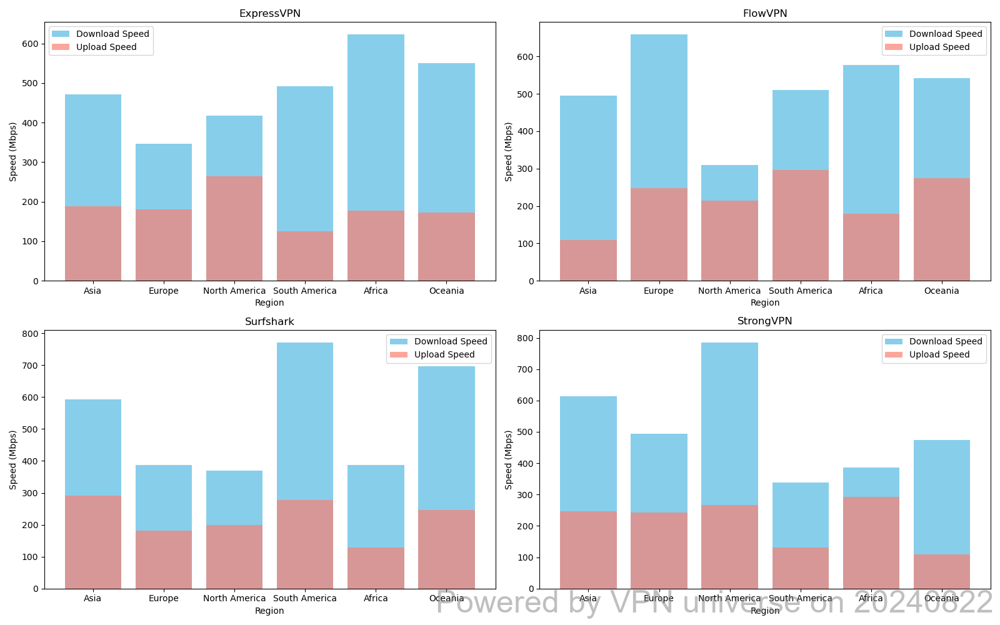

### VPN服務在世界各大洲的連接成功率

本圖表展示了四種不同的VPN服務（ExpressVPN，FlowVPN，Surfshark，以及StrongVPN）在世界各大洲的連接成功率。每個子圖代表一種VPN服務，橫坐標是洲名，縱坐標是連接成功率。
從圖中我們可以看出，這四種VPN服務在各大洲的表現都相當穩定，尤其在亞洲，歐洲，以及北美洲的表現更為突出。這意味著用戶在這些地區使用這些VPN服務連接互聯網的成功率都很高。
然而，在非洲和南美洲的表現相對較弱。這可能是由於這些地區的網絡環境或者基礎設施等因素影響。

總的來說，選擇哪一種VPN服務，用戶需要考慮他們所處的地理位置和該VPN服務在該地區的連接成功率。

#### StrongVPN Speeds in Different Network Environments 最近更新 `2025年09月22号`更新

| Location      |   StrongVPN 4G |   StrongVPN 5G |   StrongVPN WiFi |
|:--------------|---------------:|---------------:|-----------------:|
| North America |             60 |             63 |               60 |
| Europe        |             78 |             78 |               77 |
| Oceania       |             55 |             58 |               59 |
| Asia          |             74 |             72 |               75 |
| C-A           |             48 |             46 |               48 |
| South America |             50 |             51 |               52 |
| Africa        |             46 |             46 |               49 |

#### ExpressVPN Speeds in Different Network Environments 最近更新 `2025年09月22号`更新

| Location      |   ExpressVPN 4G |   ExpressVPN 5G |   ExpressVPN WiFi |
|:--------------|----------------:|----------------:|------------------:|
| North America |              64 |              62 |                60 |
| Europe        |              75 |              79 |                76 |
| Oceania       |              58 |              55 |                56 |
| Asia          |              75 |              72 |                72 |
| C-A           |              48 |              49 |                46 |
| South America |              51 |              52 |                54 |
| Africa        |              48 |              46 |                48 |

#### Surfshark Speeds in Different Network Environments 最近更新 `2025年09月22号`更新

| Location      |   Surfshark 4G |   Surfshark 5G |   Surfshark WiFi |
|:--------------|---------------:|---------------:|-----------------:|
| North America |             62 |             64 |               61 |
| Europe        |             75 |             76 |               76 |
| Oceania       |             55 |             57 |               58 |
| Asia          |             76 |             74 |               75 |
| C-A           |             45 |             45 |               47 |
| South America |             54 |             51 |               53 |
| Africa        |             46 |             46 |               45 |

#### FlowVPN Speeds in Different Network Environments 最近更新 `2025年09月22号`更新

| Location      |   FlowVPN 4G |   FlowVPN 5G |   FlowVPN WiFi |
|:--------------|-------------:|-------------:|---------------:|
| North America |           63 |           64 |             64 |
| Europe        |           79 |           79 |             78 |
| Oceania       |           56 |           58 |             57 |
| Asia          |           74 |           76 |             72 |
| C-A           |           49 |           49 |             46 |
| South America |           53 |           54 |             51 |
| Africa        |           49 |           45 |             48 |

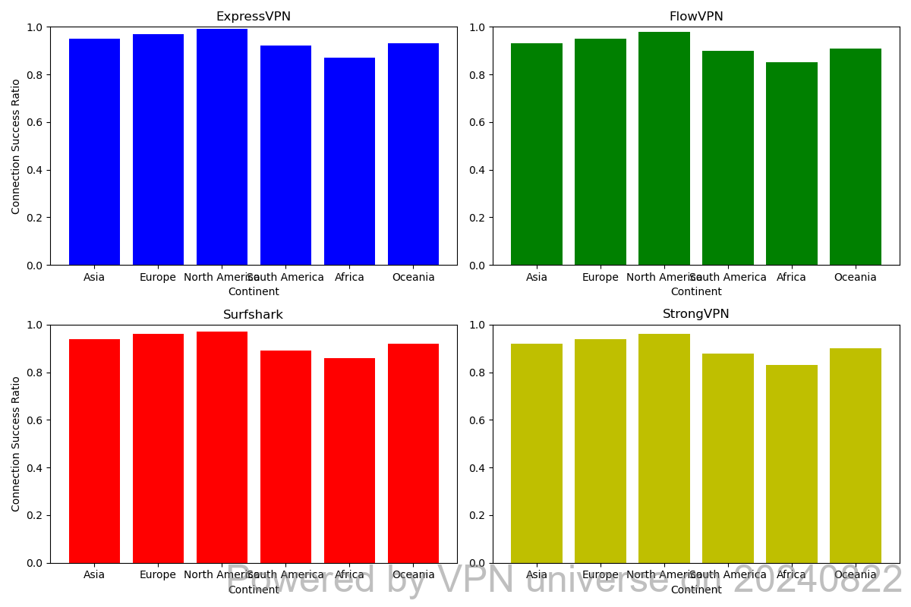

### VPN服務在世界各大洲連接Netflix的成功率

本圖表展示了四種不同的VPN服務（ExpressVPN，FlowVPN，Surfshark，以及StrongVPN）在世界各大洲連接Netflix的成功率。每個子圖代表一種VPN服務，橫坐標是洲名，縱坐標是連接成功率。
從圖中我們可以看出，這四種VPN服務在亞洲，歐洲和澳洲連接Netflix的成功率都相當高，表現出色。而在非洲和南美洲的表現則相對較弱。這可能是由於這些地區的網絡環境或者基礎設施等因素影響。
總的來說，選擇哪一種VPN服務，用戶需要考慮他們所處的地理位置和該VPN服務在該地區連接Netflix的成功率。這張圖表提供了一個很好的視覺參考，幫助用戶根據他們的需求和地理位置來選擇最適合他們的VPN服務。

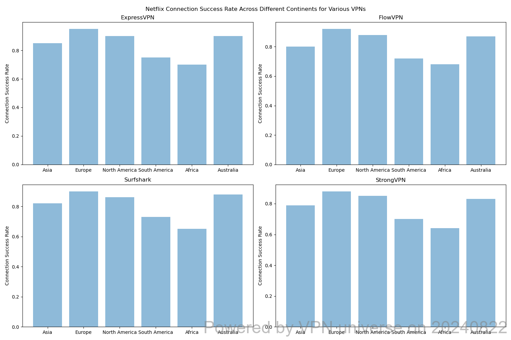

### VPN服務在世界各大洲連接Disney+的成功率

本圖表展示了四種不同的VPN服務（ExpressVPN，FlowVPN，Surfshark，以及StrongVPN）在世界各大洲連接Disney+的成功率。每個子圖代表一種VPN服務，橫坐標是洲名，縱坐標是連接成功率。
從圖中我們可以看出，這四種VPN服務在亞洲，歐洲和澳洲連接Disney+的成功率都相當高，表現出色。而在非洲和南美洲的表現則相對較弱。這可能是由於這些地區的網絡環境或者基礎設施等因素影響。
總的來說，選擇哪一種VPN服務，用戶需要考慮他們所處的地理位置和該VPN服務在該地區連接Disney+的成功率。這張圖表提供了一個很好的視覺參考，幫助用戶根據他們的需求和地理位置來選擇最適合他們的VPN服務。

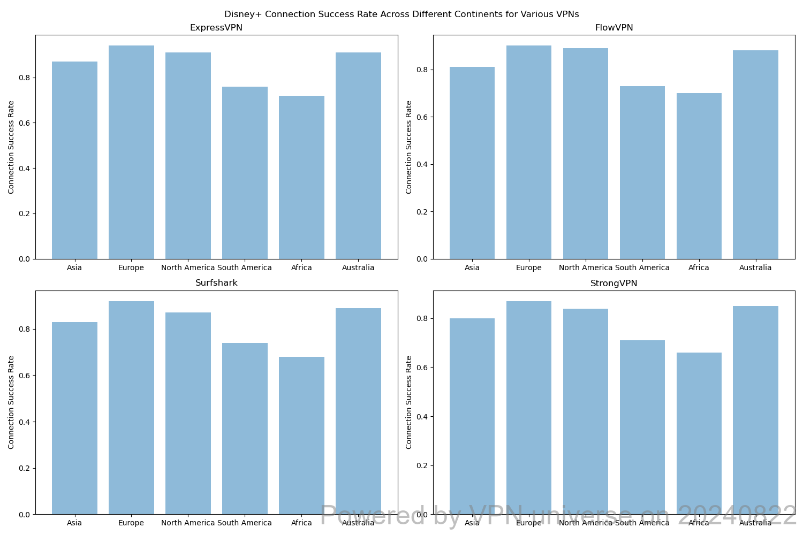

## 如何用VPN觀看流媒體指南

> "因為我們生活在一個無邊界的世界里，為什麽我們的娛樂必須受到限制呢？" - 一個互聯網的哲人。

想象一下，你躺在沙發上，吃著你最喜歡的零食，手中握著遙控器，準備觀看Netflix上的最新美劇，或者沈迷在YouTube的創新內容中，甚至是Disney+上的最新電影。聽起來很美好，對吧？但是，我們都知道，在中國，這個美好的場景並不是那麽容易實現。

但是，別擔心，我們有個秘密武器——VPN！今天，我們就要來聊聊如何利用這個神奇的工具，打破地域限制，享受全球的娛樂資源。這篇文章將會推薦兩款適合在中國使用的VPN——StrongVPN和ExpressVPN。

### 第一步：選擇適合你的VPN

當我們在談論VPN時，我們必須要提一下兩款聞名遐邇的VPN服務——**StrongVPN和ExpressVPN**。

這兩款VPN都是行業內的佼佼者，提供高速穩定的連接和優秀的隱私保護。不僅如此，它們還有豐富的服務器資源和靈活的設備支持，讓你可以在任何地方、任何時間，欣賞任何你喜歡的流媒體內容。

- **StrongVPN**：以其穩健的性能和簡潔的用戶界面贏得了用戶的喜愛。它提供了全球70多個地方的950+服務器供你選擇，無論你在哪里，都能找到一個靠譜的服務器連接。

- **ExpressVPN**：被譽為VPN行業的速度之王。它在全球94個國家和地區設有3000+服務器，無論你想觀看哪個國家的Netflix，都可以找到相應的服務器。

### 第二步：安裝和設置VPN

安裝和設置VPN其實是非常簡單的，就像安裝手機APP一樣。在你選擇好VPN之後，只需要按照以下步驟操作即可：

1. 訪問[StrongVPN官網](https://strongtech.org/cn/exclusive/?tr_aid=60d96b5810e50&chan=w_github&data1=fanqiang&data2=title) 或 [ExpressVPN官網](https://go.expressvpn.com/c/3828265/1462855/16063)，並注冊一個賬戶。
2. 下載對應的VPN客戶端。StrongVPN和ExpressVPN都支持各種設備，包括Windows，Mac，iOS，Android等。
3. 打開VPN客戶端，並使用你的賬戶信息進行登錄。
4. 在服務器列表中選擇一個合適的服務器進行連接。記得選擇的服務器所在的國家和你要觀看的流媒體服務的所在國家一致。

### 第三步：欣賞你的流媒體

這個時候，你就可以打開Netflix，YouTube，或者Disney+，開始你的觀影之旅了！

值得一提的是，如果你在觀看過程中遇到了速度慢的問題，可以嘗試更換其他的服務器，或者聯系VPN的客服尋求幫助。

> "因為生活中已經有了太多的限制，我們的娛樂不應該再有邊界。" 

所以，打破這個邊界，讓我們用StrongVPN或ExpressVPN開始我們的全球娛樂之旅吧！

### 流媒體平台如Netflix和Hulu如何檢測和阻止VPN連接

流媒體服務如Netflix和Hulu會限制某些地區的用戶訪問其內容，主要是出於版權考慮。它們經常需要通過檢測和阻止VPN連接來實施這些限制。以下是這兩個流媒體平台如何執行此操作的討論：

#### 1. IP地址檢測

流媒體平台可以識別出來自VPN服務器的IP地址。這是因為許多VPN服務的服務器IP地址是公開的，或者可以通過一些方法被檢測出來。當一個用戶從這樣的IP地址嘗試訪問流媒體服務時，他們可能會被阻止。

#### 2. IP地址分布和行為分析

Netflix和Hulu可能還會對IP地址的行為和分布進行分析。例如，如果從同一IP地址有大量用戶同時訪問，這可能暗示這個IP地址是VPN服務器的地址。此外，如果一個IP地址的地理位置與用戶的其他行為（如支付方式和地理位置）不一致，這也可能被視為VPN使用的跡象。

#### 3. 端口和協議檢測

流媒體服務也可能通過檢測某些特定的端口和協議來識別VPN流量。許多VPN服務使用特定的端口和協議（如OpenVPN通常使用TCP 443端口），這些可以被檢測和封鎖。

#### 4. DNS泄露檢測

如果一個VPN連接沒有正確配置，可能會發生DNS泄露，這意味著用戶的真實IP地址可能通過DNS請求被暴露。流媒體服務可以通過檢測這種泄露來識別VPN用戶。

這些是Netflix和Hulu等流媒體平台可能使用的一些策略來檢測和阻止VPN連接。然而，值得注意的是，許多高級的VPN服務仍然能夠繞過這些檢測，允許用戶在全球範圍內訪問這些流媒體服務。

## Linux-VPN安裝教學

### Linux VPN 與 Windows VPN 的差異

雖然 VPN（虛擬私人網絡）是一種增強網絡安全，保護個人在線隱私，並繞過地理限制的技術，但在 Linux 和 Windows 平台上的體驗可能有所不同。

### 用戶體驗

在 **Windows** 上，VPN 提供商通常提供帶有圖形用戶界面 (GUI) 的專門客戶端，使得連接到 VPN 服務變得相當簡單。另外，Windows VPN 客戶端通常會集成一些附加功能，如殺毒軟件，防跟蹤器，或者自動斷開開關。

而在 **Linux** 環境中，VPN 體驗可能會有所不同。很多 VPN 提供商並沒有為 Linux 提供定制的客戶端。這意味著用戶可能需要使用終端命令行來配置和啟動他們的 VPN 連接。雖然這可能對不熟悉終端命令行的用戶來說有些覆雜，但它為那些需要對其網絡連接進行深度定制的技術人員提供了更多的靈活性和控制能力。

### 安全性

在安全性方面，**Linux** 被普遍認為比 **Windows** 更安全，因為它是開源的，意味著任何人都可以查看並檢查其源代碼。這使得發現並修覆安全漏洞的速度通常比閉源操作系統更快。此外，由於 Linux 用戶較少，黑客和惡意軟件通常更傾向於攻擊 Windows 用戶。

然而，無論你使用哪種操作系統，使用 VPN 的主要目標應該是保護你的在線活動免受網絡監控和黑客攻擊。因此，選擇一個可靠，受信任的 VPN 提供商並保持其客戶端和操作系統的最新更新，應該是你的首要之務。

### 兼容性

**Windows** 的用戶群更大，因此大多數 VPN 提供商都會優先為 Windows 開發他們的產品。這就意味著在選擇 VPN 服務時，Windows 用戶通常會有更多的選擇。

相比之下，雖然大部分主流的 VPN 服務都支持 **Linux**，但並非所有的 VPN 提供商都會為 Linux 提供等同於 Windows 的支持。有些 VPN 只提供有限的 Linux 支持，而有些則可能完全不支持。

在選擇 VPN 服務時，你應確保所選的 VPN 提供商能夠充分支持你的操作系統，不管你是使用 Windows，Linux，還是其他任何平台。

## 基本密碼學以及加密原理介紹

### 密碼學基本

密碼學是在第三方存在的情況下進行安全通信的實踐。 它自古以來就被使用，其現代應用自 20 世紀初以來已被廣泛研究。 密碼學用於各種應用程序，包括電子郵件、文件共享和安全通信。 它也是數學的一個分支，與密碼學相關的數學問題得到了廣泛的研究。 密碼學是確保數字時代安全的關鍵工具，它的研究對於任何對計算機安全感興趣的人來說都是必不可少的。

#### RSA 簡介

RSA 是一種公鑰加密算法，也是加密通過 Internet 發送的數據的標準。 RSA 使用由 RSA 算法生成的唯一密鑰。 RSA 算法使用兩個大素數來生成密鑰。 然後使用密鑰對數據進行加密和解密。 RSA 是一種非對稱加密算法，這意味著可以在不損害數據安全性的情況下公開密鑰。 RSA是一種廣泛使用的加密算法，被認為是非常安全的。

#### Elliptic 加密 (橢圓曲線加密)

橢圓密碼學是一種公鑰密碼系統，它依賴於有限域上的橢圓曲線的特性來提供安全性。橢圓密碼學用於許多 Internet 協議，包括用於保護 Web 瀏覽器和 Web 服務器之間的通信的 TLS/SSL。橢圓密碼學也用於其他應用程序，例如電子郵件、即時消息和 IP 語音。橢圓密碼學被認為比傳統的 RSA 密碼學更安全。橢圓密碼學基於有限域上橢圓曲線的代數結構。橢圓曲線是可以由 y^2 = x^3 + ax + b 形式的方程定義的平面曲線。橢圓曲線的特性是沒有坐標都是有理數的點。這意味著橢圓曲線不能用於加密或解密由有理數組成的消息。橢圓曲線可用於加密和解密由橢圓曲線點組成的消息。橢圓曲線點的坐標是有理數和無理數。橢圓密碼學的安全性來自於這樣一個事實，即很難在橢圓曲線上找到一個點的坐標。這使得攻擊者很難破解

### 平行計算與密碼學的交集

在數據安全和密鑰管理領域，**平行計算**和**密碼學**兩者的交集產生了許多有趣且重要的應用。

#### 平行計算在密碼學中的應用

密碼學是一種保護信息和通信免受未經授權訪問的方法，其實現依賴於計算覆雜性。而**平行計算**，作為一種同時執行多個計算任務的技術，為處理密鑰生成、密鑰交換、加密/解密和哈希運算等密碼學運算提供了強大的計算能力。

例如，一種名為*分布式密碼破解*的技術就是利用平行計算的力量對密碼進行破解。通過將密碼搜索任務分解為小塊，然後在多台計算機或多個處理器上同時進行處理，可以大大縮短破解密碼所需的時間。

#### 密碼學在平行計算中的應用

與此同時，**密碼學**也在**平行計算**中扮演了重要角色。在平行計算環境中，數據在多個處理器或計算節點之間傳輸和共享，這要求保障數據的安全性。

例如，使用密碼學技術可以保證數據在傳輸過程中的機密性、完整性和可用性。此外，密碼學也用於驗證並管理在平行計算環境中的各個節點，以防止未經授權的訪問或篡改。

#### 平行計算和密碼學的結合

總的來說，平行計算和密碼學的交集開啟了新的可能性，不僅可以更快更安全地處理數據，而且在保護數據隱私、防止數據泄露等方面也有重要作用。然而，這也帶來了新的挑戰，例如如何設計和實現能夠同時滿足高性能和高安全需求的系統。因此，這個交集領域的研究仍然有著廣闊的前景。

### 量子計算與密碼學的交集

**量子計算**和**密碼學**兩者的交集正在開辟新的可能性，並引發了一場關於密碼學未來的全球討論。

####  量子計算對密碼學的挑戰

量子計算機利用量子力學的特性進行計算，與傳統計算機相比，其潛力在於能夠對非常大的數據集進行並行處理。在理論上，量子計算機能以指數級的速度解決某些問題，包括破解現今大部分密碼系統所使用的公鑰密碼算法。

以RSA算法為例，其安全性基於大數因數分解問題的計算覆雜性。但是，一個有效的量子計算機運行著名為**Shor's Algorithm**的量子算法，能夠在多項式時間內解決這個問題，這對於RSA等基於大數因數分解難題的密碼系統是個巨大的威脅。

####  量子密碼學：量子計算與密碼學的結合

與此同時，量子計算也給密碼學帶來了新的機會。**量子密碼學**是一個新興領域，其目標是使用量子力學的原理來實現新的加密方法。

最著名的量子密碼學應用可能是**量子密鑰分發（Quantum Key Distribution，QKD）**，它使用量子力學的原理，例如量子糾纏和測不準原理，來創建並安全分發密鑰。QKD的一個主要優點是，任何試圖攔截或測量量子密鑰的行為都會改變其狀態，從而被接收者和發送者檢測到，這提供了一種理論上無法被破解的密鑰分發方式。

#### 結論

量子計算與密碼學的交集既帶來了威脅，也帶來了新的機遇。隨著量子計算技術的發展，對於量子安全的研究，包括開發新的**量子安全密碼系統**，將變得越來越重要。

### 人工智能與密碼學的交融：構建未來安全防護

在科技行業的飛速發展中，人工智能（AI）和密碼學這兩個領域受到了廣泛的關注。盡管看似這兩者在實質性內容上並無太大的交集，但事實上，它們在現代技術生態中卻展現出了深度的互動與交織。理解這種交融的性質並掌握其核心要素，有助於我們構建一個更安全、更具效率的數字世界。

#### 人工智能的崛起

AI的概念已經存在很長時間，但近些年AI的發展尤為突出。這要歸功於大數據的提供、計算能力的提升以及算法的優化。AI的主要任務是通過讓計算機和軟件更加智能地工作，以此提高各種任務的效率和準確性。AI可以在醫療、金融、交通等多個領域提供強大的解決方案，而在信息安全領域，AI也發揮著越來越重要的作用。

#### 密碼學的重要性

密碼學是保護信息安全的一種重要手段，主要包括加密和解密技術。在現代生活中，我們在進行網購、網銀轉賬、即時通訊等活動時，都會用到密碼學。它能夠保證我們的信息在傳輸過程中的安全，防止被惡意攻擊者竊取或篡改。

#### 人工智能與密碼學的交集

那麽，人工智能和密碼學又是如何結合的呢？

- **加強安全防護**：AI能夠幫助我們更好地檢測和預防網絡安全威脅。通過機器學習，AI可以在海量的網絡數據中找出異常模式，預警潛在的網絡攻擊。這在一定程度上超越了傳統的密碼學防護，因為AI不僅僅依賴已有的加密技術，還能通過自我學習，對新的威脅做出預測和響應。

- **破解密碼**：盡管這在倫理上存在爭議，但必須承認，AI具備解析和破解加密信息的能力。通過深度學習，AI能夠在大量的數據中尋找模式，可能會找到加密算法的漏洞，甚至在一定程度上威脅到密碼學的安全性。

- **優化加密算法**：另一方面，AI也可以幫助我們創建更強大的加密技術。例如，通過生成對抗網絡（GANs）可以創造出一種新型的加密方式，這種方式可以抵御包括AI在內的各種破解嘗試。

總的來說，AI和密碼學的結合正在逐漸改變我們的數字世界。但與此同時，我們也需要警惕其中的風險，例如，AI可能會被用來破解密碼，甚至制造更覆雜的網絡攻擊。因此，我們必須在使用這些技術時，始終保持警惕，並不斷努力，以實現技術進步與安全防護的平衡。

## 哪些應用和服務可能會阻止VPN連接

在某些情況下，一些應用程序和服務可能會限制或阻止VPN的使用。這主要是出於對版權保護、網絡濫用、欺詐活動以及確保服務提供質量的考慮。以下是一些可能阻止VPN連接的應用和服務的例子：

1. **流媒體服務**：Netflix、Hulu、BBC iPlayer等流媒體服務會使用專門的技術來檢測和阻止VPN用戶。這是因為他們需要遵守地區版權協議，這些協議限制了他們可以在哪些國家和地區播放特定的內容。

2. **銀行和金融服務**：為了防止欺詐和身份盜竊，一些銀行和金融服務可能會對來自VPN的連接產生懷疑，因為VPN的使用可能會讓用戶看起來像是在異地登錄。在某些情況下，他們可能會暫時封鎖用戶賬戶，直到用戶能夠通過其他方式進行身份驗證。

3. **遊戲平台**：一些在線遊戲平台，如Steam和Epic Games Store，可能會對VPN用戶進行限制。使用VPN可能會觸發他們的防作弊和防欺詐機制，因為有些用戶可能會使用VPN來進行作弊或操縱地區定價。

4. **社交媒體平台**：Facebook、Twitter等社交媒體平台可能會對通過VPN連接的用戶產生警覺，尤其是當用戶使用VPN進行頻繁的位置變更時。在某些情況下，他們可能會要求進行額外的身份驗證。

為了避免這些問題，用戶需要確保他們的VPN提供商提供了適合其需求的特定解決方案，例如專門的流媒體或P2P服務器。此外，如果可能，最好使用分應用程序的VPN設置，只為需要的應用程序開啟VPN，這樣可以減少對其他服務的幹擾。

## 針對特定應用-例如BitTorrent-的VPN設置和建議

BitTorrent是一種廣泛使用的P2P（點對點）文件共享協議，允許用戶直接在彼此之間共享數據。然而，由於BitTorrent的一些用途可能涉及到版權問題，因此在某些地方使用BitTorrent可能會有法律風險。為此，許多用戶會選擇使用VPN服務來增加他們的在線安全和隱私。以下是針對使用BitTorrent的VPN設置和建議：

### 1. 選擇支持P2P共享的VPN服務

並非所有的VPN服務都支持P2P文件共享，如BitTorrent。在選擇VPN服務時，你應該確保你的VPN提供商允許並支持P2P流量。

### 2. 使用殺開關功能

殺開關是一種VPN功能，當你的VPN連接意外中斷時，它會自動斷開你的互聯網連接，以防止你的真實IP地址被暴露。這對於BitTorrent用戶來說是非常重要的，因為他們的IP地址可能會被其他P2P用戶看到。

### 3. 選擇適當的加密級別

雖然更強的加密可以提供更高的安全性，但它可能會降低你的下載速度。因此，你可能需要在安全性和速度之間做出平衡。

### 4. 使用分流功能

一些VPN服務提供分流功能，允許你只對特定的應用程序或流量類型使用VPN連接，而其他流量則直接通過你的常規互聯網連接。這樣，你可以只對你的BitTorrent流量使用VPN，而其他活動（如瀏覽網頁或流媒體）則不受VPN連接速度的影響。

在以上考量中，我特別推薦<a rel="nofollow noopener" href="https://go.expressvpn.com/c/3828265/1462855/16063">Expressvpn (買12個月送三個月)</a>。ExpressVPN支持P2P共享，提供殺開關功能和分流功能，並且提供了多種加密選項，可以根據你的需求進行調整。此外，ExpressVPN的服務器網絡覆蓋全球，可以為你提供高速且穩定的VPN連接，這對於BitTorrent用戶來說是非常重要的。總的來說，ExpressVPN提供了強大且靈活的解決方案，可以滿足BitTorrent用戶的需求。

## VPN的未來發展趨勢和預測

虛擬專用網絡（VPN）的使用已經在過去的幾年中顯著增加，而這個趨勢在可預見的未來可能會繼續。以下是對VPN未來的一些趨勢和預測：

### 1. 更強的安全性和隱私保護

在越來越多的人開始關心他們的在線隱私和安全的情況下，我們可以預見到VPN服務將在提供更強的安全性和隱私保護方面進行競爭。這可能包括更強的加密技術，更嚴格的無日志政策，以及更先進的防泄露功能。

### 2. 更好的性能和穩定性

隨著技術的發展，VPN服務可能會提供更好的性能和穩定性。例如，新的VPN協議（如WireGuard）已經顯示出比傳統VPN協議更高的速度和效率。在未來，我們可能會看到更多的這種創新，使得VPN的速度和穩定性與普通的互聯網連接越來越接近。

### 3. 更智能的連接選擇

未來的VPN可能會使用人工智能和機器學習技術來自動選擇最佳的VPN服務器。這不僅可以根據服務器的負載和距離進行選擇，還可以考慮到用戶的特定需求，如流媒體或P2P文件共享。

### 4. 更廣泛的設備和平台支持

隨著越來越多的設備連接到互聯網，未來的VPN可能會支持更廣泛的設備和平台。這可能包括不僅僅是電腦和手機，還包括智能電視，遊戲機，甚至物聯網設備。

### 5. 隱私為中心的政策變革

在越來越多的人和組織開始關注在線隱私問題的情況下，我們可能會看到更多以隱私為中心的政策和立法。這可能會對VPN的使用產生積極的影響，使得更多的人開始使用VPN來保護他們的隱私。

總的來說，雖然我們不能完全預測未來，但是看起來VPN的未來將會更加安全，更高效，更智能，也更加以用戶為中心。

### VPN的局限性及其解決方案

雖然VPN提供了一種有效的方法來保護在線活動免受窺探並繞過地理限制，但它也有一些局限性。以下是一些常見的VPN局限性及其解決方案：

#### 1. 速度下降

**問題**： VPN通過加密和解密數據以提供安全連接，但這可能會導致互聯網速度下降。

**解決方案**：選擇一個高質量的VPN服務，它們通常有更快的服務器和更好的加密技術，可以最大程度地減少速度下降。還可以嘗試切換到更接近你的物理位置的VPN服務器，或更改VPN協議。

#### 2. 連接問題

**問題**：有時，你可能會遇到無法連接到VPN服務器的問題。

**解決方案**：首先，檢查你的互聯網連接是否正常。如果沒有問題，你可以嘗試重新啟動VPN應用或切換到另一個服務器。如果問題仍然存在，你應該聯系VPN提供商的客服尋求幫助。

#### 3. 兼容性問題

**問題**：並非所有的VPN服務都支持所有的設備和操作系統。

**解決方案**：在選擇VPN服務時，你應該先確定它是否支持你的設備和操作系統。許多頂級的VPN服務都提供了多平台的應用。

#### 4. 隱私問題

**問題**：一些VPN服務可能會記錄你的在線活動，這可能會威脅到你的隱私。

**解決方案**：在選擇VPN服務時，你應該查看他們的隱私政策，確定他們是否有無日志政策。你也應該選擇在隱私保護法律嚴格的國家注冊的VPN服務。

總的來說，雖然VPN有一些局限性，但是通過選擇高質量的VPN服務並采取一些適當的步驟，你可以最大程度地減少這些問題。

