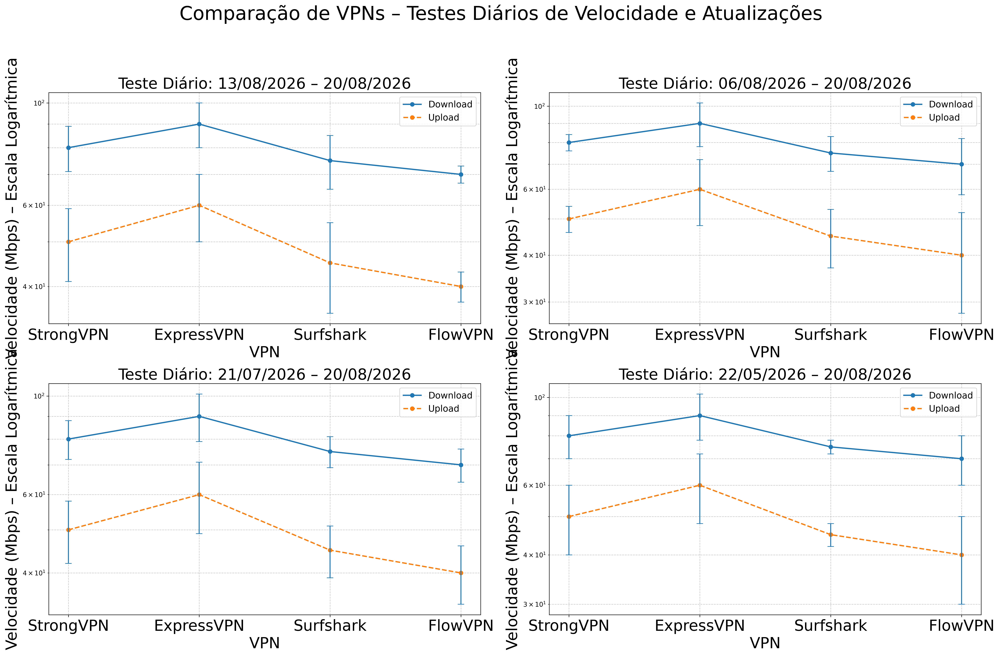

# Como testar VPN para Globoplay fora do Brasil sem confundir IP, conta e aparelho

Globoplay pode abrir normalmente fora do Brasil e ainda limitar um canal ao vivo, um evento ou parte do catálogo por causa dos direitos de transmissão. Isso é diferente de uma VPN simplesmente não conectar.

Para descobrir a causa, separe quatro camadas: IP brasileiro, sessão/cookies, região da conta e dispositivo. Trocar de VPN sem fazer esse diagnóstico pode repetir o mesmo erro.

> **Teste curto:** conecte a um servidor no Brasil, confirme IP e DNS, abra uma janela anônima, entre na conta e reproduza o conteúdo real por 15 minutos. Teste ao vivo e sob demanda separadamente.

## O que exatamente está falhando?

| Sintoma | Causa possível | Próximo teste |
|---|---|---|
| Site abre, vídeo não começa | Direitos, IP reconhecido ou cookies | Outro conteúdo, janela anônima e outro servidor Brasil |
| Catálogo aparece diferente | Região da conta ou IP | Confirmar país da IP e reiniciar sessão |
| Só o canal ao vivo falha | Direitos específicos do evento | Comparar replay e outro canal |
| Funciona no notebook, não na TV | App, loja, DNS ou roteador | Validar app e conta do aparelho |
| Imagem trava à noite | Congestionamento ou rota longa | Protocolo alternativo, Ethernet e 1080p |

VPN não altera os direitos da assinatura nem garante que todo conteúdo esteja licenciado no exterior. Consulte os termos do Globoplay e da sua conta.

## Ordem para testar os provedores

| Ordem | VPN | Para quem faz sentido | Verifique antes de manter |
|---:|---|---|---|
| 1 | [StrongVPN](https://strongvpn.com/pt/?tr_aid=60d96b5810e50&chan=w_github_pt&data1=pt-home&data2=hero) | Primeira opção paga para custo mais controlado em até um ano | Servidor Brasil, Globoplay real, preço total e reembolso |
| 2 | [ExpressVPN](https://go.expressvpn.com/c/3828265/1634695/16063) | Quem aceita pagar mais por app e suporte premium | Local Brasil, Smart TV, renovação e conteúdo principal |
| 3 | [Surfshark](https://get.surfshark.net/aff_c?offer_id=323&aff_id=5585&source=w_github&aff_sub=pt) | Casa com muitos celulares, notebooks e TVs | Plano longo, imposto, desempenho simultâneo |
| 4 | [FlowVPN](https://www.flowvpx.com/sign-up/?locale=pt&special=FREETRIAL&r=35-890485.w_github) | Teste curto de compatibilidade | Fim do teste, cancelamento e servidor brasileiro |

Aviso de afiliado: VPN Liberdade pode receber comissão se você contratar por esses links, sem custo adicional. Por isso não prometemos acesso permanente e indicamos o que precisa ser comprovado durante o prazo de teste.

## Protocolo de 20 minutos

1. Tire uma captura do erro sem VPN.
2. Meça a conexão base.
3. Conecte a um servidor brasileiro.
4. Confirme que IP e DNS apontam para o Brasil.
5. Abra o navegador em modo anônimo.
6. Faça login e teste um vídeo sob demanda.
7. Teste o canal ou evento ao vivo que motivou a compra.
8. Anote servidor, protocolo, horário e dispositivo.

## Smart TV, Android TV e Fire TV

O controle remoto, a loja de aplicativos e o DNS da TV podem criar um resultado diferente do computador.

- Comprove primeiro a reprodução em um notebook no mesmo Wi-Fi.
- Verifique se o app da VPN está na loja do aparelho.
- Feche completamente o Globoplay antes de conectar a VPN.
- Confira país da conta da loja e permissões de localização.
- Se usar roteador, teste se todos os dispositivos realmente saem pelo túnel.
- Faça uma sessão contínua, não apenas abra a tela inicial.

## Preço em reais e dólar

O valor em reais depende de câmbio, IOF, imposto, cartão e duração. Compare sempre:

1. preço base em USD;
2. total cobrado hoje;
3. valor convertido pelo checkout ou cartão;
4. duração real do contrato;
5. renovação automática.

Uma mensalidade promocional baixa pode exigir dois anos pagos de uma vez. Para uso de até um ano, compare o desembolso total, não apenas “por mês”.

## O que a nossa velocidade prova

O gráfico mostra tendência entre os quatro provedores. Ele ajuda a identificar queda ou instabilidade, mas não confirma direitos do Globoplay nem a reputação de cada IP brasileiro.

[Veja preços, metodologia e comparação geral](../#teste-diário-de-velocidade-vpn).

## Diagnóstico final

### O replay funciona, mas o ao vivo não

Provavelmente há diferença de direitos ou controle do evento. Teste outro canal antes de trocar de VPN.

### A IP é brasileira, mas o catálogo não muda

Feche sessão, use janela anônima, limpe cookies e compare navegador com app. A conta pode conservar região anterior.

### A TV falha e o celular funciona

A rota já está comprovada. O foco passa a ser aplicativo, loja, DNS, conta ou roteador da TV.

### Nenhum servidor Brasil funciona

Fale com o suporte dentro do prazo de reembolso e registre o conteúdo e aparelho. Não mantenha um contrato longo esperando uma correção futura.

## Conclusão

StrongVPN é a primeira tentativa de valor, ExpressVPN a alternativa premium, Surfshark a opção para muitos aparelhos e FlowVPN o teste curto. A compra só faz sentido se o provedor passar no conteúdo do Globoplay que você realmente quer assistir.

[Voltar ao VPN Liberdade](../)
